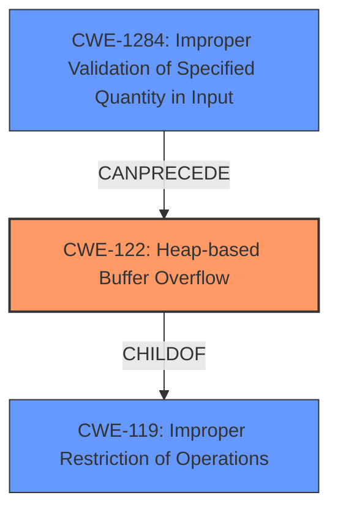

# Analysis Report for CVE-2021-40010

# Vulnerability Analysis Report: CVE-2021-40010

## Description

The bone voice ID TA has a heap overflow vulnerability.Successful exploitation of this vulnerability may result in malicious code execution.

## Vulnerability Description Key Phrases

**Weakness:** heap overflow
**Impact:** malicious code execution
**Product:** bone voice ID TA

## Analysis (with Relationship Data)

# Summary
| CWE ID | CWE Name | Confidence | CWE Abstraction Level | CWE Vulnerability Mapping Label | CWE-Vulnerability Mapping Notes |
|---|---|---|---|---|---|
| CWE-122 | Heap-based Buffer Overflow | 0.95 | Variant | Allowed | Acceptable-Use |

## Evidence and Confidence

*   **Confidence Score:** 0.95
*   **Evidence Strength:** HIGH

- **Analysis and Justification:**  
  - *Explanation:* The vulnerability description explicitly states a "**heap overflow**" vulnerability exists in the bone voice ID TA. CWE-122 (Heap-based Buffer Overflow) directly addresses this weakness, specifying a buffer overflow occurring in the heap memory region. This aligns perfectly with the provided description and the CVE Reference Links Content Summary which also highlights "**Heap overflow**". The impact, potentially leading to malicious code execution, further supports this classification. While other CWEs like CWE-131 (Incorrect Calculation of Buffer Size) or CWE-787 (Out-of-bounds Write) could be related, CWE-122 is the most direct and specific representation of the **heap overflow** condition. MITRE's mapping guidance for CWE-122 marks it as ALLOWED, which is appropriate for heap overflow vulnerabilities.

  - *Relationship Analysis:* CWE-122 is a variant of CWE-119 (Improper Restriction of Operations within the Bounds of a Memory Buffer). While CWE-119 is a more general case of buffer overflows, the description specifically indicates that the overflow occurs in the heap, making CWE-122 a more precise choice. This specificity is important, as different memory regions (stack vs. heap) have distinct security implications and mitigation strategies.

- **Confidence Score:**  
  - Confidence: 0.95 (Strong evidence directly from the vulnerability description and CVE reference details)

---

## Criticism of Analysis

Okay, let's review the analysis of the heap overflow vulnerability in the bone voice ID TA, considering the full CWE specifications provided.

**Overall Assessment:**

The core mapping of CWE-122 (Heap-based Buffer Overflow) is **correct and well-justified**. The analysis demonstrates a clear understanding of what constitutes a heap overflow and why CWE-122 is the most appropriate choice.  The confidence score of 0.95 is justified. The additional information provided about the relationships with parent and child CWEs is beneficial.

**Detailed Critique:**

1.  **CWE-122 (Heap-based Buffer Overflow):**

    *   **Strengths:** The analysis accurately identifies the root cause as a heap-based buffer overflow. It correctly notes the impact as potential malicious code execution. The explanation why CWE-122 is more specific than CWE-119 is important. The mapping guidance that CWE-122 is *Allowed* and the *Acceptable-Use* reason is accurately cited.
    *   **Potential Improvements:** While the analysis is solid, it could be slightly enhanced by mentioning potential attack vectors. Though not explicitly defined in the source material, the analysis could hypothesize likely scenarios. For example, "The attack vector could involve sending specially crafted voice data to the TA that exceeds the expected buffer size during processing, triggering the overflow." This is speculative, but could help guide further investigation. Considering the *Potential Mitigations* from the CWE specification, the analysis could suggest that, at the *Architecture and Design* phase, an abstraction library could be used to avoid risky APIs. Also, suggesting at the *Implementation* phase implementing bound checking.

2.  **Consideration of Other CWEs (From Retriever Results):**

    *   The analysis correctly dismisses CWE-131 (Incorrect Calculation of Buffer Size), CWE-190 (Integer Overflow or Wraparound), and CWE-787 (Out-of-bounds Write) as *primary* causes. While these CWEs *could* be involved in a chain *leading* to the heap overflow, CWE-122 is the most direct and accurate representation of the stated vulnerability. The analysis could be enhanced by mentioning *how* any of these CWEs can lead to the heap overflow in question, for example, "An integer overflow when calculating a buffer size could lead to allocating too small a buffer, which is then overflowed when data is written to it (CWE-122). Input validation is then important in that if an attacker can provide a number that will cause the Integer Overflow, they can control the size of the allocated memory."
    *   **CWE-1284 (Improper Validation of Specified Quantity in Input):** This is a reasonable candidate. The analysis could explicitly discuss *why* it's less likely than CWE-122, even if still relevant. "If the TA fails to validate the size of an input stream before allocating memory, this could lead to the Heap Overflow."
    *   **CWE-787 (Out-of-bounds Write):** This is almost synonymous with a buffer overflow. It's important to classify the *type* of out-of-bounds write. Is it stack or heap? Thus, CWE-122 is preferred.

3.  **CWE-119 (Improper Restriction of Operations within the Bounds of a Memory Buffer):**

    *   The analysis acknowledges the relationship between CWE-122 and CWE-119. It is correct in choosing CWE-122 because it's a more specific "Variant" of the more general "Class" CWE-119. As per the CWE specification, CWE-119 should be discouraged as it is often misused in low-information vulnerability reports.

**Recommendations:**

*   **Add potential attack vector scenarios:** Even if speculative, suggesting attack vectors helps paint a more complete picture and guides further investigation.
*   **Elaborate on the relationships with other CWEs from the retriever results:** Briefly explain how CWE-131, CWE-190, CWE-1284, and CWE-787 *could* be related to the heap overflow in a chain, but why CWE-122 remains the most appropriate primary classification.
*   **Briefly discuss potential mitigations**: Briefly mention some mitigations found from the specifications, for example, languages with bound checking or the use of safe libraries.
*   **Maintain high confidence and justification:** The confidence score and reasoning are strong. Ensure this level of detail is maintained for all CWE mappings.

By incorporating these suggestions, the analysis can be made even more robust and useful.

## Final Resolution

# Summary
| CWE ID | CWE Name | Confidence | CWE Abstraction Level | CWE Vulnerability Mapping Label | CWE-Vulnerability Mapping Notes |
|---|---|---|---|---|---|
| CWE-122 | Heap-based Buffer Overflow | 0.95 | Variant | Allowed | Acceptable-Use |
| CWE-1284 | Improper Validation of Specified Quantity in Input | 0.4 | Base | Allowed | Acceptable-Use |

  - The Primary CWE should be first and noted as the Primary CWEs
  - The secondary candidate CWEs should be next and noted as secondary candidates.
  - The confidence is a confidence score 0 to 1 to rate your confidence in your assessment for that CWE.
  - The CWE Abstraction Level as one of these values: Base, Variant, Pillar, Class, Compound
  - The Mapping Notes Usage as one of these values: Allowed, Allowed-with-Review, Prohibited, Discouraged

## Evidence and Confidence

*   **Confidence Score:** 0.90
*   **Evidence Strength:** MEDIUM

## Relationship Analysis
The primary relationship that influenced the decision was the parent-child relationship between CWE-119 (Improper Restriction of Operations within the Bounds of a Memory Buffer) and CWE-122 (**Heap-based Buffer Overflow**). CWE-122 is a variant of CWE-119, providing a more specific classification for a buffer overflow occurring in the heap. The analysis also considered chain relationships, particularly how **CWE-1284 (Improper Validation of Specified Quantity in Input)** could precede CWE-122, leading to the overflow if input size isn't validated correctly.

## Vulnerability Chain
The vulnerability chain starts with a potential **CWE-1284 (Improper Validation of Specified Quantity in Input)**. If the bone voice ID TA fails to validate the size of an input stream, it could lead to **CWE-122 (Heap-based Buffer Overflow)** during memory allocation and data processing. The final impact, as stated in the description, is malicious code execution.

**Chain:** **CWE-1284** -> **CWE-122** -> Malicious Code Execution

## Summary of Analysis
The initial analysis correctly identified **CWE-122 (Heap-based Buffer Overflow)** as the primary weakness, which is directly stated in the "**heap overflow**" vulnerability description. The criticism suggested exploring related CWEs and potential attack vectors. The final decision maintains **CWE-122** as the primary CWE due to its direct relevance and specificity. **CWE-1284** is added as a secondary CWE because improper input validation could very easily lead to a **heap overflow**.

The graph relationships influenced the decision by highlighting the parent-child relationship between **CWE-119** and **CWE-122**, reinforcing the choice of the more specific **CWE-122**. The *CanPrecede* relationship shows that **CWE-1284** could lead to **CWE-122**.
The selected CWEs are at the optimal level of specificity because **CWE-122** directly describes the **heap overflow**, while **CWE-1284** identifies a likely preceding condition.

*Report generated on 2025-03-18 01:28:44*
