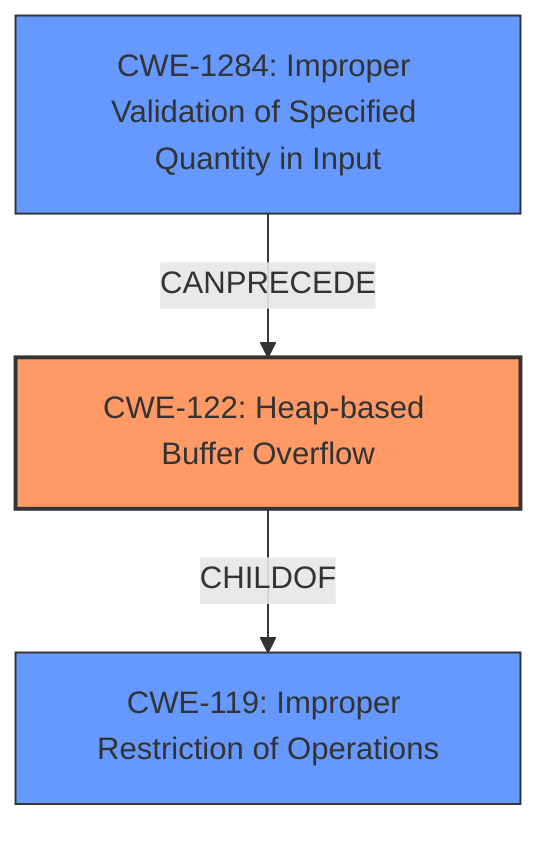

# Final Resolution for CVE-2021-40010

# Summary
| CWE ID | CWE Name | Confidence | CWE Abstraction Level | CWE Vulnerability Mapping Label | CWE-Vulnerability Mapping Notes |
|---|---|---|---|---|---|
| CWE-122 | Heap-based Buffer Overflow | 0.95 | Variant | Allowed | Acceptable-Use |
| CWE-1284 | Improper Validation of Specified Quantity in Input | 0.4 | Base | Allowed | Acceptable-Use |

  - The Primary CWE should be first and noted as the Primary CWEs
  - The secondary candidate CWEs should be next and noted as secondary candidates.
  - The confidence is a confidence score 0 to 1 to rate your confidence in your assessment for that CWE.
  - The CWE Abstraction Level as one of these values: Base, Variant, Pillar, Class, Compound
  - The Mapping Notes Usage as one of these values: Allowed, Allowed-with-Review, Prohibited, Discouraged

## Evidence and Confidence

*   **Confidence Score:** 0.90
*   **Evidence Strength:** MEDIUM

## Relationship Analysis
The primary relationship that influenced the decision was the parent-child relationship between CWE-119 (Improper Restriction of Operations within the Bounds of a Memory Buffer) and CWE-122 (**Heap-based Buffer Overflow**). CWE-122 is a variant of CWE-119, providing a more specific classification for a buffer overflow occurring in the heap. The analysis also considered chain relationships, particularly how **CWE-1284 (Improper Validation of Specified Quantity in Input)** could precede CWE-122, leading to the overflow if input size isn't validated correctly.

## Vulnerability Chain
The vulnerability chain starts with a potential **CWE-1284 (Improper Validation of Specified Quantity in Input)**. If the bone voice ID TA fails to validate the size of an input stream, it could lead to **CWE-122 (Heap-based Buffer Overflow)** during memory allocation and data processing. The final impact, as stated in the description, is malicious code execution.

**Chain:** **CWE-1284** -> **CWE-122** -> Malicious Code Execution

## Summary of Analysis
The initial analysis correctly identified **CWE-122 (Heap-based Buffer Overflow)** as the primary weakness, which is directly stated in the "**heap overflow**" vulnerability description. The criticism suggested exploring related CWEs and potential attack vectors. The final decision maintains **CWE-122** as the primary CWE due to its direct relevance and specificity. **CWE-1284** is added as a secondary CWE because improper input validation could very easily lead to a **heap overflow**.

The graph relationships influenced the decision by highlighting the parent-child relationship between **CWE-119** and **CWE-122**, reinforcing the choice of the more specific **CWE-122**. The *CanPrecede* relationship shows that **CWE-1284** could lead to **CWE-122**.
The selected CWEs are at the optimal level of specificity because **CWE-122** directly describes the **heap overflow**, while **CWE-1284** identifies a likely preceding condition.