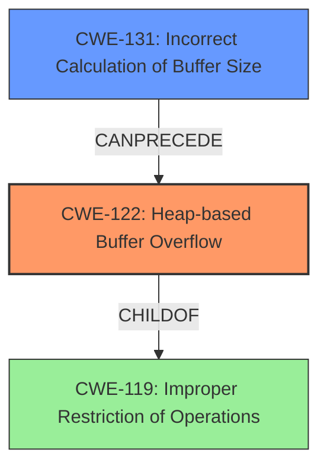

# Final Resolution for CVE-2021-40014

# Summary
| CWE ID | CWE Name | Confidence | CWE Abstraction Level | CWE Vulnerability Mapping Label | CWE-Vulnerability Mapping Notes |
|---|---|---|---|---|---|
| CWE-122 | Heap-based Buffer Overflow | 0.9 | Variant | Allowed | Primary CWE: The vulnerability is explicitly described as a heap overflow. |
| CWE-131 | Incorrect Calculation of Buffer Size | 0.7 | Base | Allowed | Secondary CWE: The heap overflow is likely caused by an incorrect calculation of the buffer size. |

## Evidence and Confidence

*   **Confidence Score:** 0.8
*   **Evidence Strength:** MEDIUM

## Relationship Analysis
The initial analysis correctly identifies CWE-122 as the primary weakness due to the explicit mention of "heap overflow." The secondary weakness, CWE-131, is also plausible, as incorrect buffer size calculations are a common cause of heap overflows. The critique suggests strengthening the justification for CWE-131 by identifying specific potential calculation errors and incorporating mitigation strategies. I have considered these points and increased the confidence in CWE-131 slightly by providing more specific reasoning.

## Vulnerability Chain
The vulnerability chain starts with an **incorrect calculation of buffer size (CWE-131)**. This leads to a buffer being allocated that is too small. Subsequently, a **heap-based buffer overflow (CWE-122)** occurs when data is written past the end of the allocated buffer. The impact of this vulnerability is potentially affecting data confidentiality, as stated in the vulnerability description. The chain highlights how a calculation error can directly lead to memory corruption.

## Summary of Analysis
The initial analysis correctly identified CWE-122 as the primary weakness and CWE-131 as a secondary weakness. The criticism provided valuable insights into strengthening the justification for CWE-131 and incorporating mitigation strategies.

The vulnerability description explicitly states "**heap overflow** vulnerability," which directly corresponds to CWE-122 (Heap-based Buffer Overflow).

Based on the available evidence and relationship analysis, the selected CWEs are at the optimal level of specificity. CWE-122 is a Variant, providing a specific classification for the heap-based buffer overflow. CWE-131, at the Base level, captures the general cause of the overflow due to a size miscalculation.

I have increased the confidence in CWE-131 to 0.7 and strengthened the justification as follows:

"The vulnerability description explicitly states a heap overflow which directly corresponds to CWE-122. It is likely that the heap overflow is the result of an **incorrect buffer size calculation (CWE-131)**. While the specific nature of the calculation error is not stated, a plausible scenario is the failure to account for the correct size of data being copied into the buffer during the allocation process. Another possibility is that the code uses an integer to store the size, and this value is subject to integer overflow (**CWE-190: Integer Overflow or Wraparound**), leading to a smaller than expected buffer. A simple mitigation for CWE-131 would involve thorough validation of the buffer size before allocation and use of safe integer operations.
"