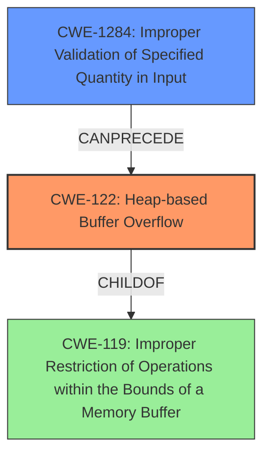

# Analysis Report for CVE-2021-40058

# Vulnerability Analysis Report: CVE-2021-40058

## Description

There is a heap-based buffer overflow vulnerability in the video framework. Successful exploitation of this vulnerability may affect availability.

## Vulnerability Description Key Phrases

**Weakness:** heap-based buffer overflow
**Impact:** affect availability
**Component:** video framework

## Analysis (with Relationship Data)

# Summary
| CWE ID | CWE Name | Confidence | CWE Abstraction Level | CWE Vulnerability Mapping Label | CWE-Vulnerability Mapping Notes |
|---|---|---|---|---|---|
| CWE-122 | Heap-based Buffer Overflow | 0.95 | Variant | Allowed | Primary CWE |
| CWE-131 | Incorrect Calculation of Buffer Size | 0.60 | Base | Allowed | Secondary Candidate |

## Evidence and Confidence

*   **Confidence Score:** 0.90
*   **Evidence Strength:** HIGH

- **Analysis and Justification:**  
  - *Explanation:* The vulnerability is explicitly described as a "**heap-based buffer overflow**" in the video framework. CWE-122 (Heap-based Buffer Overflow) directly matches this description and is at the Variant level of abstraction, which is appropriate. The description states that successful exploitation may affect availability, which is a typical impact of buffer overflows leading to denial-of-service. The CVE Reference Links Content Summary further confirms that the root cause is a heap-based buffer overflow due to incorrect handling of buffer sizes. This aligns with the characteristics of CWE-122. CWE-122 is preferred over the more generic CWE-119 (Buffer Overflow) because it specifies the heap location, which aligns with the vulnerability description.
  
  - *Relationship Analysis:* CWE-122 is a variant of CWE-119 (Buffer Overflow). The selection of CWE-122 provides a more specific classification of the vulnerability. CWE-122 can also be related to weaknesses such as CWE-131 (Incorrect Calculation of Buffer Size), as an incorrect size calculation can lead to a buffer overflow.

- **Confidence Score:**  
  - Confidence: 0.95 (High confidence due to the explicit mention of "heap-based buffer overflow" in both the vulnerability description and the CVE reference summary.)

---
- **Analysis and Justification:**  
  - *Explanation:* CWE-131 (Incorrect Calculation of Buffer Size) is a potential contributing factor to the heap-based buffer overflow. If the buffer size is not correctly calculated, it can lead to an overflow when data is written to the buffer. The "CVE Reference Links Content Summary" indicates that the vulnerability is related to incorrect handling of buffer sizes, providing supporting evidence for CWE-131. However, without more information, it is less directly evident than CWE-122. Therefore, it is classified as a secondary candidate.
  
  - *Relationship Analysis:* CWE-131 can precede CWE-122, as an incorrect size calculation is a common cause of buffer overflows. CWE-131 is at the Base level of abstraction.

- **Confidence Score:**  
  - Confidence: 0.60 (Moderate confidence because while the description mentions a heap-based buffer overflow, the root cause "incorrect handling of buffer sizes" from the CVE reference summary suggests a possible incorrect calculation of the size, but lacks explicit confirmation of size calculation errors.)

## Criticism of Analysis

Okay, here's a review of the provided CWE analysis, considering the full CWE specifications:

**Overall Assessment:**

The analysis is generally good and arrives at the correct primary CWE (CWE-122). The reasoning is clearly explained and considers the available information. The inclusion of CWE-131 as a secondary candidate is also reasonable, given the context of "incorrect handling of buffer sizes." However, there are some points where the analysis could be strengthened or alternative CWEs considered, especially relating to input validation/handling.

**Detailed Review:**

**1. CWE-122: Heap-based Buffer Overflow (Primary CWE)**

*   **Strengths:**
    *   The justification for choosing CWE-122 is strong. The vulnerability description explicitly states "heap-based buffer overflow," providing direct evidence.
    *   The explanation correctly identifies that CWE-122 is a more specific variant of CWE-119, and therefore a better fit.
    *   The analysis acknowledges the relationship between CWE-122 and CWE-131, recognizing that incorrect buffer size calculation can lead to a heap overflow.
    *   The Confidence score of 0.95 is warranted by the strong textual match.
*   **Potential Improvements:**
    *   The analysis could briefly discuss common mitigation techniques for heap-based buffer overflows, drawing from the CWE-122 "Potential Mitigations" section. For example, it could mention using languages or compilers with automatic bounds checking or using safer string manipulation libraries.  While this is not *essential*, it adds value.
    *   Mentioning the parent/child relationships of the mapped CWE can be useful context.
*   **No issues found:** this is a good mapping.

**2. CWE-131: Incorrect Calculation of Buffer Size (Secondary CWE)**

*   **Strengths:**
    *   The justification acknowledges that CWE-131 could be a contributing factor. The "CVE Reference Links Content Summary" specifically mentions "incorrect handling of buffer sizes," supporting this choice.
    *   The explanation correctly positions CWE-131 as potentially preceding CWE-122 in a vulnerability chain.
*   **Potential Improvements:**
    *   The analysis could explore *how* the buffer size calculation might be incorrect.  CWE-131's "Additional Notes" section lists examples like simple math errors, incorrectly updating parallel counters, or not accounting for size differences when transforming data. Connecting the root cause to one of these examples would strengthen the analysis.
    *   The analysis could consider whether any form of input validation might be absent or inadequate.  The supplied content suggests the issue is caused by processing video data.  Is the length or size of the video data properly validated?  If not, this may suggest a different or additional CWE.
    *   Consider CWE-467 "Use of sizeof() on a Pointer Type" if the buffer size calculation involves `sizeof`. It's a variant of CWE-131, but applicable if `sizeof` is misused on a pointer.
*   **Issues to consider:**
    *   The phrase "incorrect handling of buffer sizes" is broad. While it could imply incorrect *calculation*, it could also mean incorrect *use* of a correctly calculated size. For example, failing to account for null termination could be considered incorrect handling but not incorrect calculation.
    *   The confidence score of 0.60 is reasonable, but it hinges on interpreting "incorrect handling" as potentially including incorrect calculation.

**Additional CWE Considerations:**

The analysis is primarily focused on heap overflow and size calculation.  However, there are other potential weaknesses that could be considered based on the provided information, particularly when considering the video processing context.

*   **CWE-20 / CWE-1284 / CWE-1285: Improper Input Validation (and Children):** The description mentions "processing of malformed video data could be a vector." This strongly suggests that the video framework is not properly validating the input video data. Specific CWE children of CWE-20 could be more appropriate depending on the nature of the invalid data, for instance if a size field in the video is not properly validated then *CWE-1284: Improper Validation of Specified Quantity in Input* would be more appropriate.  The analysis makes no mention of input validation, and this seems a significant omission.  Using CWE-20 (or a child) as a secondary CWE candidate would strengthen the analysis.
*   **CWE-130: Improper Handling of Length Parameter Inconsistency:** Given that the vulnerability stems from processing potentially malformed video data, it's possible that a length parameter within the video stream is inconsistent with the actual data length. This could lead to a buffer overflow if the program relies on the incorrect length parameter. This could be considered as an alternative to CWE-131 or in combination with it.

**Retriever Results Critique:**

The retriever results list several CWEs that could be related but ultimately are not the best fit:

*   **CWE-190 (Integer Overflow or Wraparound):** While integer overflow *could* contribute to an incorrect buffer size calculation, the analysis does not provide sufficient evidence to warrant its inclusion.  It's a possible but less direct contributor than incorrect handling of video stream or incorrect input validation.
*   **CWE-125/126 (Out-of-bounds Read/Over-read):** These are less relevant given the description focuses on a *buffer overflow*.  The primary concern is that data is *written* beyond the allocated buffer.  While an over-read could be used as an attack primitive (e.g. to get information before writing to a new location), this is not the source of the vulnerability.
*   **CWE-191 (Integer Underflow):** Similarly, integer underflow is not immediately relevant without additional information.
*   **CWE-121 (Stack-based Buffer Overflow):** The analysis clearly indicates a *heap*-based overflow, making CWE-121 incorrect.
*   **CWE-1284 (Improper Validation of Specified Quantity in Input):** As previously noted, this may be *more* applicable than CWE-131 as the "incorrect handling" may be caused by not validating that the quantity is within the expected parameters for a size.
*   **CWE-787 (Out-of-Bounds Write)**: This is a valid CWE to represent what has happened in this scenario, however, it is preferable to map to the variant (CWE-122) so as to be more specific about the location of the overflow.

**Recommendations:**

1.  **Expand the analysis to include consideration of input validation.** Address whether any form of input validation is absent or inadequate.
2.  **Consider CWE-130 as an alternative or supplement to CWE-131.** If the video format involves length parameters, explore whether these parameters are handled consistently.
3.  **Strengthen the CWE-131 analysis.** Connect the root cause to one of the examples in CWE-131's "Additional Notes." Or replace it with CWE-1284 if the problem is failing to validate the size of the input.
4.  ** Briefly mention possible mitigations.** Draw examples from the "Potential Mitigations" sections of the chosen CWEs.
5.  **In the context of video processing, consider if CWE-364 would be relevant.** This is to determine whether time and state is managed correctly, especially if the vulnerability is triggered during a fast forward, skip or seek function. This is a rare case, but worth considering.

By incorporating these suggestions, the analysis can become more comprehensive and directly address the specific vulnerabilities present in the video framework.

## Final Resolution

# Summary

| CWE ID | CWE Name | Confidence | CWE Abstraction Level | CWE Vulnerability Mapping Label | CWE-Vulnerability Mapping Notes |
|---|---|---|---|---|---|
| CWE-122 | Heap-based Buffer Overflow | 0.95 | Variant | Allowed | Primary CWE |
| CWE-1284 | Improper Validation of Specified Quantity in Input | 0.75 | Base | Allowed | Secondary Candidate |

## Evidence and Confidence

*   **Confidence Score:** 0.85
*   **Evidence Strength:** MEDIUM

## Relationship Analysis

The decision was influenced by the parent-child relationship between CWE-122 and CWE-119, opting for the more specific CWE-122. Additionally, the potential for CWE-1284 to precede CWE-122 in a vulnerability chain was considered. The abstraction levels (Variant for CWE-122, Base for CWE-1284) were deemed appropriate for the level of detail available.

## Vulnerability Chain

The vulnerability chain starts with **CWE-1284** (Improper Validation of Specified Quantity in Input), where the video framework fails to properly validate the size or length of the input video data. This leads to **CWE-122** (Heap-based Buffer Overflow) when the framework allocates an insufficient buffer size on the heap based on the untrusted input, and then writes data beyond the allocated buffer. The impact is a denial-of-service due to the heap overflow.

## Summary of Analysis

The initial analysis correctly identified **CWE-122** (Heap-based Buffer Overflow) as the primary weakness. The criticism highlighted the potential omission of input validation issues. Given the description mentioning the processing of "malformed video data," it's highly probable that improper input validation contributes to the vulnerability. Therefore, **CWE-1284** (Improper Validation of Specified Quantity in Input) is added as a secondary CWE, replacing **CWE-131**.

The decision to include **CWE-1284** is based on the evidence that "processing of malformed video data could be a vector." This strongly suggests a failure to validate the input size or length parameters, which directly aligns with the description of **CWE-1284**: "The product receives input that is expected to specify a quantity (such as size or length), but it does not validate or incorrectly validates that the quantity has the required properties."

**CWE-122** is chosen as the primary CWE because the vulnerability is explicitly described as a "heap-based buffer overflow." This is a direct match, and **CWE-122** is a variant of **CWE-119** (Buffer Overflow), providing a more specific classification.

The selected CWEs are at the optimal level of specificity. **CWE-122** is a variant that specifies the heap location of the overflow, while **CWE-1284** is a base-level CWE that clearly describes the input validation issue. Together, they provide a comprehensive representation of the vulnerability.

*Report generated on 2025-03-18 01:31:45*
