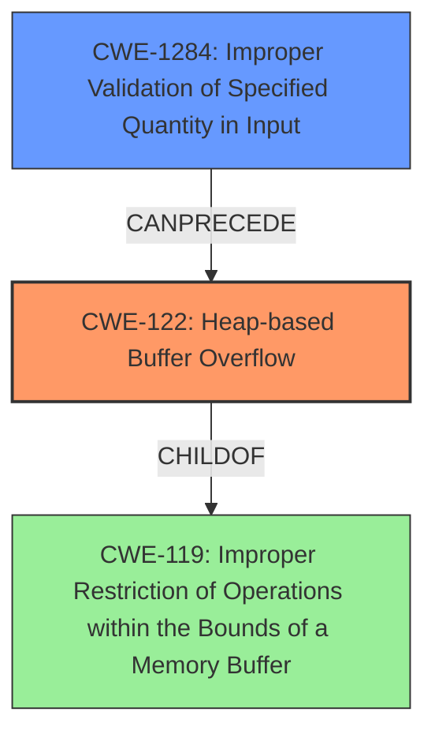

# Final Resolution for CVE-2021-40058

# Summary

| CWE ID | CWE Name | Confidence | CWE Abstraction Level | CWE Vulnerability Mapping Label | CWE-Vulnerability Mapping Notes |
|---|---|---|---|---|---|
| CWE-122 | Heap-based Buffer Overflow | 0.95 | Variant | Allowed | Primary CWE |
| CWE-1284 | Improper Validation of Specified Quantity in Input | 0.75 | Base | Allowed | Secondary Candidate |

## Evidence and Confidence

*   **Confidence Score:** 0.85
*   **Evidence Strength:** MEDIUM

## Relationship Analysis

The decision was influenced by the parent-child relationship between CWE-122 and CWE-119, opting for the more specific CWE-122. Additionally, the potential for CWE-1284 to precede CWE-122 in a vulnerability chain was considered. The abstraction levels (Variant for CWE-122, Base for CWE-1284) were deemed appropriate for the level of detail available.

## Vulnerability Chain

The vulnerability chain starts with **CWE-1284** (Improper Validation of Specified Quantity in Input), where the video framework fails to properly validate the size or length of the input video data. This leads to **CWE-122** (Heap-based Buffer Overflow) when the framework allocates an insufficient buffer size on the heap based on the untrusted input, and then writes data beyond the allocated buffer. The impact is a denial-of-service due to the heap overflow.

## Summary of Analysis

The initial analysis correctly identified **CWE-122** (Heap-based Buffer Overflow) as the primary weakness. The criticism highlighted the potential omission of input validation issues. Given the description mentioning the processing of "malformed video data," it's highly probable that improper input validation contributes to the vulnerability. Therefore, **CWE-1284** (Improper Validation of Specified Quantity in Input) is added as a secondary CWE, replacing **CWE-131**.

The decision to include **CWE-1284** is based on the evidence that "processing of malformed video data could be a vector." This strongly suggests a failure to validate the input size or length parameters, which directly aligns with the description of **CWE-1284**: "The product receives input that is expected to specify a quantity (such as size or length), but it does not validate or incorrectly validates that the quantity has the required properties."

**CWE-122** is chosen as the primary CWE because the vulnerability is explicitly described as a "heap-based buffer overflow." This is a direct match, and **CWE-122** is a variant of **CWE-119** (Buffer Overflow), providing a more specific classification.

The selected CWEs are at the optimal level of specificity. **CWE-122** is a variant that specifies the heap location of the overflow, while **CWE-1284** is a base-level CWE that clearly describes the input validation issue. Together, they provide a comprehensive representation of the vulnerability.