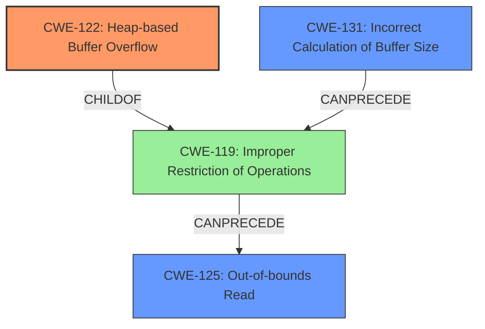

# Final Resolution for CVE-2021-40060

# Summary
| CWE ID | CWE Name | Confidence | CWE Abstraction Level | CWE Vulnerability Mapping Label | CWE-Vulnerability Mapping Notes |
|---|---|---|---|---|---|
| CWE-122 | Heap-based Buffer Overflow | 0.9 | Variant | Primary | Allowed |
| CWE-131 | Incorrect Calculation of Buffer Size | 0.5 | Base | Potential Root Cause | Allowed |
| CWE-125 | Out-of-bounds Read | 0.4 | Base | Potential Consequence | Allowed |

## Evidence and Confidence

*   **Confidence Score:** 0.8
*   **Evidence Strength:** MEDIUM

## Relationship Analysis
The primary weakness is **CWE-122** (Heap-based Buffer Overflow), which is a variant of **CWE-119** (Improper Restriction of Operations within the Bounds of a Memory Buffer). **CWE-131** (Incorrect Calculation of Buffer Size) can precede **CWE-119**, as an incorrect size calculation can lead to a buffer overflow. **CWE-125** (Out-of-bounds Read) is a potential consequence of **CWE-119**. The abstraction levels of these CWEs (Variant, Base, Base respectively) are appropriate for the level of detail provided in the vulnerability description.

## Vulnerability Chain
The vulnerability chain starts with a potential **ROOTCAUSE** of **CWE-131** (Incorrect Calculation of Buffer Size), which leads to **CWE-122** (Heap-based Buffer Overflow), resulting in a potential consequence of **CWE-125** (Out-of-bounds Read) and ultimately affecting system availability. The description doesn't confirm the presence of the out-of-bounds read, hence it is a potential consequence.

## Summary of Analysis
The initial analysis correctly identified **CWE-122** (Heap-based Buffer Overflow) as the primary **WEAKNESS**. The criticism provided suggestions to strengthen the justification for secondary CWEs, specifically **CWE-131** (Incorrect Calculation of Buffer Size) and **CWE-125** (Out-of-bounds Read).

I have increased the confidence in **CWE-131** (Incorrect Calculation of Buffer Size) to 0.5 because, while not explicitly stated, a **heap-based buffer overflow** often originates from an incorrect size calculation. Therefore, it's reasonable to consider it a potential root cause based on the vulnerability description. I reduced the confidence in **CWE-125** (Out-of-bounds Read) to 0.4 because it is an assumed consequence of the overflow, but is not explicitly stated in the vulnerability description.

The graph relationships helped to clarify the potential vulnerability chain, showing how an incorrect buffer size calculation can lead to a buffer overflow and potentially an out-of-bounds read.

The selected CWEs are at the optimal level of specificity, given the available evidence. **CWE-122** (Heap-based Buffer Overflow) precisely describes the type of buffer overflow, while **CWE-131** (Incorrect Calculation of Buffer Size) and **CWE-125** (Out-of-bounds Read) represent potential contributing factors and consequences, respectively.