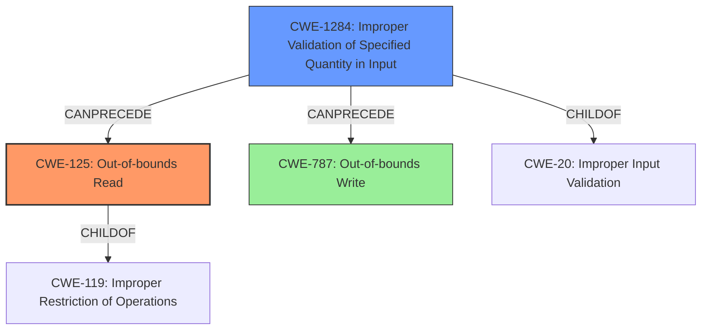

# Analysis Report for CVE-2021-40167

# Vulnerability Analysis Report: CVE-2021-40167

## Description

A malicious crafted dwf or .pct file when consumed through DesignReview.exe application could lead to memory corruption vulnerability by read access violation. This vulnerability in conjunction with other vulnerabilities could lead to code execution in the context of the current process.

## Vulnerability Description Key Phrases

**Rootcause:** read access violation
**Weakness:** memory corruption
**Impact:** code execution
**Vector:** malicious crafted dwf or .pct file

## Analysis (with Relationship Data)

# Summary
| CWE ID | CWE Name | Confidence | CWE Abstraction Level | CWE Vulnerability Mapping Label | CWE-Vulnerability Mapping Notes |
|---|---|---|---|---|---|
| CWE-125 | Out-of-bounds Read | 0.85 | Base | Primary | Allowed |
| CWE-787 | Out-of-bounds Write | 0.65 | Base | Secondary Candidate | Allowed |

## Evidence and Confidence

*   **Confidence Score:** 0.80
*   **Evidence Strength:** HIGH

- **Analysis and Justification:**  
  - *Explanation:* The vulnerability description indicates a "**memory corruption** vulnerability by **read access violation**" when processing a malicious crafted dwf or .pct file using DesignReview.exe. This directly aligns with CWE-125 (Out-of-bounds Read), where the product reads data past the end, or before the beginning, of the intended buffer. The CVE reference specifically mentions a "read access violation" which further supports this mapping. The retriever results also list CWE-125 as the top candidate based on combined score. While CWE-787 (Out-of-bounds Write) is also a potential candidate given the memory corruption, the "read access violation" indicates that the primary issue is reading memory outside of the intended buffer. Therefore, CWE-125 is chosen as the primary CWE. MITRE mapping guidance for CWE-125 indicates this is ALLOWED.

  - *Relationship Analysis:* CWE-125 is a base-level CWE and is a child of CWE-119 (Improper Restriction of Operations within the Bounds of a Memory Buffer). The vulnerability description doesn't provide enough information to identify a more specific variant of CWE-125. The "CanFollow" relationship of CWE-125 to CWE-825 (Expired Pointer Dereference), CWE-824 (Access of Uninitialized Pointer), CWE-823 (Use of Out-of-range Pointer Offset), and CWE-822 (Untrusted Pointer Dereference) suggest potential follow-on weaknesses if the out-of-bounds read leads to further vulnerabilities. CWE-787 (Out-of-bounds Write) is also a related CWE and is listed as a secondary candidate.

- **Confidence Score:**
  - Confidence: 0.85 (High confidence due to explicit "read access violation" and memory corruption, aligning with CWE-125)

---

## Criticism of Analysis

Okay, I've reviewed the provided analysis and the full CWE specifications. Here's my critique:

**Overall Assessment:**

The analysis is generally good, providing a clear justification for the primary CWE selection of CWE-125 (Out-of-bounds Read). The inclusion of a secondary candidate (CWE-787) is also reasonable, acknowledging the broader "memory corruption" aspect. However, there are some areas where the confidence could be improved, the relationship analysis strengthened, and the potential for more specific CWEs considered.

**Detailed Critique:**

1.  **Primary CWE: CWE-125 (Out-of-bounds Read)**

    *   **Strengths:**
        *   The explanation correctly identifies that the "read access violation" explicitly points to CWE-125.
        *   It acknowledges that while memory corruption could also indicate a write, the "read" keyword is more specific.
        *   The usage is marked as Allowed, as per CWE guidelines.
        *   Good use of terminology and alternative terms
    *   **Areas for Improvement:**
        *   **Specificity:** While CWE-125 is a good base choice, consider exploring if a more specific *variant* of CWE-125 could apply.  For example:
            *   **CWE-823: Use of Out-of-range Pointer Offset:** If the out-of-bounds read is happening because a pointer offset is being manipulated (e.g., reading `array[i + offset]` where `offset` is malicious), then CWE-823 would be more precise. The example CVEs provided for CWE-823 are relevant.  Does the format of the DWF/PCT file allow control of offsets?  If so, this is a strong contender.
            *   **CWE-127: Buffer Under-read:** It is unlikely in this case, but it is good practice to double-check that the "read access violation" is not happening *before* the intended buffer.
        *   **Relationship Analysis:** The "CanFollow" relationships of CWE-125 to other CWEs are not well-explored. While the analysis mentions them, it doesn't connect them to the specific vulnerability.  How *could* the OOB read lead to CWE-825 (Expired Pointer Dereference), CWE-824 (Access of Uninitialized Pointer), CWE-823, or CWE-822?  For instance, could the out-of-bounds read retrieve a pointer that is then used, leading to one of these issues? Describing potential scenarios would increase confidence.

2.  **Secondary Candidate: CWE-787 (Out-of-bounds Write)**

    *   **Strengths:**
        *   Acknowledges that "memory corruption" is a broader term that *could* involve writes.
    *   **Areas for Improvement:**
        *   The justification for *not* choosing CWE-787 as primary could be slightly stronger. Emphasize that the vulnerability *explicitly states a read access violation*. If there was no mention of "read access violation", CWE-787 would be a stronger contender given the "memory corruption" language.
        *   If a write is suspected, explore CWE-788, access of memory location after end of buffer.
        *   Check for any indication of the attacker controlling buffer sizes.

3.  **Confidence Score:**

    *   While a score of 0.85 for CWE-125 is reasonable given the information, further investigation into variants and relationships, as described above, could push this even higher if more specific information is found in the DWF/PCT file format. The confidence for CWE-787 is reasonably low.
    *   Remember that confidence scores reflect the certainty of the *specific* CWE mapping, not just the presence of *a* vulnerability.

4.  **Retriever Results:**

    *   The retriever results are valuable and should be considered. However, the analysis should not solely rely on them. Use the results as hints to explore other potential CWEs but always make the final decision based on a thorough understanding of the vulnerability.
    *   The retriever results list some other CWEs that *could* be relevant, but only in specific circumstances. For example:
        *   **CWE-476 (NULL Pointer Dereference):** Could an OOB read return a NULL value that is subsequently dereferenced? (Chain of events)
        *   **CWE-190 (Integer Overflow):** Could the size of the buffer be related to an integer overflow? (Calculation of the size)
        *   **CWE-427 (Uncontrolled Search Path Element)** This CWE is completely irrelevant.
        *   **CWE-782 (Exposed IOCTL with Insufficient Access Control)** This CWE is completely irrelevant.

5.  **General Recommendations:**

    *   **Focus on Root Cause:**  The analysis should strive to identify the *root cause* of the memory corruption.  Is it simply a missing bounds check (CWE-125/787)? Or is there another factor at play, such as improper input validation (leading to an incorrect buffer size or offset), an integer overflow, or a type confusion? Identifying the root cause strengthens the analysis.
    *   **Input Validation:** The vulnerability stems from a malicious *crafted* file. Therefore, it's highly likely that *improper input validation* (CWE-20) is involved *somewhere*. However, CWE-20 is too broad. You need to pinpoint the *specific* type of improper validation. For example:
        *   **CWE-1284: Improper Validation of Specified Quantity in Input:** If the malicious file contains a size/length field that's not properly checked, and that size is used to read or write data, this is very relevant.
        *  **CWE-129: Improper Validation of Array Index:** If an attacker can influence the index used to access the memory location.
    *   **Chain of Events:** Think in terms of a "chain of events." The attacker provides a malicious file (CWE-20)-> This leads to an incorrect calculation or missing validation (e.g., CWE-1284)-> This results in an out-of-bounds read (CWE-125). Documenting this chain strengthens the analysis.
    *   **Consider attack vector**: The DWF/PCT file is used as an attack vector, so what input is attacker controlling in the malicious file, and how it is handled?
    *   **Exploration of the DWF/PCT Format:** To improve the analysis, it's necessary to understand *how* the DWF/PCT files are parsed and processed by `DesignReview.exe`.  What fields are present, and how are they used to determine buffer sizes, offsets, etc.?  This knowledge will enable a more specific CWE mapping.
    *   **Mitigations:** Briefly mentioning relevant mitigations from the CWE specifications can add value. For example, "Using a memory-safe language (Mitigation 1 for CWE-787) would eliminate this vulnerability."

**Revised Summary Table (Illustrative):**

| CWE ID   | CWE Name                 | Confidence | CWE Abstraction Level | CWE Vulnerability Mapping Label | CWE-Vulnerability Mapping Notes                                                                                                                                                                  |
| :------- | :----------------------- | :--------- | :-------------------- | :------------------------------ | :--------------------------------------------------------------------------------------------------------------------------------------------------------------------------------------------- |
| CWE-125 | Out-of-bounds Read       | 0.75     | Base                   | Primary                       | Explicit "read access violation." However, consider CWE-823 if offsets are attacker-controlled.                                                                                               |
| CWE-1284  | Improper Validation of Specified Quantity in Input | 0.5 | Base | Contributing Factor | Input validation on the size of the buffer was likely missing, which made it possible for attacker to cause the out-of-bounds read. |
| CWE-787   | Out-of-bounds Write      | 0.65     | Base                   | Secondary Candidate         | Less likely given the "read access violation" but possible if the root cause involves a size miscalculation leading to an overflow write.                                                                                    |

**In conclusion:** The provided analysis is a solid starting point. By focusing on specificity, exploring relationships between CWEs, and understanding the details of the file format and code involved, the analysis can be further strengthened and the confidence level increased. Remember to always consider the *chain* of events and the *root cause* of the vulnerability.

## Final Resolution

# Summary
| CWE ID | CWE Name | Confidence | CWE Abstraction Level | CWE Vulnerability Mapping Label | CWE-Vulnerability Mapping Notes |
|---|---|---|---|---|---|
| CWE-125 | Out-of-bounds Read | 0.75 | Base | Primary | Allowed |
| CWE-1284 | Improper Validation of Specified Quantity in Input | 0.60 | Base | Contributing Factor | Allowed |
| CWE-787 | Out-of-bounds Write | 0.50 | Base | Secondary Candidate | Allowed |

## Evidence and Confidence

*   **Confidence Score:** 0.70
*   **Evidence Strength:** MEDIUM

## Relationship Analysis
The primary weakness is CWE-125 (**Out-of-bounds Read**), a base-level CWE. It's a child of CWE-119 (**Improper Restriction of Operations within the Bounds of a Memory Buffer**), but selecting CWE-119 would be too general. The criticism suggested CWE-823 (**Use of Out-of-range Pointer Offset**) as a more specific alternative if the offset is attacker-controlled. However, the description lacks this specific detail. CWE-1284 (**Improper Validation of Specified Quantity in Input**) is included as a contributing factor because the vulnerability arises from a maliciously crafted file, implying a failure to validate input size or length. CWE-787 (**Out-of-bounds Write**) remains a secondary candidate because memory corruption could involve writes, though the explicit mention of a "read access violation" makes it less likely. The "CanFollow" relationships of CWE-125 were considered, potentially leading to issues like CWE-825 (**Expired Pointer Dereference**), CWE-824 (**Access of Uninitialized Pointer**), CWE-823, or CWE-822 (**Untrusted Pointer Dereference**), but these are speculative without further information.

## Vulnerability Chain
The vulnerability chain starts with a maliciously crafted DWF or PCT file (CWE-20 **Improper Input Validation** - though this is too general). The crafted file is consumed by DesignReview.exe. A failure to properly validate the size or length fields in the file (CWE-1284 **Improper Validation of Specified Quantity in Input**) leads to an out-of-bounds read (CWE-125 **Out-of-bounds Read**), resulting in memory corruption and a read access violation. This could potentially lead to code execution if exploited in conjunction with other vulnerabilities. The chain highlights how improper input validation enables the out-of-bounds read.

## Summary of Analysis
The initial analysis correctly identified CWE-125 (**Out-of-bounds Read**) as the primary weakness due to the explicit "read access violation" mentioned in the vulnerability description: "A malicious crafted dwf or .pct file when consumed through DesignReview.exe application could lead to **memory corruption vulnerability by read access violation**".

The criticism suggested exploring more specific variants of CWE-125, like CWE-823 (**Use of Out-of-range Pointer Offset**), if the offset was attacker-controlled. However, there's no evidence in the description to support this. The criticism also highlighted the potential role of input validation, which led to the inclusion of CWE-1284 (**Improper Validation of Specified Quantity in Input**) as a contributing factor. This is based on the fact that the file is maliciously crafted, suggesting a failure to properly handle the file's contents, especially size-related fields.

The graph relationships influenced the decision by clarifying the parent-child relationship between CWE-125 and CWE-119 (**Improper Restriction of Operations**), reinforcing that CWE-125 is a more specific and appropriate choice than its parent. The "CanPrecede" relationship between CWE-1284 and CWE-125 highlights how input validation failures can directly lead to out-of-bounds reads.

The selected CWEs are at the optimal level of specificity given the available evidence. While a more specific variant of CWE-125 might exist, there's insufficient information to confirm it. CWE-125 directly reflects the "read access violation," while CWE-1284 accounts for the role of improper input validation in enabling the vulnerability. CWE-787 remains a possibility given memory corruption but is not explicitly indicated. The confidence score reflects the certainty in the mapping based on the vulnerability description.

*Report generated on 2025-03-18 01:45:59*
