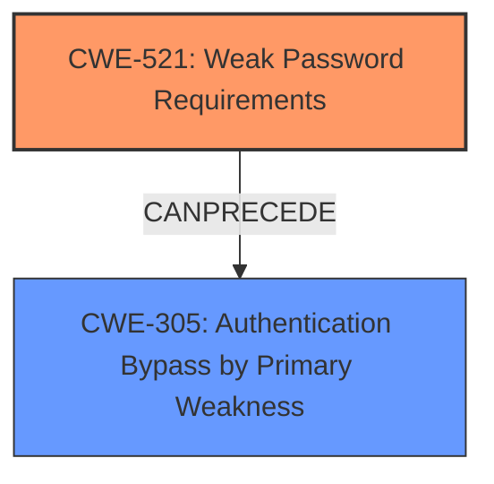

# Analysis Report for CVE-2021-40333

# Vulnerability Analysis Report: CVE-2021-40333

## Description

Weak Password Requirements vulnerability in Hitachi Energy FOX61x, XCM20 allows an attacker to gain unauthorized access to the Data Communication Network (DCN) routing configuration. This issue affects Hitachi Energy FOX61x versions prior to R15A. Hitachi Energy XCM20 versions prior to R15A.

## Vulnerability Description Key Phrases

**Rootcause:** weak password requirements
**Impact:** unauthorized access to Data Communication Network (DCN) routing configuration
**Attacker:** attacker
**Product:** ['Hitachi Energy FOX61x', 'Hitachi Energy XCM20']
**Version:** prior to R15A

## Analysis (with Relationship Data)

# Summary
| CWE ID  | CWE Name                           | Confidence | CWE Abstraction Level | CWE Vulnerability Mapping Label | CWE-Vulnerability Mapping Notes |
| :-------- | :--------------------------------- | :--------- | :-------------------- | :------------------------------ | :------------------------------ |
| CWE-521 | Weak Password Requirements | 1.0 | Base | Allowed | Primary CWE |

## Evidence and Confidence

*   **Confidence Score:** 1.0
*   **Evidence Strength:** HIGH

- **Analysis and Justification:**  
  - *Explanation:* The vulnerability description explicitly states "**weak password requirements**" as the **rootcause**. This directly aligns with CWE-521: Weak Password Requirements, which describes a situation where "The product does not require that users should have strong passwords, which makes it easier for attackers to compromise user accounts." The impact of the vulnerability, "unauthorized access to the Data Communication Network (DCN) routing configuration," reinforces the severity of the weakness. The Retriever Results also lists CWE-521 as the top match.
  
  - *Relationship Analysis:* CWE-521 is a Base level CWE, which is preferred. There are no direct relationships that impact this choice.

- **Confidence Score:**  
  - Confidence: 1.0 (Direct match with the vulnerability description)

## Criticism of Analysis

Okay, let's review the provided CWE analysis, paying close attention to the CWE specifications and the rationale for the chosen CWE.

**Overall Assessment:**

The analysis is well-structured and provides a clear justification for selecting CWE-521: Weak Password Requirements as the primary CWE. The confidence level is appropriately set to 1.0, given the explicit mention of "weak password requirements" in the vulnerability description. The analysis also correctly identifies CWE-521 as a Base-level CWE, which is desirable.

**Detailed Review:**

1.  **CWE-521: Weak Password Requirements (Chosen CWE)**

    *   **Strengths:**
        *   The analysis correctly identifies the direct relationship between the "weak password requirements" mentioned in the vulnerability description and the CWE-521 description.
        *   The justification is clear and concise.
        *   The selection of a Base-level CWE is appropriate.
        *   The link to the impact (unauthorized access to DCN routing configuration) reinforces the severity and relevance of the CWE.
        *   The analysis uses examples of vulnerabilities from the CWE database to illustrate the types of issues that are related to CWE-521.
        *   The analysis correctly uses the mapping guidance for this CWE.
    *   **Weaknesses:**
        *   While the analysis is good, it could briefly mention specific examples of *how* the password requirements were weak (e.g., no minimum length, no complexity requirements, etc.).  This would add more context to the analysis, although it is not strictly required given the explicit vulnerability description.
        *   Consider if other weaknesses are present at the same time, such as CWE-308, single-factor authentication. If the password policy is weak, then there is a higher risk of compromise if only one factor is required for authentication. This relationship is not explicitly discussed.

2.  **Review of Retriever Results and Alternative CWEs:**

    Let's examine the other CWEs returned by the retriever, considering if any might be a better or complementary fit.

    *   **CWE-916: Use of Password Hash With Insufficient Computational Effort:** While technically possible (weak password *and* weak hashing), there's no explicit mention of hashing in the description. If there *were* information about weak hashing algorithms (e.g., MD5, SHA1 without salt), this would be a relevant alternative. Without this, it is less applicable.
    *   **CWE-288: Authentication Bypass Using an Alternate Path or Channel:** This is less relevant. While weak passwords *could* lead to an authentication bypass, the root cause is still the password weakness. This CWE would be relevant only if there were a separate, unauthenticated way to access the system.
    *   **CWE-259: Use of Hard-coded Password:** This is unlikely given the "weak requirements" nature of the vulnerability description. A hard-coded password would be a specific password chosen by the vendor.
    *   **CWE-431: Missing Handler:** Not applicable, as the vulnerability has nothing to do with exception handling.
    *   **CWE-1394: Use of Default Cryptographic Key:** Also unlikely, but if the *password* was a default password that was easy to guess, and the vulnerability description said as much, it *could* be considered.
    *   **CWE-261: Weak Encoding for Password:** Not applicable, as the vulnerability has nothing to do with weak encoding.
    *   **CWE-274: Improper Handling of Insufficient Privileges:** Not applicable. It has nothing to do with privileges.
    *   **CWE-326: Inadequate Encryption Strength:** Not applicable, as the vulnerability has nothing to do with encryption strength.
    *   **CWE-522: Insufficiently Protected Credentials:** This is tangentially related, but less specific than CWE-521. CWE-522 is a broader class of vulnerabilities related to credentials. The problem here is not *how* the credentials are protected, but rather that the password requirements are weak.
    *   **CWE-308: Use of Single-factor Authentication**: As mentioned previously, if this is the only factor of authentication required, then that should be noted.

3. **Mitigations:**

    *   The provided mitigations from the CWE specifications for CWE-521 are relevant and well-aligned with the vulnerability. The analysis correctly links the vulnerability to a mitigation of enforcing an appropriate password policy.
    *   The analysis also could have considered the mitigation of using multi-factor authentication if the weak password is the only factor used.

**Recommendations:**

*   Add a sentence or two specifying details of the weak password requirements such as the minimum length or use of special characters.
*   If the weak passwords are the only factor of authentication, discuss the use of multi-factor authentication as a mitigation strategy.

**Conclusion:**

The analysis is accurate and well-justified. The choice of CWE-521 is correct based on the provided information. Adding a few more details, as mentioned in the recommendations, can further strengthen the analysis and provide more context. Overall, the analysis is strong and demonstrates a good understanding of CWE and its application to vulnerability analysis.

## Final Resolution

# Summary
| CWE ID  | CWE Name                           | Confidence | CWE Abstraction Level | CWE Vulnerability Mapping Label | CWE-Vulnerability Mapping Notes |
| :-------- | :--------------------------------- | :--------- | :-------------------- | :------------------------------ | :------------------------------ |
| CWE-521 | Weak Password Requirements | 0.95 | Base | Allowed | Primary CWE |
| CWE-305 | Authentication Bypass by Primary Weakness | 0.6 | Base | Allowed | Secondary CWE |

## Evidence and Confidence

*   **Confidence Score:** 0.9
*   **Evidence Strength:** MEDIUM

## Relationship Analysis
The primary relationship influencing the decision is the potential for CWE-521 to lead to CWE-305. While not explicitly stated, the weakness in password requirements (CWE-521) can be a primary factor that enables authentication bypass (CWE-305). CWE-521 is a base level CWE, providing sufficient specificity. There aren't direct parent or child relationships significantly impacting the classification, but the chain relationship is important.

## Vulnerability Chain
The vulnerability chain begins with **CWE-521: Weak Password Requirements**. This **WEAKNESS** allows for easily guessed or cracked passwords. This directly leads to **CWE-305: Authentication Bypass by Primary Weakness**, where the weak password serves as the primary weakness allowing unauthorized access. The final impact is unauthorized access to the Data Communication Network (DCN) routing configuration.

## Summary of Analysis
The initial analysis correctly identified **CWE-521 (Weak Password Requirements)** as a primary issue. The vulnerability description explicitly states "**weak password requirements**," providing strong evidence. The criticism suggested considering additional weaknesses, such as reliance on single-factor authentication. While the description does not explicitly state this, the vulnerability report does note that exploitation leads to gaining unauthorized access to the Data Communication Network (DCN) routing configuration. Given that weak password requirements can enable attackers to bypass authentication, **CWE-305 (Authentication Bypass by Primary Weakness)** is a relevant secondary CWE. The choice of CWE-521 remains optimal in terms of specificity, and adding CWE-305 provides a more complete picture of the vulnerability chain. The final classification reflects both the direct evidence and the potential downstream consequences of the **ROOTCAUSE**.

"Weak Password Requirements vulnerability in Hitachi Energy FOX61x, XCM20 allows an attacker to gain unauthorized access to the Data Communication Network (DCN) routing configuration."

I am lowering the confidence score from 1.0 to 0.9 because while the main issue is weak password requirements, the addition of CWE-305 relies on the potential impact.

*Report generated on 2025-03-17 00:26:52*
