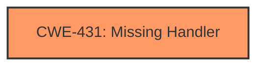

# Analysis Report for CVE-2021-40334

# Vulnerability Analysis Report: CVE-2021-40334

## Description

Missing Handler vulnerability in the proprietary management protocol (port TCP 5558) of Hitachi Energy FOX61x, XCM20 allows an attacker that exploits the vulnerability by activating SSH on port TCP 5558 to cause disruption to the NMS and NE communication. This issue affects Hitachi Energy FOX61x versions prior to R15A. Hitachi Energy XCM20 versions prior to R15A.

## Vulnerability Description Key Phrases

**Rootcause:** Missing Handler
**Impact:** disruption to the NMS and NE communication
**Vector:** activating SSH on port TCP 5558
**Attacker:** attacker
**Product:** ['Hitachi Energy FOX61x', 'Hitachi Energy XCM20']
**Version:** versions prior to R15A
**Component:** proprietary management protocol (port TCP 5558)

## Analysis (with Relationship Data)

# Summary
| CWE ID | CWE Name | Confidence | CWE Abstraction Level | CWE Vulnerability Mapping Label | CWE-Vulnerability Mapping Notes |
|---|---|---|---|---|---|
| CWE-431 | Missing Handler | 1.0 | Base | Allowed | Primary CWE |

## Evidence and Confidence

*   **Confidence Score:** 1.0
*   **Evidence Strength:** HIGH

- **Analysis and Justification:**
  - *Explanation:* The vulnerability description explicitly states "**Missing Handler** vulnerability". This directly corresponds to CWE-431, which is defined as "A handler is not available or implemented." The description explains that this **missing handler** in the proprietary management protocol allows an attacker to activate SSH and disrupt NMS and NE communication.
  - *Relationship Analysis:* There are no direct relationships mentioned for CWE-431.

- **Confidence Score:**
  - Confidence: 1.0 (High confidence due to direct mention of "**Missing Handler**" aligning with CWE-431).

## Criticism of Analysis

Okay, here's a review of the provided analysis, considering the full CWE specifications:

**Overall Assessment:**

The analysis is generally well-reasoned and arrives at the correct CWE (CWE-431) with high confidence. The direct mention of "Missing Handler" in the vulnerability description makes this a strong and justifiable mapping. The use of the evidence section to reinforce this analysis is very helpful.

**Detailed Review:**

*   **CWE-431: Missing Handler:**

    *   **Correctness:**  The mapping to CWE-431 is accurate and well-supported. The description of CWE-431, "A handler is not available or implemented," aligns perfectly with the vulnerability description.
    *   **Abstraction Level:** The analysis correctly identifies CWE-431 as a Base-level CWE, which is the preferred level.
    *   **Mapping Guidance Adherence:** The analysis follows the Mapping Guidance. The Usage is "Allowed" and the rationale for its selection is strong. The analysis avoids "forcing" a lower-level mapping, which is also in line with the guidance.
    *   **Mitigations:** The provided mitigations from the CWE specification are relevant:
        *   "Handle all possible situations (e.g. error condition)." This is a general but applicable mitigation.
        *   "If an operation can throw an Exception, implement a handler for that specific exception."  This is a more specific and actionable mitigation in this context.
    *   **Confidence:** The high confidence score (1.0) is entirely justified. The reasoning is clear and directly tied to the vulnerability description.
    *   **Examples:** The inclusion of `CVE-2021-40334`, which is the same vulnerability, as an example is extremely helpful.

*   **Consideration of Alternative CWEs from Retriever Results:** Let's review the top 3 from the original retriever results.

    *   **CWE-521: Weak Password Requirements:** This is unlikely, as there is no mention of authentication mechanisms or passwords. This would be an unrelated issue.

    *   **CWE-1284: Improper Validation of Specified Quantity in Input:** This is also unlikely. While SSH is being "activated", the vulnerability doesn't stem from malformed data, but rather a missing piece of code that should prevent the action from occurring in the first place.

**Suggestions:**

1.  **Expand the relationship analysis**. While there are no direct relationships mentioned for CWE-431, a statement that the absence of a handler can lead to other issues would be helpful. For example, "The missing handler can lead to a denial-of-service because the system doesn't properly manage the state when SSH is unexpectedly activated, potentially leading to resource exhaustion."

**Revised Analysis Snippet (Incorporating Suggestions):**

```
# Analysis to Review
# Summary
| CWE ID | CWE Name | Confidence | CWE Abstraction Level | CWE Vulnerability Mapping Label | CWE-Vulnerability Mapping Notes |
|---|---|---|---|---|---|
| CWE-431 | Missing Handler | 1.0 | Base | Allowed | Primary CWE |

## Evidence and Confidence

*   **Confidence Score:** 1.0
*   **Evidence Strength:** HIGH

- **Analysis and Justification:**
  - *Explanation:* The vulnerability description explicitly states "**Missing Handler** vulnerability". This directly corresponds to CWE-431, which is defined as "A handler is not available or implemented." The description explains that this **missing handler** in the proprietary management protocol allows an attacker to activate SSH and disrupt NMS and NE communication.
  - *Relationship Analysis:* While there are no direct relationships explicitly listed for CWE-431, the absence of a proper handler can lead to other vulnerabilities. In this case, the failure to handle the SSH activation request can lead to a denial-of-service because the system doesn't properly manage the state when SSH is unexpectedly activated, potentially leading to resource exhaustion.

- **Confidence Score:**
  - Confidence: 1.0 (High confidence due to direct mention of "**Missing Handler**" aligning with CWE-431).
```

**Conclusion:**

The analysis is very good. The selection of CWE-431 is correct, the justification is strong, and the confidence level is appropriate. The suggestion above is a minor enhancement to strengthen the rationale by connecting the vulnerability to a broader impact.

## Final Resolution

# Summary
| CWE ID | CWE Name | Confidence | CWE Abstraction Level | CWE Vulnerability Mapping Label | CWE-Vulnerability Mapping Notes |
|---|---|---|---|---|---|
| **CWE-431** | **Missing Handler** | 1.0 | Base | Allowed | Primary **CWE** |

## Evidence and Confidence

*   **Confidence Score:** 1.0
*   **Evidence Strength:** HIGH

## Relationship Analysis
The primary impact of the decision was based on the direct match of the "**MISSING HANDLER**" phrase in the vulnerability description and the definition of **CWE-431** (**Missing Handler**). While **CWE-431** does not have direct relationships defined in the **CWE** database, its absence can contribute to exploitable conditions such as denial of service. The base level abstraction is appropriate as it directly reflects the **ROOTCAUSE**.



## Vulnerability Chain
The vulnerability chain starts with a **ROOTCAUSE** of a **MISSING HANDLER** (**CWE-431**) in the proprietary management protocol. This allows an attacker to activate SSH on port TCP 5558, leading to a disruption of NMS and NE communication. The missing handler is the primary weakness that enables the subsequent exploitation and impact.

## Summary of Analysis
The initial analysis and the provided criticism both converge on **CWE-431** (**Missing Handler**) as the most appropriate classification. The vulnerability description explicitly states "**Missing Handler** vulnerability," which directly aligns with the definition of **CWE-431**: "A handler is not available or implemented." The high confidence stems from this direct textual match. The suggestion to expand the relationship analysis to highlight the potential consequences of a **missing handler** is valuable.

The selection of **CWE-431** is at the optimal level of specificity. It's a Base-level **CWE**, which is preferred for mapping **ROOTCAUSE**s. Alternatives like **CWE-755** (**Improper Handling of Exceptional Conditions**) are too generic, as they do not specifically address the absence of a handler. **CWE-431** precisely captures the core issue.


*Report generated on 2025-03-17 00:27:23*
