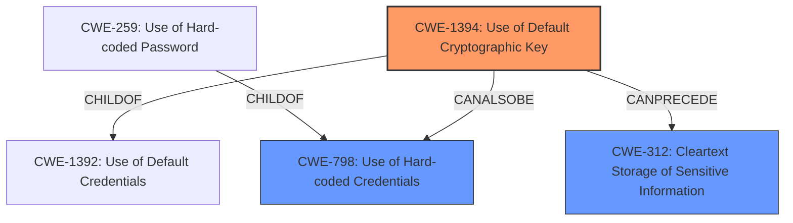

# Analysis Report for CVE-2021-40342

# Vulnerability Analysis Report: CVE-2021-40342

## Description

In the DES implementation, the affected product versions use a default key for encryption. Successful exploitation allows an attacker to obtain sensitive information and gain access to the network elements that are managed by the affected products versions. This issue affects * FOXMAN-UN product FOXMAN-UN R16A, FOXMAN-UN R15B, FOXMAN-UN R15A, FOXMAN-UN R14B, FOXMAN-UN R14A, FOXMAN-UN R11B, FOXMAN-UN R11A, FOXMAN-UN R10C, FOXMAN-UN R9C * UNEM product UNEM R16A, UNEM R15B, UNEM R15A, UNEM R14B, UNEM R14A, UNEM R11B, UNEM R11A, UNEM R10C, UNEM R9C. List of CPEs * cpe2.3ahitachienergyfoxman-unR16A******* * cpe2.3ahitachienergyfoxman-unR15B******* * cpe2.3ahitachienergyfoxman-unR15A******* * cpe2.3ahitachienergyfoxman-unR14B******* * cpe2.3ahitachienergyfoxman-unR14A******* * cpe2.3ahitachienergyfoxman-unR11B******* * cpe2.3ahitachienergyfoxman-unR11A******* * cpe2.3ahitachienergyfoxman-unR10C******* * cpe2.3ahitachienergyfoxman-unR9C******* * cpe2.3ahitachienergyunemR16A******* * cpe2.3ahitachienergyunemR15B******* * cpe2.3ahitachienergyunemR15A******* * cpe2.3ahitachienergyunemR14B******* * cpe2.3ahitachienergyunemR14A******* * cpe2.3ahitachienergyunemR11B******* * cpe2.3ahitachienergyunemR11A******* * cpe2.3ahitachienergyunemR10C******* * cpe2.3ahitachienergyunemR9C*******

## Vulnerability Description Key Phrases

**Rootcause:** use of default key for encryption
**Impact:** obtain sensitive information and gain access to network elements
**Product:** ['FOXMAN-UN', 'UNEM']
**Version:** ['R16A', 'R15B', 'R15A', 'R14B', 'R14A', 'R11B', 'R11A', 'R10C', 'R9C']

## Analysis (with Relationship Data)

# Summary
| CWE ID | CWE Name | Confidence | CWE Abstraction Level | CWE Vulnerability Mapping Label | CWE-Vulnerability Mapping Notes |
|---|---|---|---|---|---|
| CWE-1394 | Use of Default Cryptographic Key | 0.95 | Base | Allowed | Primary CWE |
| CWE-312 | Cleartext Storage of Sensitive Information | 0.60 | Base | Allowed | Secondary Candidate |

## Evidence and Confidence

*   **Confidence Score:** 0.90
*   **Evidence Strength:** HIGH

- **Analysis and Justification:**  
  - *Explanation:* The vulnerability description explicitly states the **rootcause** is the "**use of default key for encryption**". This directly aligns with CWE-1394 "Use of Default Cryptographic Key". The **impact** described is "**obtain sensitive information and gain access to network elements**," indicating the sensitive data is not adequately protected due to the weak default key. CWE-1394 is a Base level CWE with ALLOWED usage.
  - *Relationship Analysis:* While other CWEs are related to cryptographic weaknesses, CWE-1394 is the most specific to the **use of a default key**. CWE-1394 is a child of CWE-1392 (Use of Default Credentials) which is a more general case.

- **Confidence Score:**  
  - Confidence: 0.95 (High confidence because the vulnerability description directly matches the CWE description and usage guidance.)

---
- **Analysis and Justification:**  
  - *Explanation:* The vulnerability also leads to sensitive information being exposed, which could be considered **cleartext storage of sensitive information**, especially if the default key is easily compromised. Hence, CWE-312, "Cleartext Storage of Sensitive Information", is considered as a secondary candidate.
  - *Relationship Analysis:* CWE-312 is a base CWE with ALLOWED Usage.

- **Confidence Score:**  
  - Confidence: 0.60 (Medium confidence, dependent on whether the default key directly leads to de facto cleartext storage)

---

## Criticism of Analysis

Okay, here's a review of the provided analysis, considering the full CWE specifications.

**Overall Assessment:**

The analysis is generally good and arrives at a reasonable primary CWE. The reasoning for selecting CWE-1394 as the primary weakness is well-supported by the vulnerability description. The inclusion of CWE-312 as a secondary candidate is also plausible and demonstrates a deeper consideration of the potential impact.

**Detailed Review:**

**1. CWE-1394: Use of Default Cryptographic Key (Primary)**

*   **Confidence Level:** The assigned confidence level of 0.95 is justified. The vulnerability description directly states the use of a default key, making this a strong match.
*   **Justification:** The explanation clearly connects the "use of default key for encryption" from the vulnerability description to the CWE-1394 definition. The impact ("obtain sensitive information and gain access to network elements") further supports this mapping, as it highlights the potential consequences of using a weak or known key. The provided examples from the CWE database also align well with the described vulnerability.
*   **Relationship Analysis:** The analysis correctly identifies CWE-1392 as a parent CWE and explains the relationship.
*   **Mitigation:** The analysis could be improved by explicitly mentioning the potential mitigations outlined in the CWE specification. For example, stating that "a strong mitigation would be to require the administrator to change the key upon installation" would add more value.

**2. CWE-312: Cleartext Storage of Sensitive Information (Secondary)**

*   **Confidence Level:** The assigned confidence level of 0.60 is appropriate. The connection to CWE-312 is conditional on whether the default key effectively results in cleartext storage.
*   **Justification:** The explanation acknowledges that the validity of CWE-312 depends on the ease of compromise of the default key. If the key is easily obtained or known, the encrypted data is effectively in cleartext. The analysis appropriately highlights that this is a secondary consideration.
*   **Relationship Analysis:** The analysis correctly explains the relationship between using a weak key (CWE-1394) and the potential for information to be exposed as if it were stored in cleartext (CWE-312).
*   **Mitigation:** As with CWE-1394, the analysis could benefit from mentioning relevant mitigations from the CWE specification for CWE-312. For example, "Implementing data encryption at rest using robust, non-default keys would mitigate the risk of cleartext storage."

**3. Retriever Results Analysis (General Comments):**

*   The retriever results show that multiple CWEs were considered, which is good.
*   **CWE-326: Inadequate Encryption Strength:** This is a reasonable alternative that highlights that the DES encryption algorithm is considered inadequate. However, the primary issue is the use of a *default* key, not necessarily the algorithm itself. DES *could* be used securely if the key was strong and properly managed.
*   **CWE-321: Use of Hard-coded Cryptographic Key:** Similar to CWE-326, this is plausible but less precise than CWE-1394. The key might be considered hardcoded, but the main issue is it is the *default* key.
*   **CWE-327: Use of a Broken or Risky Cryptographic Algorithm:** This is related because DES is now considered a risky algorithm. But it doesn't capture the main point of the vulnerability, which is the use of default credentials. DES could be considered adequate, and still use a default key.

**Suggestions for Improvement:**

1.  **Explicitly Reference CWE Mitigations:** For both the primary and secondary CWEs, explicitly mention potential mitigations from the CWE specification. This would make the analysis more actionable and valuable.
2.  **Clarify the Connection between Default Key and Cleartext Storage:**  Elaborate on the conditions under which the use of a default key would lead to cleartext storage. For example: "If the default key is publicly known, easily cracked, or widely shared, the encrypted data is functionally equivalent to being stored in cleartext, as any attacker can decrypt it."
3.  **Address Algorithm Weakness (DES):** Consider explicitly mentioning that while CWE-1394 is the primary issue, the use of DES adds another layer of risk due to its inherent weaknesses and vulnerability to brute-force attacks, especially with a compromised or easily guessed default key. The mitigations could include upgrading to a stronger encryption algorithm.
4. **Consider CWE-798 (Use of Hardcoded Credentials):** While the primary issue is that it is *default*, the keys are likely hardcoded into the devices. Mentioning CWE-798 as a potential related weakness may be warranted, since the devices cannot generate unique keys.

**Revised Summary Table (Example):**

| CWE ID | CWE Name | Confidence | CWE Abstraction Level | CWE Vulnerability Mapping Label | CWE-Vulnerability Mapping Notes |
|---|---|---|---|---|---|
| CWE-1394 | Use of Default Cryptographic Key | 0.95 | Base | Allowed | Primary CWE. Mitigation: Require administrator to change the key upon installation. |
| CWE-312 | Cleartext Storage of Sensitive Information | 0.60 | Base | Allowed | Secondary Candidate. Dependent on the ease of compromise of the default key. Mitigation: Encrypt data at rest with strong, non-default keys. |

By incorporating these suggestions, the analysis will be more comprehensive and provide greater insight into the vulnerability and its potential impact.

## Final Resolution

# Summary
| CWE ID | CWE Name | Confidence | CWE Abstraction Level | CWE Vulnerability Mapping Label | CWE-Vulnerability Mapping Notes |
|---|---|---|---|---|---|
| **CWE-1394** | **Use of Default Cryptographic Key** | 0.95 | Base | Allowed | Primary CWE. Mitigation: Require administrator to change the key upon installation. |
| **CWE-798** | **Use of Hard-coded Credentials** | 0.70 | Base | Allowed | Secondary Candidate. The default key is likely hardcoded into the device. Mitigation: Avoid hardcoding credentials and implement secure key management practices. |
| **CWE-312** | **Cleartext Storage of Sensitive Information** | 0.60 | Base | Allowed | Secondary Candidate. Dependent on the ease of compromise of the default key. Mitigation: Encrypt data at rest with strong, non-default keys. |

## Evidence and Confidence

*   **Confidence Score:** 0.90
*   **Evidence Strength:** HIGH

## Relationship Analysis
The primary weakness is clearly the **use of a default cryptographic key (CWE-1394)**. This is a specific instance of using default credentials. **CWE-798 (Use of Hard-coded Credentials)** is a peer of **CWE-259 (Use of Hard-coded Password)**, which is a more specific version of **CWE-798**. The weakness can also lead to **CWE-312 (Cleartext Storage of Sensitive Information)** if the default key is easily compromised. The relationship analysis reinforces the initial assessment, indicating that the selected CWEs accurately capture the vulnerability's characteristics and potential consequences.

## Vulnerability Chain
The vulnerability chain starts with the **root cause: CWE-1394 (Use of Default Cryptographic Key)**. This leads to a situation where sensitive information is encrypted with a key that is known or easily guessed. This may be because of **CWE-798 (Use of Hard-coded Credentials)**. If the key is compromised, the encrypted data is effectively exposed as **CWE-312 (Cleartext Storage of Sensitive Information)**. The ultimate impact is the ability for an attacker to obtain sensitive information and gain unauthorized access to network elements.

## Summary of Analysis
The analysis is based on the vulnerability description, which states that the affected product versions use a default key for encryption. The initial analysis and the criticism both arrive at **CWE-1394 (Use of Default Cryptographic Key)** as the primary weakness, and the confidence score remains high (0.95). The inclusion of **CWE-312 (Cleartext Storage of Sensitive Information)** as a secondary candidate is also reasonable, as the use of a default key can lead to data being exposed as if it were stored in cleartext. As the keys are likely hardcoded into the devices, including **CWE-798 (Use of Hard-coded Credentials)** as a secondary candidate is also warranted. The selected CWEs are at the optimal level of specificity, as they accurately reflect the nature of the vulnerability and its potential impact.

*Report generated on 2025-03-17 03:30:02*
