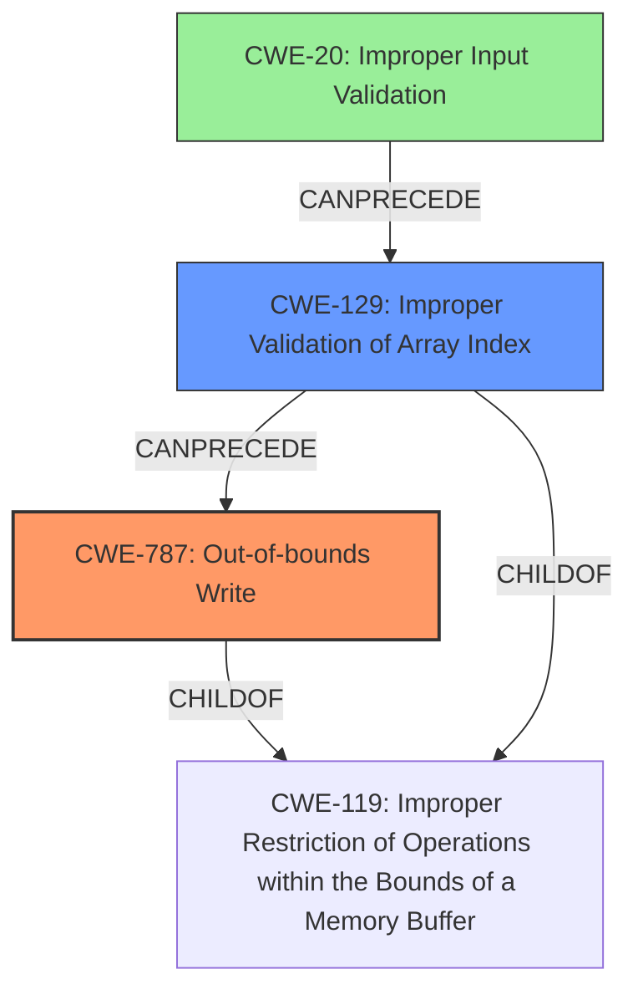

# Final Resolution for CVE-2021-40393

# Summary
| CWE ID  | CWE Name                     | Confidence | CWE Abstraction Level | CWE Vulnerability Mapping Label | CWE-Vulnerability Mapping Notes |
| :-------- | :--------------------------- | :--------- | :-------------------- | :------------------------------ | :------------------------------ |
| CWE-787 | **Out-of-bounds Write** | 1.0       | Base                 | Allowed                        | Primary **CWE**                      |
| CWE-129 | **Improper Validation of Array Index**  | 0.80      | Variant                  | Allowed                        | Secondary **CWE**                      |
| CWE-20 | **Improper Input Validation**  | 0.70      | Class                  | Allowed                        | Supporting **CWE**                      |

## Evidence and Confidence

*   **Confidence Score:** 0.95
*   **Evidence Strength:** HIGH

## Relationship Analysis
The analysis focuses on identifying the root cause and contributing factors to the vulnerability. CWE-787 (**Out-of-bounds Write**) is correctly identified as the primary weakness due to the direct mention of an out-of-bounds write in the vulnerability description. CWE-129 (**Improper Validation of Array Index**) is included as it describes the immediate cause of the out-of-bounds write. CWE-20 (**Improper Input Validation**) is included as a contributing factor, as the lack of input validation enables the improper array index validation.

## Vulnerability Chain
The vulnerability chain starts with **CWE-20 (Improper Input Validation)**, where the product does not properly validate the input. This leads to **CWE-129 (Improper Validation of Array Index)**, where the product uses an untrusted input when calculating or using an array index, but does not validate or incorrectly validates the index. This then leads to **CWE-787 (Out-of-bounds Write)**, where the product writes data past the end, or before the beginning, of the intended buffer.

## Summary of Analysis
The initial analysis correctly identified **CWE-787 (Out-of-bounds Write)** as the primary **weakness**. The criticism suggested increasing the confidence score for **CWE-129 (Improper Validation of Array Index)**, which is reflected in the updated table. The addition of **CWE-20 (Improper Input Validation)** provides a more complete view of the vulnerability chain. The evidence provided in the vulnerability description supports the inclusion of all three **CWEs**.

The following quotes from the vulnerability description support the classification:
*   "An **out-of-bounds write** vulnerability exists in the RS-274X aperture macro variables handling functionality of Gerbv 2.7.0" - Supports **CWE-787**.
*   "A specially-crafted gerber file can lead to code execution. An attacker can provide a malicious file to trigger this vulnerability." - Supports **CWE-20** by indicating a lack of input validation, allowing a malicious file to trigger the vulnerability.
* The CVE reference summary confirms that the root cause is the lack of proper bounds checking when accessing and modifying an array of parameters used in the aperture macro execution leading to an out-of-bounds write. Specifically, the code doesn't validate if the variable number (array index) is within the valid range - Supports **CWE-129**.

The selected **CWEs** are at the optimal level of specificity because they accurately describe the root cause and contributing factors to the vulnerability. **CWE-787** is a base level **CWE** that directly describes the **out-of-bounds write**. **CWE-129** is a variant level **CWE** that describes the improper validation of the array index. **CWE-20** is a class level **CWE** that highlights the lack of input validation.