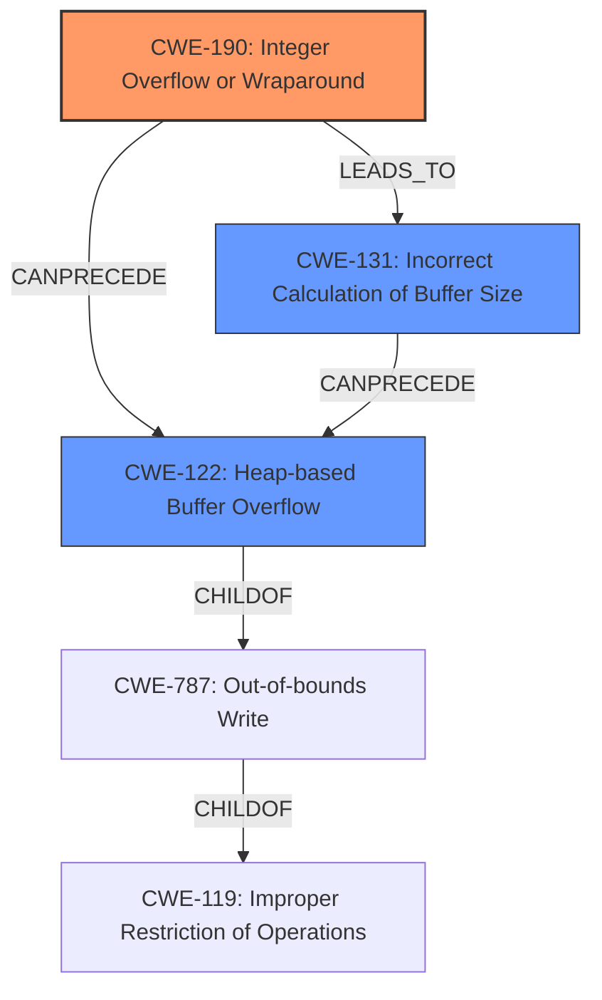

# Final Resolution for CVE-2021-40417

# Summary
| CWE ID | CWE Name | Confidence | CWE Abstraction Level | CWE Vulnerability Mapping Label | CWE-Vulnerability Mapping Notes |
|---|---|---|---|---|---|
| CWE-190 | Integer Overflow or Wraparound | 0.95 | Base | Allowed | Primary CWE: The **integer overflow** is the **root cause** of the vulnerability. |
| CWE-122 | Heap-based Buffer Overflow | 0.85 | Variant | Allowed | Secondary CWE: The **integer overflow** leads directly to a **heap-based buffer overflow**. |
| CWE-131 | Improper Calculation of Buffer Size | 0.75 | Base | Allowed | Secondary CWE: The **integer overflow** results in an incorrect buffer size calculation leading to a heap buffer overflow. |

## Evidence and Confidence

*   **Confidence Score:** 0.92
*   **Evidence Strength:** HIGH

## Relationship Analysis
The primary relationships are as follows:
  - CWE-122 is a child of CWE-787 (Out-of-bounds Write), indicating it's a specific type of out-of-bounds write.
  - CWE-122 relates to CWE-119 (Improper Restriction of Operations within the Bounds of a Memory Buffer).
  - CWE-190 CanPrecede CWE-122, as the **integer overflow** directly causes the **heap-based buffer overflow**.
  - CWE-131 is related to both CWE-190 and CWE-122 because the **integer overflow** leads to an incorrect buffer size calculation, which then leads to the overflow.

## Vulnerability Chain
The vulnerability chain is as follows:
  1. An attacker submits a file to the DPDecoder service with specific decoding parameters.
  2. The service, along with the R3D SDK, parses fields from the video file and uses them with the provided decoding parameters to calculate the size of a heap buffer.
  3. **CWE-190 (Integer Overflow or Wraparound):** An **integer overflow** occurs during this size calculation, resulting in an undersized buffer.
  4. **CWE-131 (Improper Calculation of Buffer Size):** The overflow leads to an incorrect buffer size.
  5. **CWE-122 (Heap-based Buffer Overflow):** When the undersized heap buffer is written to, a **heap-based buffer overflow** occurs, allowing for potential code execution under the context of the application.
  - **Impact:** Code execution under the context of the application.

## Summary of Analysis
The initial analysis correctly identified CWE-190 as the primary **root cause** and CWE-122 as the direct consequence. The criticism suggested adding CWE-131 to provide more specific guidance on mitigation regarding buffer size calculations, which is helpful for mitigation purposes.

The vulnerability description explicitly states: "Due to an **integer overflow** with regards to this calculation, this can result in an undersized heap buffer being allocated. When this heap buffer is written to, a **heap-based buffer overflow** will occur." This provides strong evidence for both CWE-190 and CWE-122.

The addition of CWE-131 adds nuance to the analysis and provides more specific mitigation guidance.
The selected CWEs are at the optimal level of specificity, with CWE-190 representing the **root cause**, CWE-122 representing the direct consequence, and CWE-131 representing the improper calculation.