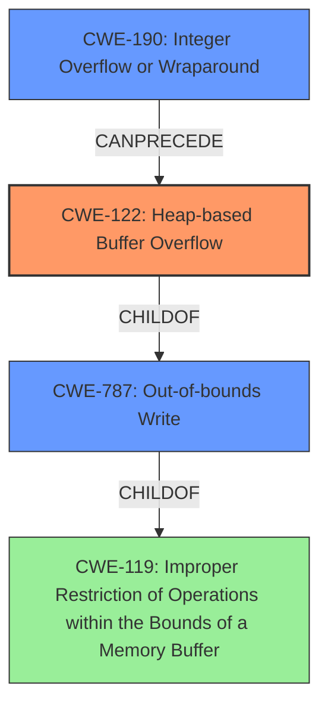

# Final Resolution for CVE-2021-4055

# Summary

| CWE ID  | CWE Name                     | Confidence | CWE Abstraction Level | CWE Vulnerability Mapping Label | CWE-Vulnerability Mapping Notes                                                                                                                   |
| :------- | :--------------------------- | :--------- | :-------------------- | :------------------------------ | :------------------------------------------------------------------------------------------------------------------------------------------------- |
| CWE-122  | Heap-based Buffer Overflow   | 0.95       | Variant             | Primary                        | Allowed                                                                                                                                            |
| CWE-787  | Out-of-bounds Write          | 0.70       | Base                | Secondary Candidate           | Allowed. The **buffer overflow** constitutes an out-of-bounds write as a result                                                                      |
| CWE-190  | Integer Overflow or Wraparound | 0.50       | Base                | Secondary Candidate           | Allowed. Potential **integer overflow** if the size calculation is not properly validated when allocating memory on the heap for the buffer. |

## Evidence and Confidence

*   **Confidence Score:** 0.90
*   **Evidence Strength:** MEDIUM

## Relationship Analysis

The primary classification is CWE-122 (Heap-based Buffer Overflow), which is a variant of CWE-787 (Out-of-bounds Write) and a child of CWE-119 (Improper Restriction of Operations within the Bounds of a Memory Buffer). CWE-190 (Integer Overflow or Wraparound) is considered as a possible contributing factor if an **integer overflow** leads to an undersized buffer allocation, which is a prerequisite for the heap overflow. The relationships clarify the hierarchy and potential chain of events leading to the vulnerability.

## Vulnerability Chain

The vulnerability chain starts with a crafted Chrome Extension which leads to:
1.  CWE-190: Potential **integer overflow** during size calculation for heap allocation.
2.  CWE-122: Heap-based **buffer overflow** due to insufficient buffer size.
3.  CWE-787: Out-of-bounds write resulting from the **buffer overflow**.
The impact is heap corruption, potentially leading to arbitrary code execution.

## Summary of Analysis

The initial analysis correctly identifies CWE-122 (Heap-based Buffer Overflow) as the primary weakness given the explicit mention of a "heap **buffer overflow**" in the vulnerability description. The criticism suggests strengthening the justification for secondary candidates. CWE-787 is a valid secondary classification as it is the broader category of out-of-bounds writes, and the heap **buffer overflow** is a specific instance of this.

To address the criticism and to strengthen the analysis, CWE-190 (Integer Overflow or Wraparound) is added as a secondary candidate. It is plausible that an **integer overflow** could occur when calculating the size of the buffer to be allocated on the heap. If the calculated size wraps around to a smaller value, the subsequent heap allocation would be too small, leading to the **buffer overflow**.

The inclusion of CWE-190 provides a more complete picture of the potential vulnerability chain. This selection is based on the relationship between **integer overflows** and **buffer overflows**, as noted in the CWE-190 description: "Integer overflows can be primary to **buffer overflows** when they cause less memory to be allocated."

The final classification reflects the optimal level of specificity based on the available evidence, incorporating the explicit description of a heap **buffer overflow** and the potential for an **integer overflow** to contribute to the vulnerability.