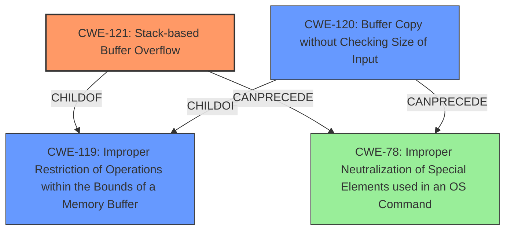

# Analysis Report for CVE-2021-40556

# Vulnerability Analysis Report: CVE-2021-40556

## Description

A stack overflow vulnerability exists in the httpd service in ASUS RT-AX56U Router Version 3.0.0.4.386.44266. This vulnerability is caused by the strcat function called by caupload input handle function allowing the user to enter 0xFFFF bytes into the stack. This vulnerability allows an attacker to execute commands remotely. The vulnerability requires authentication.

## Vulnerability Description Key Phrases

**Rootcause:** strcat function called by caupload input handle function allowing the user to enter 0xFFFF bytes into the stack
**Weakness:** stack overflow
**Impact:** execute commands remotely
**Product:** ASUS RT-AX56U Router
**Version:** Version 3.0.0.4.386.44266
**Component:** httpd service

## Analysis (with Relationship Data)

# Summary
| CWE ID | CWE Name | Confidence | CWE Abstraction Level | CWE Vulnerability Mapping Label | CWE-Vulnerability Mapping Notes |
|---|---|---|---|---|---|
| CWE-121 | Stack-based Buffer Overflow | 0.95 | Variant | Allowed | Primary CWE |
| CWE-120 | Buffer Copy without Checking Size of Input ('Classic Buffer Overflow') | 0.75 | Base | Allowed-with-Review | Secondary Candidate |
| CWE-78 | Improper Neutralization of Special Elements used in an OS Command ('OS Command Injection') | 0.60 | Base | Allowed | Secondary Candidate |

## Evidence and Confidence

*   **Confidence Score:** 0.90
*   **Evidence Strength:** HIGH

- **Analysis and Justification:**  
  - *Explanation:* The vulnerability description clearly states "**stack overflow** vulnerability exists in the httpd service" and is caused by the "**strcat function called by caupload input handle function allowing the user to enter 0xFFFF bytes into the stack**". The "**stack overflow**" is the primary **weakness**.
  The CVE reference summary content confirms the root cause is a "stack buffer overflow within the `caupload.cgi` handler's input function in the httpd service" caused by "**strcat** function copies data of an attacker-controlled size onto a fixed-size stack buffer, leading to the overwrite of stack memory". It is also mentioned "**No stack canaries** are used to detect buffer overflows".
  CWE-121 (Stack-based Buffer Overflow) is a Variant level CWE which is a preferred level of abstraction. The description "A stack-based buffer overflow condition is a condition where the buffer being overwritten is allocated on the stack" aligns directly with the vulnerability description. MITRE mapping guidance for CWE-121 indicates this is ALLOWED for stack-based buffer overflows.

  - *Relationship Analysis:* CWE-121 is a child of CWE-119 (Improper Restriction of Operations within the Bounds of a Memory Buffer), but CWE-121 is a more specific variant so it is more appropriate.

- **Confidence Score:**  
  - Confidence: 0.95 (High confidence due to explicit mention of stack overflow and detailed technical description)

---

- **Analysis and Justification:**  
  - *Explanation:* CWE-120 (Buffer Copy without Checking Size of Input ('Classic Buffer Overflow')) is a Base level CWE. The description is "The product copies an input buffer to an output buffer without verifying that the size of the input buffer is less than the size of the output buffer, leading to a buffer overflow." The CVE reference summary content mentions the "**strcat** function copies data of an attacker-controlled size onto a fixed-size stack buffer". While this is very similar to CWE-121, CWE-121 is a specific variant of a Stack-based Buffer Overflow so it is more appropriate. MITRE mapping guidance for CWE-120 indicates this is Allowed-with-Review, but it is not as precise as CWE-121.

  - *Relationship Analysis:* CWE-120 is a child of CWE-119 (Improper Restriction of Operations within the Bounds of a Memory Buffer), but CWE-121 is a more specific variant so it is more appropriate.

- **Confidence Score:**  
  - Confidence: 0.75 (Medium confidence because the description does fit but CWE-121 is more accurate)

---

- **Analysis and Justification:**  
  - *Explanation:* CWE-78 (Improper Neutralization of Special Elements used in an OS Command ('OS Command Injection')) is a Base level CWE. The CVE reference summary content mentions "The attacker can gain arbitrary code execution by overwriting return addresses on the stack" and "redirect execution to a gadget that calls system() and controlling the arguments." The **impact** is clearly remote code execution by overwriting return addresses on the stack. The **rootcause** is the stack buffer overflow. While the attacker is able to execute OS commands, the vulnerability is not primarily caused by command injection, but by a stack overflow that allows the attacker to overwrite the return address on the stack and redirect execution to a gadget that calls system(). Therefore, CWE-78 is not the primary CWE.

  - *Relationship Analysis:* CWE-78 is related to CWE-119 (Improper Restriction of Operations within the Bounds of a Memory Buffer) and CWE-121 (Stack-based Buffer Overflow) as the overflow allows for command injection.

- **Confidence Score:**  
  - Confidence: 0.60 (Low confidence because the root cause is not command injection, but the impact is remote code execution)

## Criticism of Analysis

Okay, I've reviewed your CWE analysis of the stack overflow vulnerability in the ASUS RT-AX56U router, considering the full CWE specifications you've provided. Here's my critique, focusing on accuracy, completeness, and adherence to CWE guidelines:

**Overall Assessment:**

The analysis is generally well-reasoned and technically sound. The primary CWE mapping to CWE-121 (Stack-based Buffer Overflow) is correct and strongly supported by the evidence. The secondary candidates are also plausible, but appropriately ranked with lower confidence. The justifications provided for each CWE selection and ranking are clear and well-articulated.

**Specific Feedback:**

*   **CWE-121 (Stack-based Buffer Overflow):**
    *   **Confidence:** The high confidence score (0.95) is justified. The vulnerability description explicitly mentions "stack overflow" and the CVE summary confirms the root cause as a stack buffer overflow due to `strcat` without bounds checking.
    *   **Abstraction Level:**  Mapping to the Variant-level CWE-121 is appropriate and follows CWE guidelines.
    *   **Mapping Guidance Adherence:** The analysis correctly notes that CWE-121's mapping guidance indicates "Allowed" for stack-based buffer overflows, further solidifying the choice.
    *   **Mitigations:**  The analysis implicitly covers several potential mitigations from the CWE details. For example, the use of compilers with buffer overflow detection mechanisms (e.g., /GS flag, FORTIFY_SOURCE) would be a relevant mitigation.
*   **CWE-120 (Buffer Copy without Checking Size of Input ('Classic Buffer Overflow'))**
    *   **Confidence:** The medium confidence score (0.75) is appropriate.  While the `strcat` function *is* copying data without checking the input size, the *location* of the buffer (stack) makes CWE-121 a more precise fit.
    *   **Abstraction Level:**  The analysis correctly identifies that CWE-120 is a Base-level CWE and therefore less specific than CWE-121.
    *   **Mapping Guidance Adherence:** The analysis acknowledges the "Allowed-with-Review" mapping guidance for CWE-120 and explains why it's not the *best* fit.
    *   **Mitigations:** Could mention using safe string libraries (e.g., SafeStr, Strsafe.h) as a mitigation to avoid the use of `strcat`.
*   **CWE-78 (Improper Neutralization of Special Elements used in an OS Command ('OS Command Injection'))**
    *   **Confidence:** The low confidence score (0.60) is correct.  While the *impact* is remote code execution, the *root cause* is the stack overflow, *not* direct insertion of OS command special characters.  The attacker gains code execution *by overwriting the return address* and calling `system()` (or a wrapper).
    *   **Abstraction Level:** The Base level of abstraction is appropriate for CWE-78, but the analysis correctly recognizes that it's not the primary weakness.
    *   **Mapping Guidance Adherence:** Follows the "Allowed" mapping guidance, but correctly downplays the importance of this CWE for this scenario.
    *   **Mitigations:** The analysis would be strengthened by explicitly stating that applying command injection defenses would *not* prevent this vulnerability, as the core issue is the buffer overflow.
*   **General Observations:**
    *   **Clarity and Justification:** The analysis is very clear and provides strong justifications for each CWE assignment.  The relationship analysis (parent/child, etc.) is accurate.
    *   **Completeness:** The analysis covers the key aspects of the vulnerability.  The inclusion of the CVE reference summary is helpful.
    *   **Use of CWE Specifications:** The analysis demonstrates a strong understanding and appropriate application of the CWE specifications, including the mapping guidance.

**Suggestions for Improvement:**

1.  **Explicitly Address Alternative CWEs in Discussion:** While the analysis focuses on the most likely CWEs, it could be strengthened by briefly discussing *why* certain other related CWEs (such as CWE-119, CWE-787, CWE-676, CWE-1284) are *not* the primary weakness. For instance, mention why CWE-119 is too broad. This can further demonstrate a comprehensive understanding of the vulnerability.

2.  **Chaining Implications:** Expand on the "Relationship Analysis" sections to explicitly mention how the CWEs could be chained (if applicable). For example, if the lack of input validation (CWE-20 or CWE-1284) contributed to the overflow, briefly describe the chain, even if input validation is not the root cause.

3.  **Mitigation Specificity:** While general mitigations are mentioned, tailoring the mitigation discussion to the *specific* exploit technique would be valuable. For example, state that enabling stack canaries would make exploitation more difficult.

**Revised Summary Table (Incorporating a suggestion):**

| CWE ID | CWE Name | Confidence | CWE Abstraction Level | CWE Vulnerability Mapping Label | CWE-Vulnerability Mapping Notes |
|---|---|---|---|---|---|
| CWE-121 | Stack-based Buffer Overflow | 0.95 | Variant | Allowed | Primary CWE |
| CWE-120 | Buffer Copy without Checking Size of Input ('Classic Buffer Overflow') | 0.75 | Base | Allowed-with-Review | Secondary Candidate |
| CWE-78 | Improper Neutralization of Special Elements used in an OS Command ('OS Command Injection') | 0.60 | Base | Allowed | Secondary Candidate, Impact is RCE through Return Address Overwrite, but Root Cause is Stack Overflow |

**In conclusion:**

This is a high-quality CWE analysis. The selection of CWE-121 as the primary weakness is accurate, well-supported, and adheres to CWE guidelines. The lower-confidence secondary candidates are also plausible and thoroughly justified. The suggestions above are primarily for refinement and further demonstration of understanding, not for correcting any significant errors.

## Final Resolution

# Summary
| CWE ID | CWE Name | Confidence | CWE Abstraction Level | CWE Vulnerability Mapping Label | CWE-Vulnerability Mapping Notes |
|---|---|---|---|---|---|
| CWE-121 | Stack-based Buffer Overflow | 0.95 | Variant | Allowed | Primary CWE |
| CWE-120 | Buffer Copy without Checking Size of Input ('Classic Buffer Overflow') | 0.75 | Base | Allowed-with-Review | Secondary Candidate |
| CWE-78 | Improper Neutralization of Special Elements used in an OS Command ('OS Command Injection') | 0.60 | Base | Allowed | Secondary Candidate, Impact is RCE through Return Address Overwrite, but Root Cause is Stack Overflow |

## Evidence and Confidence

*   **Confidence Score:** 0.95
*   **Evidence Strength:** HIGH

## Relationship Analysis
The primary weakness is **CWE-121 (Stack-based Buffer Overflow)**, a Variant of **CWE-119 (Improper Restriction of Operations within the Bounds of a Memory Buffer)**. The vulnerability occurs because the `strcat` function copies an attacker-controlled size of data onto a fixed-size stack buffer. **CWE-120 (Buffer Copy without Checking Size of Input)** is a potential secondary candidate because `strcat` performs a buffer copy without checking the size of the input. However, **CWE-121** is more specific because it explicitly identifies the overflow as stack-based. **CWE-78 (Improper Neutralization of Special Elements used in an OS Command)** is a tertiary candidate because the overflow allows for remote code execution by overwriting the return address on the stack, but command injection is not the root cause.

## Vulnerability Chain
The vulnerability chain starts with a lack of input validation in the `caupload` input handle function. The `strcat` function then copies the attacker-controlled input onto a fixed-size stack buffer without checking the size, leading to a stack buffer overflow. This allows the attacker to overwrite the return address on the stack, redirect execution to a gadget that calls `system()`, and execute arbitrary commands remotely.

ROOTCAUSE: Lack of input validation -> **WEAKNESS**: **CWE-121 (Stack-based Buffer Overflow)** -> IMPACT: Remote Code Execution

## Summary of Analysis
The initial analysis and criticism are both well-reasoned and technically sound. The selection of **CWE-121 (Stack-based Buffer Overflow)** as the primary weakness is accurate and well-supported by the evidence: "A stack overflow vulnerability exists in the httpd service in ASUS RT-AX56U Router Version 3.0.0.4.386.44266. This vulnerability is caused by the strcat function called by caupload input handle function allowing the user to enter 0xFFFF bytes into the stack." The vulnerability description explicitly mentions "stack overflow", and the CVE summary confirms the root cause as a stack buffer overflow due to `strcat` without bounds checking.

The graph relationships influenced the decision by highlighting the hierarchical relationship between **CWE-121** and **CWE-119 (Improper Restriction of Operations within the Bounds of a Memory Buffer)**, and by clarifying the potential for **CWE-78 (Improper Neutralization of Special Elements used in an OS Command)** as a secondary impact due to the ability to overwrite the return address on the stack.

**CWE-121** is at the optimal level of specificity because it is a Variant-level CWE that directly describes the stack-based nature of the buffer overflow.

*Report generated on 2025-03-18 01:51:52*
