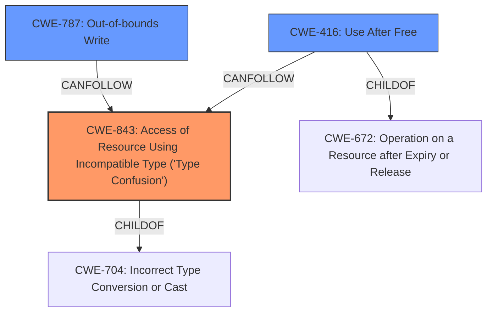

# Final Resolution for CVE-2021-4056

# Summary
| CWE ID | CWE Name | Confidence | CWE Abstraction Level | CWE Vulnerability Mapping Label | CWE-Vulnerability Mapping Notes |
|---|---|---|---|---|---|
| CWE-843 | Access of Resource Using Incompatible Type ('Type Confusion') | 0.95 | Base | Allowed | Primary CWE |
| CWE-787 | Out-of-bounds Write | 0.70 | Base | Allowed | Secondary Candidate |
| CWE-416 | Use After Free | 0.60 | Variant | Allowed | Secondary Candidate - Plausible, but requires further investigation. Heap corruption *suggests* a potential Use-After-Free, but this is not explicitly stated. |

## Evidence and Confidence

*   **Confidence Score:** 0.85
*   **Evidence Strength:** MEDIUM

## Relationship Analysis
The primary weakness is **CWE-843** [Access of Resource Using Incompatible Type ('Type Confusion')], which is a Base level CWE.
**CWE-843** is a child of **CWE-704** [Incorrect Type Conversion or Cast]. A likely consequence of **CWE-843** is **CWE-787** [Out-of-bounds Write].
**CWE-416** [Use After Free] is a Variant level weakness and a child of **CWE-672** [Operation on a Resource after Expiry or Release]. **CWE-416** can be a consequence of **CWE-843**, where the type confusion could lead to premature deallocation.

## Vulnerability Chain
The vulnerability chain begins with **CWE-843** [Access of Resource Using Incompatible Type ('Type Confusion')] in the loader. This **type confusion** can lead to **CWE-787** [Out-of-bounds Write] due to incorrect memory access or manipulation. A plausible, but less directly supported consequence, is **CWE-416** [Use After Free] if the **type confusion** results in premature deallocation of memory that is later accessed. The ultimate impact is **heap corruption**.

## Summary of Analysis
The initial analysis correctly identified **CWE-843** [Access of Resource Using Incompatible Type ('Type Confusion')] as the primary **weakness** due to the explicit mention of **type confusion** in the vulnerability description: "Type confusion in loader in Google Chrome prior to 96.0.4664.93 allowed a remote attacker to potentially exploit heap corruption via a crafted HTML page."

The criticism was helpful in refining the analysis and considering other potential **weaknesses**. The suggestion to explore **CWE-787** [Out-of-bounds Write] due to the mention of heap corruption is valid. The **type confusion** could lead to writing outside allocated memory bounds, which would directly cause heap corruption. Therefore, **CWE-787** is added as a secondary candidate with a confidence of 0.70.

The initial analysis also considered **CWE-416** [Use After Free]. While heap corruption could be a consequence of a UAF, the vulnerability description doesn't explicitly state this. The confidence remains at 0.60, acknowledging the plausibility but lack of direct evidence.

The final decision is based on the following:

*   **CWE-843** [Access of Resource Using Incompatible Type ('Type Confusion')] is the primary **rootcause** as it is explicitly mentioned.
*   **CWE-787** [Out-of-bounds Write] is a likely consequence of **CWE-843** and a direct cause of heap corruption.
*   **CWE-416** [Use After Free] is a plausible but less directly supported consequence.

The selected CWEs are at the optimal level of specificity, with **CWE-843** being a Base level weakness and **CWE-787** also being a Base level weakness.