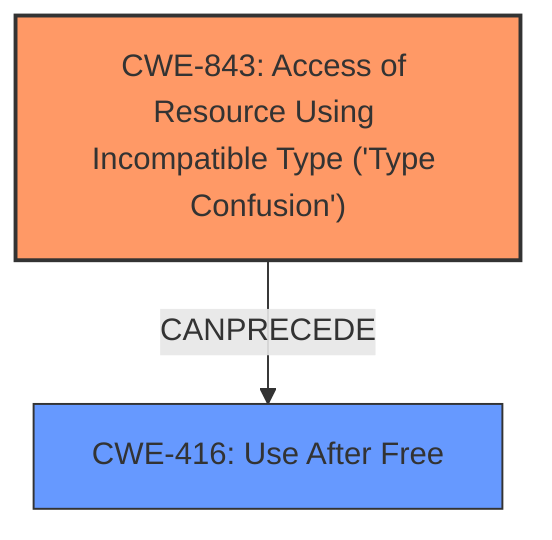

# Analysis Report for CVE-2021-4061

# Vulnerability Analysis Report: CVE-2021-4061

## Description

Type confusion in V8 in Google Chrome prior to 96.0.4664.93 allowed a remote attacker to potentially exploit heap corruption via a crafted HTML page.

## Vulnerability Description Key Phrases

**Rootcause:** confusion in V8
**Impact:** heap corruption
**Vector:** crafted HTML page
**Attacker:** remote attacker
**Product:** Google Chrome
**Version:** prior to 96.0.4664.93

## Analysis (with Relationship Data)

# Summary
| CWE ID | CWE Name | Confidence | CWE Abstraction Level | CWE Vulnerability Mapping Label | CWE-Vulnerability Mapping Notes |
|---|---|---|---|---|---|
| CWE-843 | Access of Resource Using Incompatible Type ('Type Confusion') | 0.95 | Base | Allowed | Primary CWE |
| CWE-416 | Use After Free | 0.5 | Variant | Allowed | Secondary Candidate |

## Evidence and Confidence

*   **Confidence Score:** 0.75
*   **Evidence Strength:** HIGH

- **Analysis and Justification:**  
  - *Explanation:* The vulnerability description explicitly mentions "**type confusion in V8**" as the **rootcause**, which directly corresponds to CWE-843, "Access of Resource Using Incompatible Type ('Type Confusion')". The impact, "heap corruption," is a typical consequence of type confusion. The "CVE Reference Links Content Summary" confirms the **root_cause** as "Type confusion in V8" and lists "Type confusion" as a **weakness**. CWE-843 is a Base level CWE, which is appropriate for mapping the root cause. The MITRE mapping guidance for CWE-843 states that its Usage is "Allowed" because it is at the Base level of abstraction.

  - *Relationship Analysis:* While CWE-843 doesn't have direct relationships listed, its nature can often lead to other weaknesses. In this case, type confusion leading to heap corruption could potentially create conditions for "Use After Free" (CWE-416). However, the description doesn't explicitly detail the mechanisms needed for a use-after-free condition, so I'm considering it as a secondary candidate.

- **Confidence Score:**  
  - *CWE-843 Confidence:* 0.95 (High confidence due to direct match with the vulnerability description and CVE reference content).
  - *CWE-416 Confidence:* 0.5 (Lower confidence due to the implied, but not explicitly stated, use-after-free condition).

---

## Criticism of Analysis

Okay, here's a detailed review of the analysis, incorporating the full CWE specifications provided:

**Overall Assessment:**

The analysis is well-structured and generally accurate.  The primary CWE mapping to CWE-843 is strongly justified. The consideration of CWE-416 as a secondary candidate is reasonable, given the common consequences of type confusion, but the lower confidence is appropriate since it's not explicitly stated.

**Detailed Review:**

**1. CWE-843: Access of Resource Using Incompatible Type ('Type Confusion')**

*   **Confidence:**  The 0.95 confidence level is justified. The description explicitly mentions "type confusion in V8," which is a direct match. The "heap corruption" impact aligns with the potential consequences of type confusion, especially in languages like C/C++ often used in browser engines.

*   **Abstraction Level:** The choice of the Base level (CWE-843) is appropriate.  The description points to the root cause of the vulnerability.  Mapping Guidance for CWE-843: "This CWE entry is at the Base level of abstraction, which is a preferred level of abstraction for mapping to the root causes of vulnerabilities."

*   **Relationship Analysis:**  The analysis correctly identifies that CWE-843 can *lead* to other weaknesses.
    *   The analysis mentions that CWE-843 can often lead to other weaknesses and mentions "Use After Free" (CWE-416).
    *   The analysis also mentions that type confusion leading to heap corruption could potentially create conditions for "Use After Free" (CWE-416).

*   **Observed Examples:** The observed examples in the full specifications for CWE-843 are relevant:
    *   **CVE-2010-4577:** Type confusion in CSS sequence leads to out-of-bounds read.
    *   **CVE-2011-0611:** Size inconsistency allows code execution, first discovered when it was actively exploited in-the-wild.
    *   **CVE-2010-0258:** Improperly-parsed file containing records of different types leads to code execution when a memory location is interpreted as a different object than intended.

    These examples illustrate the potential severity and exploitability of type confusion vulnerabilities.

*   **Mitigation:** The specifications for CWE-843 don't offer specific mitigations, as it's a root cause. However, it can be inferred that using a type-safe language can prevent it.

*   **Minor Suggestion:** It might be helpful to explicitly mention that V8, while using JavaScript, has significant portions written in C/C++, making it susceptible to memory corruption issues stemming from type confusion.

**2. CWE-416: Use After Free**

*   **Confidence:** The 0.5 confidence level is appropriate. The analysis correctly identifies that UAF is *possible* as a consequence, but not directly stated in the vulnerability description. It's a *potential* secondary effect, not a guaranteed one.

*   **Abstraction Level:** The choice of the Variant level (CWE-416) is appropriate, if it is chosen as a secondary candidate.

*   **Relationship Analysis:** The analysis correctly identifies that CWE-416 is a *potential* consequence of CWE-843

*   **Observed Examples:** The examples in the full specifications for CWE-416 are helpful in understanding the context in which UAF vulnerabilities occur:
    *   **CVE-2022-20141:** Chain: an operating system kernel has insufficent resource locking (CWE-413) leading to a use after free (CWE-416).
    *   **CVE-2022-2621:** Chain: two threads in a web browser use the same resource (CWE-366), but one of those threads can destroy the resource before the other has completed (CWE-416).
    *   **CVE-2021-0920:** Chain: mobile platform race condition (CWE-362) leading to use-after-free (CWE-416), as exploited in the wild per CISA KEV.

    These examples help illustrate the complex chains of weaknesses that can lead to UAF.

*   **Mitigation:** The specifications for CWE-416 provide relevant mitigation strategies:
    *   **Language Selection:** Choosing a language with automatic memory management.
    *   **Setting freed pointers to NULL:** This is a common defense-in-depth technique.

*   **Alternative Candidates:**

    *   **CWE-787: Out-of-bounds Write:**  Given the "heap corruption" impact, consider CWE-787 as a *potential* alternative or addition to CWE-416.  Type confusion can lead to writing to unintended memory locations.  However, without more details, it's harder to justify than CWE-416.

    *   **CWE-122: Heap-based Buffer Overflow:** Is also another candidate, however "Type Confusion" is the more precise cause.

**3. General Improvements:**

*   **Chains of Weaknesses:**  While not explicitly stated, it's worth noting that vulnerabilities often involve chains of weaknesses. A more comprehensive analysis might explore potential chains stemming from CWE-843. For instance:

    *   CWE-843 -> CWE-787 (Out-of-bounds Write) -> Potential for arbitrary code execution
    *   CWE-843 -> CWE-416 -> Potential for arbitrary code execution

*   **Exploitability:** Briefly touching on the exploitability of the vulnerability would strengthen the analysis.  A remote attacker exploiting heap corruption has the potential for arbitrary code execution, making this a high-severity vulnerability.

**Revised Summary Table (Incorporating Suggestions):**

| CWE ID | CWE Name | Confidence | CWE Abstraction Level | CWE Vulnerability Mapping Label | CWE-Vulnerability Mapping Notes |
|---|---|---|---|---|---|
| CWE-843 | Access of Resource Using Incompatible Type ('Type Confusion') | 0.95 | Base | Allowed | Primary CWE. Type confusion in V8 leads to heap corruption. |
| CWE-416 | Use After Free | 0.5 | Variant | Allowed | Secondary Candidate.  Potential consequence of heap corruption, but not explicitly stated.  |

**Conclusion:**

The original analysis is strong. The suggested additions, particularly considering potential chains and exploitability, would further enhance the analysis and provide a more complete picture of the vulnerability's impact. The high confidence in the primary CWE is justified and the consideration of a secondary CWE, even with lower confidence, shows a thorough approach.

## Final Resolution

# Summary
| CWE ID | CWE Name | Confidence | CWE Abstraction Level | CWE Vulnerability Mapping Label | CWE-Vulnerability Mapping Notes |
|---|---|---|---|---|---|
| CWE-843 | Access of Resource Using Incompatible Type ('Type Confusion') | 0.95 | Base | Allowed | Primary CWE. Type confusion in V8 leads to heap corruption. |
| CWE-416 | Use After Free | 0.5 | Variant | Allowed | Secondary Candidate. Potential consequence of heap corruption, but not explicitly stated. |

## Evidence and Confidence

*   **Confidence Score:** 0.85
*   **Evidence Strength:** HIGH

## Relationship Analysis
The primary relationship considered is that **CWE-843 (Type Confusion)** can **CANPRECEDE** **CWE-416 (Use After Free)**, as type confusion can lead to memory corruption, potentially creating conditions where freed memory is accessed. However, this relationship is not explicitly detailed in the vulnerability description, leading to a lower confidence in the secondary CWE.

## Vulnerability Chain
The vulnerability chain starts with the **ROOTCAUSE**, **CWE-843 (Type Confusion)** in the V8 engine. This leads to heap corruption. A potential consequence is **CWE-416 (Use After Free)** if the corrupted heap results in accessing freed memory. The ultimate impact is the potential for arbitrary code execution due to heap corruption, allowing a remote attacker to exploit the vulnerability.

## Summary of Analysis
The initial analysis correctly identifies **CWE-843 (Type Confusion)** as the primary **WEAKNESS**, with high confidence due to the explicit mention of "type confusion in V8" in the vulnerability description. The consideration of **CWE-416 (Use After Free)** as a secondary candidate is reasonable, given that heap corruption resulting from type confusion can create conditions for use-after-free.

The decision is primarily based on the provided evidence, specifically the vulnerability description: "Type confusion in V8... allowed a remote attacker to potentially exploit heap corruption". This directly aligns with the definition of **CWE-843 (Type Confusion)**.

The graph relationships influenced the decision to include **CWE-416 (Use After Free)** as a secondary candidate, but with lower confidence. While type confusion can lead to heap corruption and potentially use-after-free, the vulnerability description doesn't explicitly state that a use-after-free condition is present.

The selected CWEs are at the optimal level of specificity. **CWE-843 (Type Confusion)** is a Base-level CWE that directly represents the **ROOTCAUSE** of the vulnerability. **CWE-416 (Use After Free)**, while at the Variant level, is considered a potential consequence rather than a direct cause. Using a Class-level CWE would be too general, while more specific Variant-level CWEs would require more detailed information about the specific type confusion occurring.

*Report generated on 2025-03-18 01:54:33*
