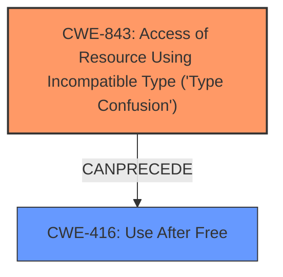

# Final Resolution for CVE-2021-4061

# Summary
| CWE ID | CWE Name | Confidence | CWE Abstraction Level | CWE Vulnerability Mapping Label | CWE-Vulnerability Mapping Notes |
|---|---|---|---|---|---|
| CWE-843 | Access of Resource Using Incompatible Type ('Type Confusion') | 0.95 | Base | Allowed | Primary CWE. Type confusion in V8 leads to heap corruption. |
| CWE-416 | Use After Free | 0.5 | Variant | Allowed | Secondary Candidate. Potential consequence of heap corruption, but not explicitly stated. |

## Evidence and Confidence

*   **Confidence Score:** 0.85
*   **Evidence Strength:** HIGH

## Relationship Analysis
The primary relationship considered is that **CWE-843 (Type Confusion)** can **CANPRECEDE** **CWE-416 (Use After Free)**, as type confusion can lead to memory corruption, potentially creating conditions where freed memory is accessed. However, this relationship is not explicitly detailed in the vulnerability description, leading to a lower confidence in the secondary CWE.

## Vulnerability Chain
The vulnerability chain starts with the **ROOTCAUSE**, **CWE-843 (Type Confusion)** in the V8 engine. This leads to heap corruption. A potential consequence is **CWE-416 (Use After Free)** if the corrupted heap results in accessing freed memory. The ultimate impact is the potential for arbitrary code execution due to heap corruption, allowing a remote attacker to exploit the vulnerability.

## Summary of Analysis
The initial analysis correctly identifies **CWE-843 (Type Confusion)** as the primary **WEAKNESS**, with high confidence due to the explicit mention of "type confusion in V8" in the vulnerability description. The consideration of **CWE-416 (Use After Free)** as a secondary candidate is reasonable, given that heap corruption resulting from type confusion can create conditions for use-after-free.

The decision is primarily based on the provided evidence, specifically the vulnerability description: "Type confusion in V8... allowed a remote attacker to potentially exploit heap corruption". This directly aligns with the definition of **CWE-843 (Type Confusion)**.

The graph relationships influenced the decision to include **CWE-416 (Use After Free)** as a secondary candidate, but with lower confidence. While type confusion can lead to heap corruption and potentially use-after-free, the vulnerability description doesn't explicitly state that a use-after-free condition is present.

The selected CWEs are at the optimal level of specificity. **CWE-843 (Type Confusion)** is a Base-level CWE that directly represents the **ROOTCAUSE** of the vulnerability. **CWE-416 (Use After Free)**, while at the Variant level, is considered a potential consequence rather than a direct cause. Using a Class-level CWE would be too general, while more specific Variant-level CWEs would require more detailed information about the specific type confusion occurring.