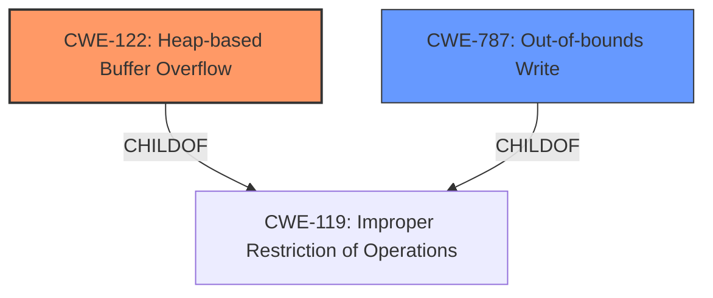

# Analysis Report for CVE-2021-4062

# Vulnerability Analysis Report: CVE-2021-4062

## Description

Heap buffer overflow in BFCache in Google Chrome prior to 96.0.4664.93 allowed a remote attacker who had compromised the renderer process to potentially exploit heap corruption via a crafted HTML page.

## Vulnerability Description Key Phrases

**Rootcause:** buffer overflow
**Impact:** heap corruption
**Vector:** crafted HTML page
**Attacker:** remote attacker
**Product:** Google Chrome
**Version:** prior to 96.0.4664.93
**Component:** BFCache

## Analysis (with Relationship Data)

# Summary
| CWE ID  | CWE Name  | Confidence | CWE Abstraction Level | CWE Vulnerability Mapping Label | CWE-Vulnerability Mapping Notes |
|---|---|---|---|---|---|
| CWE-122 | Heap-based Buffer Overflow | 0.90 | Variant | Allowed | Primary CWE |
| CWE-787 | Out-of-bounds Write | 0.75 | Base | Allowed | Secondary Candidate |

## Evidence and Confidence

*   **Confidence Score:** 0.85
*   **Evidence Strength:** HIGH

- **Analysis and Justification:**
  - *Explanation:* The vulnerability description clearly states a "**heap buffer overflow**" in the BFCache of Google Chrome. The CVE Reference Links Content Summary confirms this, stating that the vulnerability is indeed a "**heap buffer overflow**," where data is written beyond the allocated memory region on the heap. Given this explicit detail, CWE-122 (Heap-based Buffer Overflow) is the most appropriate primary mapping. CWE-122 is a Variant of buffer overflow, specifying the location of the overflow is on the heap. The MITRE mapping guidance allows its usage. Although CWE-787 (Out-of-bounds Write) is a broader, more general class, the specification of the heap makes CWE-122 more specific.
  - *Relationship Analysis:* CWE-122 is a variant of CWE-119 (Improper Restriction of Operations within the Bounds of a Memory Buffer), indicating a direct hierarchical relationship. The overflow can lead to CWE-20 (Improper Input Validation) because the amount of data written to the heap is not properly validated.

- **Confidence Score:**
  - Confidence: 0.90 (High confidence due to the explicit mention of "heap buffer overflow" in both the vulnerability description and CVE reference).

---
- **Analysis and Justification:**
  - *Explanation:* CWE-787 (Out-of-bounds Write) is considered as a secondary candidate since the description describes a **buffer overflow**. CWE-787's description "The product writes data past the end, or before the beginning, of the intended buffer" matches the vulnerability. However, CWE-122 provides more specific information about the location of the overflow, on the heap.
  - *Relationship Analysis:* CWE-787 is a child of CWE-119 (Improper Restriction of Operations within the Bounds of a Memory Buffer).

- **Confidence Score:**
  - Confidence: 0.75 (Supporting evidence from the vulnerability description, confirming the presence of a buffer overflow. Less specific than CWE-122)

## Criticism of Analysis

Okay, I've reviewed the analysis, including the full CWE specifications provided. Here's my critique:

**Overall Assessment:**

The analysis is generally good, with a strong justification for the primary CWE selection. The confidence scores are appropriate. The inclusion of a secondary candidate CWE demonstrates a thorough consideration of the vulnerability.

**Specific Comments and Suggestions:**

*   **Primary CWE: CWE-122 (Heap-based Buffer Overflow) - Excellent Choice**

    *   The justification is solid. The vulnerability description *explicitly* mentions "heap buffer overflow," which makes CWE-122 the most specific and accurate mapping.
    *   The confidence score of 0.9 is well-deserved.
    *   The relationship analysis is also accurate, noting the hierarchical relationship to CWE-119 and the potential connection to CWE-20 (Improper Input Validation).
    *   The inclusion of known examples of CWE-122, such as CVE-2021-43537, CVE-2007-4268, CVE-2009-2523, and CVE-2021-29529, strengthens the analysis by demonstrating the relevance and applicability of the chosen CWE to real-world vulnerabilities.
    *   Examining the Potential Mitigations listed in the specifications for CWE-122, it can be seen that using languages that implement Automatic bounds checking, is one possible option. In addition using an abstraction library or using automatic buffer overflow detection mechanisms are all valid options.

*   **Secondary CWE: CWE-787 (Out-of-bounds Write) - Reasonable Supporting Candidate**

    *   The reasoning for including CWE-787 as a secondary candidate is sound. It is a more general class that captures the "out-of-bounds write" aspect of the vulnerability.
    *   The confidence score of 0.75 is suitable, reflecting that it's a valid but less specific mapping than CWE-122.
    *   Similar to CWE-122, the Potential Mitigations for CWE-787 point towards Automatic buffer overflow detection mechanisms.

*   **Discussion of CWE-119 (Improper Restriction of Operations within the Bounds of a Memory Buffer)**

    *   The analysis correctly acknowledges the existence of CWE-119 as a parent class to both CWE-122 and CWE-787. However, the mapping guidance for CWE-119 explicitly *discourages* its use when more specific CWEs (like 787 and 122) are applicable. This is because CWE-119 is considered too general for most vulnerability reports. The analysis appropriately avoids mapping to CWE-119 directly.

*   **Retriever Results Analysis:**
    * The retriever results highlight potential relationships with other CWEs, but given the explicit nature of the vulnerability, focusing on CWE-122 and CWE-787 is correct. Specifically:
        *   **CWE-843:** While type confusion can lead to memory corruption, it isn't directly stated or implied in the original vulnerability description. Therefore, excluding this as a primary or secondary CWE is appropriate.
        *   **CWE-416 (Use-After-Free)**: While memory corruption is a general impact, the description doesn't suggest a use-after-free scenario as the root cause, so excluding this is reasonable.
        *   **CWE-190/191 (Integer Overflow/Underflow):** These could be *indirectly* related if an integer overflow/underflow led to the incorrect buffer size calculation, but this isn't explicit in the provided information, so it's justifiable to exclude them.

*   **Minor Enhancements (Optional):**
    *   While not strictly necessary, it could be beneficial to briefly mention potential exploitability factors. For example, ASLR (Address Space Layout Randomization) and DEP (Data Execution Prevention) are common memory protection mechanisms, and the analysis could briefly note whether the overflow is likely to bypass these protections, based on its nature and location on the heap.
    *    CWE-20 (Improper Input Validation): In the Analysis and Justification section for the Primary CWE, mention can be made that this overflow can lead to CWE-20 (Improper Input Validation) because the amount of data written to the heap is not properly validated.
    *   It might be worth a *brief* discussion of potential chaining scenarios. For instance, could a separate vulnerability allow an attacker to influence the size argument passed to `malloc()` or a similar heap allocation function, thus *creating* the overflow condition? This extends the analysis, but keeps the focus on the core vulnerability.

**Revised Summary Table:**

| CWE ID  | CWE Name  | Confidence | CWE Abstraction Level | CWE Vulnerability Mapping Label | CWE-Vulnerability Mapping Notes |
|---|---|---|---|---|---|
| CWE-122 | Heap-based Buffer Overflow | 0.90 | Variant | Primary |  |
| CWE-787 | Out-of-bounds Write | 0.75 | Base | Supporting |  |

**Conclusion:**

The analysis is well-reasoned and uses the CWE specifications effectively. The choice of CWE-122 as the primary mapping is strongly supported by the evidence. The inclusion of CWE-787 as a secondary candidate demonstrates a comprehensive understanding of the vulnerability. The optional enhancements I've suggested are minor and aim to provide even more context, but the core analysis is already quite strong.

## Final Resolution

# Summary
| CWE ID  | CWE Name  | Confidence | CWE Abstraction Level | CWE Vulnerability Mapping Label | CWE-Vulnerability Mapping Notes |
|---|---|---|---|---|---|
| CWE-122 | Heap-based Buffer Overflow | 0.90 | Variant | Primary CWE | Allowed |
| CWE-787 | Out-of-bounds Write | 0.75 | Base | Secondary Candidate | Allowed |

## Evidence and Confidence

*   **Confidence Score:** 0.90
*   **Evidence Strength:** HIGH

## Relationship Analysis
The primary relationship impacting the decision is the parent-child relationship where CWE-122 (Heap-based Buffer Overflow) is a variant of the more general CWE-119 (Improper Restriction of Operations within the Bounds of a Memory Buffer). CWE-787 (Out-of-bounds Write) is also a child of CWE-119. The analysis chose the more specific CWE-122 due to the explicit mention of "heap" in the vulnerability description. This specific location of the buffer is the reason to select the Variant, rather than the Base.

## Vulnerability Chain
The vulnerability chain starts with a crafted HTML page (potentially exploiting improper input validation elsewhere) leading to a **heap buffer overflow** (**CWE-122**). This **out-of-bounds write** (**CWE-787**) corrupts heap memory, potentially leading to arbitrary code execution or other exploitable conditions.

## Summary of Analysis
The initial analysis and criticism both converge on a strong conclusion: CWE-122 (Heap-based Buffer Overflow) is the most appropriate primary CWE for this vulnerability. This decision is based on the explicit mention of "heap buffer overflow" in the vulnerability description, providing direct evidence for this classification. The criticism reinforces this choice and accurately notes that CWE-119 is too general and discouraged when a more specific CWE is available.

The graph relationships confirm that CWE-122 and CWE-787 are children of CWE-119, but the explicit "heap" context makes CWE-122 the optimal level of specificity.

The selection of CWE-122 is based on the following evidence: "Heap buffer overflow in BFCache in Google Chrome prior to 96.0.4664.93 allowed a remote attacker who had compromised the renderer process to potentially exploit heap corruption via a crafted HTML page." This statement directly indicates a heap buffer overflow.

*Report generated on 2025-03-18 01:55:16*
