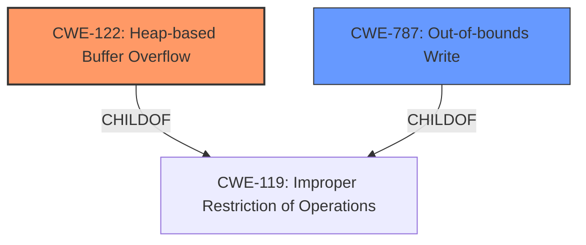

# Final Resolution for CVE-2021-4062

# Summary
| CWE ID  | CWE Name  | Confidence | CWE Abstraction Level | CWE Vulnerability Mapping Label | CWE-Vulnerability Mapping Notes |
|---|---|---|---|---|---|
| CWE-122 | Heap-based Buffer Overflow | 0.90 | Variant | Primary CWE | Allowed |
| CWE-787 | Out-of-bounds Write | 0.75 | Base | Secondary Candidate | Allowed |

## Evidence and Confidence

*   **Confidence Score:** 0.90
*   **Evidence Strength:** HIGH

## Relationship Analysis
The primary relationship impacting the decision is the parent-child relationship where CWE-122 (Heap-based Buffer Overflow) is a variant of the more general CWE-119 (Improper Restriction of Operations within the Bounds of a Memory Buffer). CWE-787 (Out-of-bounds Write) is also a child of CWE-119. The analysis chose the more specific CWE-122 due to the explicit mention of "heap" in the vulnerability description. This specific location of the buffer is the reason to select the Variant, rather than the Base.

## Vulnerability Chain
The vulnerability chain starts with a crafted HTML page (potentially exploiting improper input validation elsewhere) leading to a **heap buffer overflow** (**CWE-122**). This **out-of-bounds write** (**CWE-787**) corrupts heap memory, potentially leading to arbitrary code execution or other exploitable conditions.

## Summary of Analysis
The initial analysis and criticism both converge on a strong conclusion: CWE-122 (Heap-based Buffer Overflow) is the most appropriate primary CWE for this vulnerability. This decision is based on the explicit mention of "heap buffer overflow" in the vulnerability description, providing direct evidence for this classification. The criticism reinforces this choice and accurately notes that CWE-119 is too general and discouraged when a more specific CWE is available.

The graph relationships confirm that CWE-122 and CWE-787 are children of CWE-119, but the explicit "heap" context makes CWE-122 the optimal level of specificity.

The selection of CWE-122 is based on the following evidence: "Heap buffer overflow in BFCache in Google Chrome prior to 96.0.4664.93 allowed a remote attacker who had compromised the renderer process to potentially exploit heap corruption via a crafted HTML page." This statement directly indicates a heap buffer overflow.