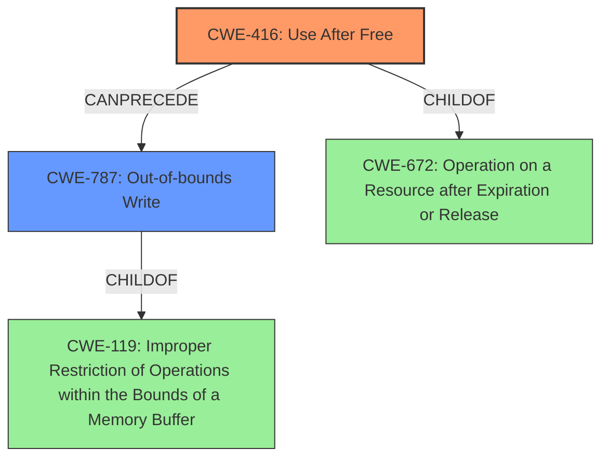

# Analysis Report for CVE-2021-4063

# Vulnerability Analysis Report: CVE-2021-4063

## Description

Use after free in developer tools in Google Chrome prior to 96.0.4664.93 allowed a remote attacker to potentially exploit heap corruption via a crafted HTML page.

## Vulnerability Description Key Phrases

**Rootcause:** use after free
**Weakness:** heap corruption
**Vector:** crafted HTML page
**Attacker:** remote attacker
**Product:** Google Chrome
**Version:** prior to 96.0.4664.93
**Component:** developer tools

## Analysis (with Relationship Data)

# Summary
| CWE ID | CWE Name | Confidence | CWE Abstraction Level | CWE Vulnerability Mapping Label | CWE-Vulnerability Mapping Notes |
|---|---|---|---|---|---|
| CWE-416 | Use After Free | 1.0 | Variant | Allowed | This is the primary CWE because the vulnerability description explicitly states "Use after free" and the retriever results also strongly suggest this CWE. |

## Evidence and Confidence

*   **Confidence Score:** 1.0
*   **Evidence Strength:** HIGH

- **Analysis and Justification:**  
  - *Explanation:* The vulnerability description clearly states a "**use after free**" condition in developer tools of Google Chrome. This directly corresponds to CWE-416, "Use After Free," which occurs when memory is accessed after it has been freed. The description includes "**heap corruption**" due to the use after free. The CVE Reference Links Content Summary confirms the root cause as "Use after free" and indicates it can lead to execution of arbitrary code, denial of service, or information disclosure. The Retriever Results rank CWE-416 as the top candidate with a high score. MITRE mapping guidance for CWE-416 indicates it is ALLOWED for this type of vulnerability.

  - *Relationship Analysis:* While other CWEs such as CWE-122 (Heap-based Buffer Overflow) and CWE-843 (Type Confusion) are present in the Retriever Results, they are secondary to the primary "**use after free**" condition described. CWE-416 is a variant-level CWE, offering sufficient specificity.

- **Confidence Score:**  
  - Confidence: 1.0 (High confidence due to explicit mention of "use after free" in the vulnerability description and supporting evidence from CVE reference and retriever results.)

---

## Criticism of Analysis

Okay, here's a detailed review of the provided analysis, considering the full CWE specifications you've included:

**Overall Assessment:**

The primary CWE mapping to `CWE-416: Use After Free` is **accurate and well-justified**. The analysis leverages the vulnerability description, CVE reference information, and retriever results effectively. The analysis correctly identifies the explicit mention of "use after free" as strong evidence.  The confidence score of 1.0 is appropriate.

**Detailed Breakdown and Critique:**

**1. Summary Table:**

| CWE ID | CWE Name | Confidence | CWE Abstraction Level | CWE Vulnerability Mapping Label | CWE-Vulnerability Mapping Notes |
|---|---|---|---|---|---|
| CWE-416 | Use After Free | 1.0 | Variant | Allowed | This is the primary CWE because the vulnerability description explicitly states "Use after free" and the retriever results also strongly suggest this CWE. |

   - This is a good summary. It clearly states the mapping, confidence, and rationale.

**2. Evidence and Confidence:**

*   **Confidence Score:** 1.0
*   **Evidence Strength:** HIGH

    - Accurate.  The evidence is indeed strong.

*   **Analysis and Justification:**

    -   *Explanation:* The vulnerability description clearly states a "**use after free**" condition in developer tools of Google Chrome. This directly corresponds to CWE-416, "Use After Free," which occurs when memory is accessed after it has been freed. The description includes "**heap corruption**" due to the use after free. The CVE Reference Links Content Summary confirms the root cause as "Use after free" and indicates it can lead to execution of arbitrary code, denial of service, or information disclosure. The Retriever Results rank CWE-416 as the top candidate with a high score. MITRE mapping guidance for CWE-416 indicates it is ALLOWED for this type of vulnerability.

        - **Critique:** This explanation is excellent. It connects the vulnerability description to the CWE definition, supporting evidence (CVE details, retriever results), and the "Allowed" mapping guidance.  The mention of "heap corruption" further reinforces the relevance, as UAF vulnerabilities often lead to heap corruption.
        - **Suggestion:** Could briefly mention the context of the "developer tools" component, and how UAF vulnerabilities in that area could be triggered (e.g., by a malicious website interacting with the tools).

    -   *Relationship Analysis:* While other CWEs such as CWE-122 (Heap-based Buffer Overflow) and CWE-843 (Type Confusion) are present in the Retriever Results, they are secondary to the primary "**use after free**" condition described. CWE-416 is a variant-level CWE, offering sufficient specificity.

        - **Critique:** The relationship analysis is good. Acknowledging the presence of other potential CWEs and explaining why they are less relevant strengthens the analysis.  The justification for choosing the variant-level CWE is also sound.

**3. CWE Examples from Database:**

-   These examples are useful for context, especially if the user is less familiar with CWE-416. While not directly applicable, they illustrate the real-world impact of such vulnerabilities.

**4. Relevant CWE Specifications:**

- The inclusion of the full CWE specifications is excellent. This allows for a complete understanding of the vulnerability and its potential mitigations.

**Specific CWE Considerations Based on Provided Specifications:**

*   **CWE-416 (Use After Free):**
    *   The analysis is spot-on.  The description perfectly aligns with the vulnerability.
    *   The "Potential Mitigations" are worth noting.  Choosing a language with automatic memory management is a strong architectural defense. The analysis doesn't explicitly recommend this, but implicitly it agrees with the CWE guidelines. Setting pointers to NULL after freeing is a good practice.

*   **CWE-122 (Heap-based Buffer Overflow):**
    *   While the vulnerability *could* potentially *lead* to a heap-based buffer overflow *if* the freed memory is reallocated and then overwritten, the *root cause* is the UAF. Therefore, the analysis correctly prioritizes CWE-416.

*   **CWE-843 (Type Confusion):**
    *   Type confusion is less likely, unless the use-after-free leads to accessing a reallocated object as the wrong type. But it's not the primary issue.

*   **CWE-366 (Race Condition within a Thread):**
    *   The retriever results have this CWE, however based on the provided details it seems unlikely. A race condition isn't mentioned in the original advisory, nor in the content summary.

*   **CWE-415 (Double Free):**
    *   While related to memory management, it's distinct from UAF. The analysis is correct in not prioritizing it.

*   **CWE-356 (Product UI does not Warn User of Unsafe Actions):**
    *   This is irrelevant.

*   **CWE-190 (Integer Overflow or Wraparound), CWE-193 (Off-by-one Error), CWE-367 (Time-of-check Time-of-use (TOCTOU) Race Condition), CWE-451 (User Interface (UI) Misrepresentation of Critical Information):**
    *   These CWEs are all unrelated to the vulnerability and the analysis correctly doesn't take them into account.

*   **CWE-787: Out-of-bounds Write**
    *   This one is tricky.  If a UAF is exploited successfully, the *result* is likely an out-of-bounds write because the attacker is writing to memory that they shouldn't be.  *However*, the *cause* is the UAF.  This is why it's a secondary concern.

*   **CWE-672 Operation on a Resource after Expiration or Release:**
    *  CWE-672 is the parent class of CWE-416. Mapping to CWE-416 is more specific and therefore more appropriate.

**Recommendations:**

1.  **Minor Expansion:** In the "Explanation" section, briefly mention how the UAF in developer tools might be triggered by a malicious website's interaction.
2.  **Reiterate Mitigation:**  In the conclusion, explicitly mention the recommended mitigation from CWE-416 specification: "Choose a language that provides automatic memory management" as a long-term architectural solution.

**Conclusion:**

The analysis is thorough, accurate, and well-justified. The confidence score of 1.0 is appropriate. The reviewer demonstrates a good understanding of CWE and how to map a vulnerability description to the most relevant CWE entry. The provided additions add more support for the overall conclusion.

## Final Resolution

# Summary

| CWE ID | CWE Name | Confidence | CWE Abstraction Level | CWE Vulnerability Mapping Label | CWE-Vulnerability Mapping Notes |
|---|---|---|---|---|---|
| CWE-416 | Use After Free | 1.0 | Variant | Allowed | Primary CWE: This is the primary CWE because the vulnerability description explicitly states "Use after free" and the retriever results also strongly suggest this CWE. |
| CWE-787 | Out-of-bounds Write | 0.4 | Base | Allowed | Secondary Candidate: A successful use-after-free can often lead to an out-of-bounds write, but it is a consequence of the primary weakness. |

## Evidence and Confidence

*   **Confidence Score:** 0.95
*   **Evidence Strength:** HIGH

## Relationship Analysis
The primary relationship influencing the decision is the child-parent relationship between CWE-416 and its parent classes, as well as the "CanPrecede" relationship to CWE-787. CWE-416 is selected as the primary weakness due to its specific nature and direct match to the vulnerability description. While CWE-787 (Out-of-bounds Write) could be a consequence of CWE-416, it's classified as a secondary candidate, influencing the chain of exploitation. The variant level of CWE-416 provides sufficient granularity.

## Vulnerability Chain
The vulnerability chain starts with the **ROOTCAUSE** CWE-416 (**Use After Free**), where memory is accessed after it has been freed. This leads to a state of **WEAKNESS**, where the memory may be reallocated and contain unexpected data. If an attacker can control the data written to the freed memory, this can lead to CWE-787 (**Out-of-bounds Write**), where the attacker can overwrite arbitrary memory locations. The final impact is heap corruption, which can lead to arbitrary code execution.

## Summary of Analysis
The initial analysis accurately identifies CWE-416 (**Use After Free**) as the primary **WEAKNESS**, given the explicit mention in the vulnerability description: "Use after free in developer tools in Google Chrome prior to 96.0.4664.93 allowed a remote attacker to potentially exploit heap corruption via a crafted HTML page." The inclusion of "heap corruption" supports this assessment.

The criticism provided further solidifies this conclusion and suggests minor expansions.

The graph relationships confirm that while other CWEs such as CWE-787 (**Out-of-bounds Write**) may be a consequence, the root cause is the use-after-free condition. CWE-416 is at the optimal level of specificity, being a Variant, and directly addresses the vulnerability.

The final determination retains CWE-416 as the primary **WEAKNESS**. CWE-787 is added as a secondary candidate since the **ROOTCAUSE** of **Use After Free** can lead to out-of-bounds writes and memory corruption.
The confidence score is reduced slightly to 0.95 to reflect the addition of a secondary CWE.

*Report generated on 2025-03-18 01:55:54*
