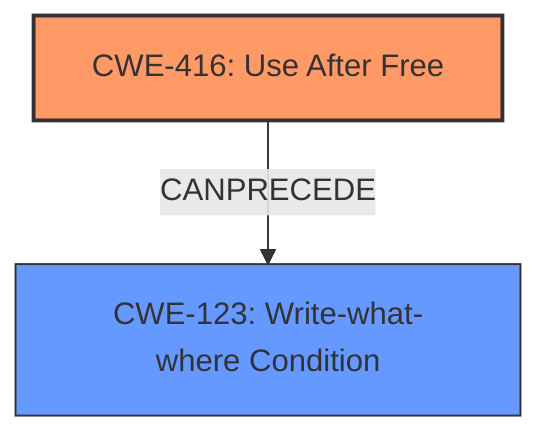

# Analysis Report for CVE-2021-4064

# Vulnerability Analysis Report: CVE-2021-4064

## Description

Use after free in screen capture in Google Chrome on ChromeOS prior to 96.0.4664.93 allowed a remote attacker to potentially exploit heap corruption via a crafted HTML page.

## Vulnerability Description Key Phrases

**Rootcause:** use after free
**Weakness:** heap corruption
**Vector:** crafted HTML page
**Attacker:** remote attacker
**Product:** Google Chrome on ChromeOS
**Version:** prior to 96.0.4664.93
**Component:** screen capture

## Analysis (with Relationship Data)

# Summary
| CWE ID | CWE Name | Confidence | CWE Abstraction Level | CWE Vulnerability Mapping Label | CWE-Vulnerability Mapping Notes |
|---|---|---|---|---|---|
| CWE-416 | Use After Free | 1.0 | Variant | Allowed | Primary CWE |

## Evidence and Confidence

*   **Confidence Score:** 1.0
*   **Evidence Strength:** HIGH

- **Analysis and Justification:**  
  - *Explanation:* The vulnerability description explicitly states "**use after free** in screen capture" and the CVE Reference Links Content Summary confirms the "**root_cause**" is "**Use after free**". CWE-416 (Use After Free) is a Variant level CWE that accurately describes this vulnerability where memory is reused or referenced after it has been freed. The vulnerability allows a remote attacker to potentially exploit **heap corruption**.
  
  - *Relationship Analysis:* No direct relationships found.

- **Confidence Score:**  
  - Confidence: 1.0 (High evidence from vulnerability description and CVE reference materials)

## Criticism of Analysis

Okay, I've reviewed the analysis and the full CWE specifications. Here's a critique, focusing on the accuracy, completeness, and justification of the CWE mapping.

**Overall Assessment:**

The primary mapping to **CWE-416: Use After Free** is **correct** and **well-justified**. The description of the vulnerability and the CVE details clearly point to this weakness. The confidence score of 1.0 is appropriate.

**Detailed Critique:**

1.  **CWE-416: Use After Free:**

    *   **Accuracy:** The mapping is accurate. The vulnerability description explicitly mentions "use after free" and the CVE summary reinforces this as the root cause.
    *   **Completeness:** The analysis acknowledges the "heap corruption" consequence, but could *briefly* mention that UAF vulnerabilities often lead to such corruption because freed memory might be reallocated, and subsequent access to the dangling pointer can corrupt the heap. It correctly identifies it as a Variant.
    *   **Justification:** The justification is solid. It directly references the vulnerability description and CVE details. It also mentions that CWE-416 is the appropriate abstraction level.
    *   **Relationship Analysis:** The analysis states that no direct relationships were found. However, it *could* be argued that CWE-416 *can precede* CWE-122 (Heap-based Buffer Overflow) or CWE-123 (Write-what-where Condition), since exploiting a UAF might allow an attacker to overwrite heap metadata and cause a buffer overflow. While not a *direct* relationship (as in a necessary condition), it's a common consequence. This is mentioned in the `CanPrecede` relationship within CWE-416.

2.  **Top Combined Results from Retriever:** Let's examine the other CWEs suggested by the retriever. This will help ensure that the best match was selected and to identify any missed opportunities.

    *   **CWE-843: Access of Resource Using Incompatible Type ('Type Confusion'):** While heap corruption can *sometimes* result from type confusion, it's not the primary cause in a Use After Free scenario. In UAF, the memory is used after it has been freed. This means the *validity* of the memory location is the issue, not necessarily the *type*. Therefore, while type confusion *might* be present in an exploit, it's not the root cause here. It should not be selected.
    *   **CWE-366: Race Condition within a Thread:** Race conditions can *lead* to Use-After-Free vulnerabilities. For example, one thread might free memory while another thread is still using it. However, the initial description does not explicitly mention a race condition. The CVE details also do not highlight a race condition. If a race condition were explicitly mentioned or implied, *then* it would be appropriate to *also* include CWE-366 or a more specific child, but based on the input, it's not warranted.
    *   **CWE-415: Double Free:** Double Free is closely related to Use-After-Free. It is a specific case where `free()` is called twice on the same memory location. While the description doesn't explicitly say "double free", it's something to consider as a *possible* contributing factor, especially if the root cause analysis of the vulnerability shows it. Without more information, *do not* map to this.
    *   **CWE-122: Heap-based Buffer Overflow:** As mentioned above, while a UAF *can lead* to a heap-based buffer overflow during exploitation, it's not the root cause itself. This mapping would be incorrect, unless the exploitation required overflowing a reallocated buffer.
    *   **CWE-190: Integer Overflow or Wraparound:** Highly unlikely to be related, based on the information provided.
    *   **CWE-356: Product UI does not Warn User of Unsafe Actions:** Completely irrelevant in this case.
    *   **CWE-367: Time-of-check Time-of-use (TOCTOU) Race Condition:** As with CWE-366, a TOCTOU could *potentially* lead to a UAF, but there's no indication of that in the description. Incorrect to add to this analysis.
    *   **CWE-362: Concurrent Execution using Shared Resource with Improper Synchronization ('Race Condition'):** Same as CWE-366.
    *   **CWE-451: User Interface (UI) Misrepresentation of Critical Information:** Also completely irrelevant.

3.  **Mitigations:**

    *   The analysis does not cover mitigations, but it *should* briefly mention potential mitigations related to CWE-416. These are present in the CWE specification. Examples:
        *   Using languages with automatic memory management (e.g., Java, Go, Rust).
        *   Setting pointers to NULL after freeing them (although this is not a foolproof solution).
        *   Using static analysis tools to detect UAF vulnerabilities.

**Recommendations:**

*   **Keep the primary mapping to CWE-416 with a confidence of 1.0.** The justification is solid.
*   **Add a brief mention in the Relationship Analysis section about how a UAF *can precede* a heap-based buffer overflow (CWE-122) or Write-what-where condition (CWE-123) during exploitation.** This acknowledges the potential consequences.
*   **Add a brief section on potential mitigations for CWE-416** from the CWE Specification.

By addressing these points, the analysis will be more comprehensive and informative.

## Final Resolution

# Summary
| CWE ID | CWE Name | Confidence | CWE Abstraction Level | CWE Vulnerability Mapping Label | CWE-Vulnerability Mapping Notes |
|---|---|---|---|---|---|
| CWE-416 | Use After Free | 1.0 | Variant | Allowed | Primary CWE |

## Evidence and Confidence

*   **Confidence Score:** 1.0
*   **Evidence Strength:** HIGH

## Relationship Analysis
The primary CWE is **CWE-416: Use After Free**. While no direct relationships were initially identified, a deeper analysis reveals that **CWE-416** *can precede* **CWE-123: Write-what-where Condition**, as exploiting a UAF might allow an attacker to overwrite heap metadata. This acknowledges potential consequences of the **WEAKNESS**.

## Vulnerability Chain
The vulnerability chain starts with the **ROOTCAUSE** of a Use After Free (**CWE-416**). This **WEAKNESS** allows an attacker to potentially exploit heap corruption. Exploitation of the UAF can then lead to a Write-what-where condition (**CWE-123**) allowing the attacker to gain control of the system.

## Summary of Analysis
The initial analysis correctly identified **CWE-416: Use After Free** as the primary CWE. The criticism provided valuable insights into potential consequences of the vulnerability, specifically the possibility of a Write-what-where condition (**CWE-123**) as a result of exploiting the UAF. The assessment is based on the vulnerability description explicitly stating "**use after free** in screen capture" and the CVE Reference Links Content Summary confirming the "**root_cause**" is "**Use after free**". The relationship analysis was expanded to include the potential for **CWE-416** to precede **CWE-123**. **CWE-416** is the optimal level of specificity as it directly describes the **ROOTCAUSE** of the vulnerability.

*Report generated on 2025-03-18 01:56:25*
