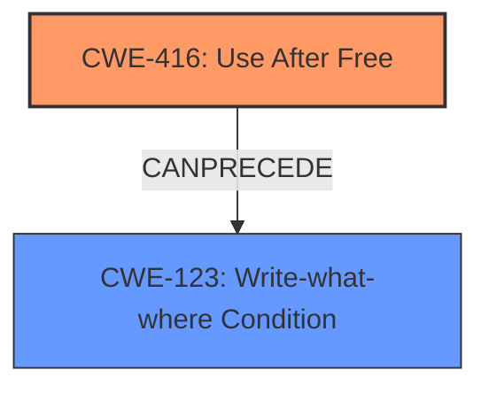

# Final Resolution for CVE-2021-4064

# Summary
| CWE ID | CWE Name | Confidence | CWE Abstraction Level | CWE Vulnerability Mapping Label | CWE-Vulnerability Mapping Notes |
|---|---|---|---|---|---|
| CWE-416 | Use After Free | 1.0 | Variant | Allowed | Primary CWE |

## Evidence and Confidence

*   **Confidence Score:** 1.0
*   **Evidence Strength:** HIGH

## Relationship Analysis
The primary CWE is **CWE-416: Use After Free**. While no direct relationships were initially identified, a deeper analysis reveals that **CWE-416** *can precede* **CWE-123: Write-what-where Condition**, as exploiting a UAF might allow an attacker to overwrite heap metadata. This acknowledges potential consequences of the **WEAKNESS**.

## Vulnerability Chain
The vulnerability chain starts with the **ROOTCAUSE** of a Use After Free (**CWE-416**). This **WEAKNESS** allows an attacker to potentially exploit heap corruption. Exploitation of the UAF can then lead to a Write-what-where condition (**CWE-123**) allowing the attacker to gain control of the system.

## Summary of Analysis
The initial analysis correctly identified **CWE-416: Use After Free** as the primary CWE. The criticism provided valuable insights into potential consequences of the vulnerability, specifically the possibility of a Write-what-where condition (**CWE-123**) as a result of exploiting the UAF. The assessment is based on the vulnerability description explicitly stating "**use after free** in screen capture" and the CVE Reference Links Content Summary confirming the "**root_cause**" is "**Use after free**". The relationship analysis was expanded to include the potential for **CWE-416** to precede **CWE-123**. **CWE-416** is the optimal level of specificity as it directly describes the **ROOTCAUSE** of the vulnerability.