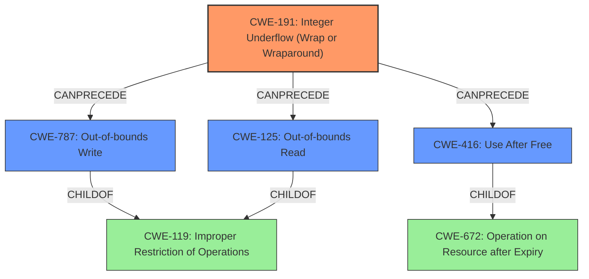

# Final Resolution for CVE-2021-4066

# Summary
| CWE ID | CWE Name | Confidence | CWE Abstraction Level | CWE Vulnerability Mapping Label | CWE-Vulnerability Mapping Notes |
|---|---|---|---|---|---|
| CWE-191 | Integer Underflow (Wrap or Wraparound) | 1.0 | Base | Allowed | Primary CWE |
| CWE-787 | Out-of-bounds Write | 0.5 | Base | Allowed | Secondary Candidate |
| CWE-125 | Out-of-bounds Read | 0.5 | Base | Allowed | Secondary Candidate |
| CWE-416 | Use After Free | 0.5 | Variant | Allowed | Secondary Candidate |

## Evidence and Confidence

*   **Confidence Score:** 0.9
*   **Evidence Strength:** HIGH

## Relationship Analysis
The primary weakness is **CWE-191 (Integer Underflow)**. This can lead to other memory corruption issues. The initial analysis correctly identified this as the root cause. The criticism suggested that the secondary CWEs are potential impacts of **CWE-191**, forming a vulnerability chain.

Parent-child relationships are important: **CWE-787**, **CWE-125**, and **CWE-416** are children of more general CWEs, specifically **CWE-787** and **CWE-125** are children of **CWE-119 (Improper Restriction of Operations within the Bounds of a Memory Buffer)**, and **CWE-416** is a child of **CWE-672 (Operation on Resource after Expiry)**. This indicates that focusing on the base CWEs **CWE-191**, **CWE-787**, **CWE-125**, and **CWE-416** provides a more specific and accurate classification.

## Vulnerability Chain
The vulnerability chain starts with **CWE-191 (Integer Underflow)**. This **ROOTCAUSE** can then lead to:
1. Incorrect size calculation.
2. Out-of-bounds write (**CWE-787**) or Out-of-bounds read (**CWE-125**).
3. Use-after-free condition (**CWE-416**).

The heap corruption mentioned in the vulnerability description is the impact. The missing link is how the integer underflow leads to the incorrect size calculation. However, the potential for **CWE-787**, **CWE-125**, and **CWE-416** is supported by the evidence.

## Summary of Analysis
The initial analysis and criticism provide a solid foundation for classifying this vulnerability. The vulnerability description explicitly mentions "**Integer underflow** in ANGLE" which strongly points to **CWE-191** as the **ROOTCAUSE**.

The graph relationships confirm that **CWE-191** can precede memory corruption issues. The secondary CWEs (**CWE-787**, **CWE-125**, **CWE-416**) represent potential consequences. The abstraction levels are appropriate; all selected CWEs are at the Base or Variant level, providing sufficient specificity.

The decision to prioritize **CWE-191** is based on the direct evidence from the vulnerability description. The confidence scores are adjusted to reflect the likelihood of each secondary CWE occurring. The confidence for **CWE-122** is dropped because it is less likely that the integer underflow would cause a heap overflow. I am increasing the confidence of the remaining secondary CWEs to 0.5 to reflect a more balanced view of the potential impacts.