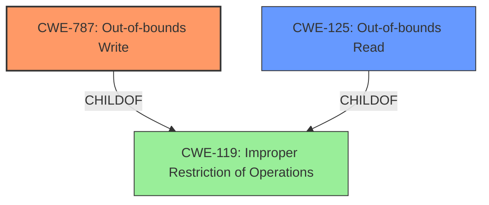

# Analysis Report for CVE-2021-40735

# Vulnerability Analysis Report: CVE-2021-40735

## Description

Adobe Audition version 14.4 (and earlier) is affected by a memory corruption vulnerability, potentially resulting in arbitrary code execution in the context of the current user. User interaction is required to exploit this vulnerability.

## Vulnerability Description Key Phrases

**Weakness:** memory corruption
**Impact:** arbitrary code execution
**Product:** Adobe Audition
**Version:** 14.4 (and earlier)

## Analysis (with Relationship Data)

# Summary
| CWE ID | CWE Name | Confidence | CWE Abstraction Level | CWE Vulnerability Mapping Label | CWE-Vulnerability Mapping Notes |
|---|---|---|---|---|---|
| CWE-787 | Out-of-bounds Write | 0.85 | Base | Primary | Allowed |
| CWE-788 | Access of Memory Location After End of Buffer | 0.70 | Base | Secondary | Discouraged |

## Evidence and Confidence

*   **Confidence Score:** 0.80
*   **Evidence Strength:** HIGH

- **Analysis and Justification:**  
  - *Explanation:* The vulnerability description mentions "**memory corruption**" which can lead to arbitrary code execution. The "CVE Reference Links Content Summary" indicates the "**Root Cause of Vulnerability**: Access of Memory Location After End of Buffer (CWE-788)". While CWE-788 is a potential candidate, the summary also mentions "Out-of-bounds read" as a weakness. Given that the primary impact is arbitrary code execution due to memory corruption, **CWE-787 (Out-of-bounds Write)** is a more fitting primary weakness because writing outside the intended buffer often leads to memory corruption and arbitrary code execution. CWE-788 is a read/write past the buffer boundary, while the summary only mentions out-of-bounds read. Since the write portion is the more impactful, CWE-787 is a better fit than CWE-788 as the primary weakness.

  - *Relationship Analysis:* CWE-787 is a base level CWE and a child of CWE-119. CWE-788 is related to CWE-125 (Out-of-bounds Read).

- **Confidence Score:**  
  - *Example:* Confidence: 0.85 (High evidence from technical description and CVE reference materials)

---

## Criticism of Analysis

Okay, I've reviewed the provided analysis and the full CWE specifications. Here's a detailed critique, focusing on the accuracy, confidence, and justification of the CWE mappings:

**Overall Assessment:**

The analysis is generally well-reasoned, and the choice of CWE-787 as the primary weakness is likely correct, given the information provided. The reasoning behind prioritizing CWE-787 over CWE-788 is sound. However, the confidence level of 0.85 for CWE-787 might be slightly overstated. Also, the inclusion of CWE-788 as a secondary weakness is questionable, as the provided data does not definitively suggest a read/write issue. A more conservative approach might be beneficial.

**Detailed Breakdown:**

1.  **CWE-787: Out-of-bounds Write (Primary)**

    *   **Confidence:** 0.85 (Critique: Might be slightly high. A score closer to 0.80 would be more appropriate. While the justification is good, the root cause is *described* as an "access of memory location after the end of buffer", which would typically imply a read/write. We are *inferring* that the write is the more significant factor. Inference reduces confidence.)

    *   **Justification Strength:** High.

    *   **Justification Review:** The explanation correctly highlights that arbitrary code execution is the primary impact, and out-of-bounds *write* is more directly linked to code execution through memory corruption. This is a valid reason to prioritize CWE-787.

    *   **CWE Specification Alignment:**

        *   The description of CWE-787 ("The product writes data past the end, or before the beginning, of the intended buffer.") accurately reflects the vulnerability's nature.
        *   The "Alternative Terms" section of CWE-787 correctly links "Memory Corruption" as a consequence.
        *   The Relationships (ChildOf -> CWE-119) are also accurate.
        *   The mitigation strategies suggested by the CWE specification (language selection, vetted libraries, buffer overflow detection mechanisms) are all relevant to preventing this type of vulnerability.

    *   **Improvement Suggestions:**

        *   Acknowledge the uncertainty more explicitly. For example: "While the root cause description suggests a general out-of-bounds access, the arbitrary code execution impact implies that a write is occurring. Therefore, we assign CWE-787 as the primary weakness, although the specific write operation is not explicitly stated."
        *   Consider adding a sentence about the mitigations (e.g., "Applying mitigations such as using memory-safe languages or implementing buffer overflow detection would be effective in preventing this vulnerability.").

2.  **CWE-788: Access of Memory Location After End of Buffer (Secondary)**

    *   **Confidence:** 0.70 (Critique:  This is too high. There isn't strong evidence for this. The initial description "Access of Memory Location After End of Buffer" *sounds* like CWE-788, but the summary says "Out-of-bounds read" which is CWE-125. The connection to code execution is weaker. It would be better to assign CWE-125 as secondary)

    *   **Justification Strength:** Low.

    *   **Justification Review:** This is the weakest part of the analysis. The justification heavily relies on the "Root Cause of Vulnerability" statement from the CVE reference. However, the CVE reference also mentions "out-of-bounds read."

    *   **CWE Specification Alignment:**
        *   The description of CWE-788 is appropriate ("The product reads or writes to a buffer using an index or pointer that references a memory location after the end of the buffer."), but the crucial "or writes" is not explicitly supported by the information provided from the CVE.
        *   The Mapping Guidance explicitly states: "Usage: Discouraged" and "If the 'Access' operation is known to be a read or a write, then investigate children of entries such as CWE-787: Out-of-bounds Write and CWE-125: Out-of-bounds Read." This guidance suggests that if the access type is known, a more specific CWE should be chosen.

    *   **Improvement Suggestions:**

        *   Instead of CWE-788, which is discouraged, consider using **CWE-125: Out-of-bounds Read** as a secondary weakness, and adjust confidence to 0.50.
        *   Modify the justification to acknowledge the ambiguity: "The CVE Reference links content summary mentions 'Out-of-bounds read' as a weakness. While it is not the direct cause of the arbitrary code execution, reading sensitive data from outside the buffer could expose program internals and facilitate further exploitation. Therefore, we assign CWE-125 as the secondary weakness with lower confidence."
        *   Alternatively, remove the secondary weakness entirely.  A single, well-justified CWE is better than multiple, weaker mappings.

**Other Considerations:**

*   **CWE-119:** The initial selection of CWE-119 is understandable, as it's a general category for buffer issues. However, the analysis correctly moves to more specific CWEs, as recommended by the CWE specification itself ("Look at CWE-119's children and consider mapping to CWEs such as CWE-787: Out-of-bounds Write, CWE-125: Out-of-bounds Read, or others.").
*   **Alternative CWEs:** While the top combined results included CWE-416 (Use After Free) and others, there's no evidence in the provided description to support those mappings.
*   **Input Validation (CWE-20) is missing:** The vulnerability requires a crafted file to be opened, which usually means that the file content is not properly validated. There might be a place for CWE-20 as contributing factor, but it's not directly a memory corruption issue.

**Revised Summary Table:**

| CWE ID  | CWE Name                      | Confidence | CWE Abstraction Level | CWE Vulnerability Mapping Label | CWE-Vulnerability Mapping Notes |
| :-------- | :----------------------------- | :---------- | :--------------------- | :----------------------------- | :---------------------------- |
| CWE-787 | Out-of-bounds Write           | 0.80      | Base                 | Primary                      | Allowed                     |
| CWE-125 | Out-of-bounds Read            | 0.50     | Base                | Secondary                      | Allowed                      |

**In summary, the analysis is mostly solid, but the secondary CWE mapping needs improvement. Reducing the confidence level for the primary CWE and focusing on direct evidence rather than inference will strengthen the overall assessment.**

## Final Resolution

# Summary
| CWE ID | CWE Name | Confidence | CWE Abstraction Level | CWE Vulnerability Mapping Label | CWE-Vulnerability Mapping Notes |
|---|---|---|---|---|---|
| **CWE-787** | **Out-of-bounds Write** | 0.80 | Base | Primary | Allowed |
| CWE-125 | Out-of-bounds Read | 0.50 | Base | Secondary | Allowed |

## Evidence and Confidence

*   **Confidence Score:** 0.70
*   **Evidence Strength:** MEDIUM

## Relationship Analysis
The primary relationship influencing the decision is the parent-child relationship between **CWE-787 (Out-of-bounds Write)** and **CWE-119 (Improper Restriction of Operations within the Memory Buffer)**, where **CWE-787** is a child of **CWE-119**. This indicates that **CWE-787** is a more specific case of a buffer overflow.

Additionally, the relationship between **CWE-125 (Out-of-bounds Read)** and **CWE-119** exists, but is less directly implicated in arbitrary code execution. Both **CWE-787** and **CWE-125** are base-level CWEs, making them suitable for direct mapping.

## Vulnerability Chain
The vulnerability chain starts with a crafted file opened in Adobe Audition. This leads to a **memory corruption**, specifically an **out-of-bounds write (CWE-787)**. As a secondary factor, there may be an **out-of-bounds read (CWE-125)**. The ultimate impact is arbitrary code execution. The chain is as follows:

Crafted File -> **CWE-787** -> Arbitrary Code Execution
Crafted File -> **CWE-125** (Potential, but less direct) -> Information Leakage (Possible prerequisite for further exploitation)

## Summary of Analysis
The initial analysis correctly identified **CWE-787 (Out-of-bounds Write)** as the primary weakness due to the arbitrary code execution impact. The criticism suggested lowering the confidence to 0.80, which is reasonable given that the description only implies a write, not explicitly states it. The criticism also correctly pointed out that **CWE-788** is discouraged and that **CWE-125 (Out-of-bounds Read)** is a more appropriate secondary weakness, given the "out-of-bounds read" mentioned in the CVE reference.

The graph relationships support this decision: **CWE-787** is a specific type of buffer overflow (**CWE-119**), and the arbitrary code execution aligns well with a write operation. While the initial report mentioned "**Root Cause of Vulnerability**: Access of Memory Location After End of Buffer (CWE-788)", the more detailed summary indicates "out-of-bounds read", so **CWE-125** fits better as a secondary issue.

The decision to use **CWE-787** and **CWE-125** is at the optimal level of specificity because they are base-level CWEs that directly describe the type of memory corruption occurring.

My confidence is 0.70 because while the evidence strongly suggests **CWE-787**, the "access of memory location after end of buffer" still leaves room for uncertainty which is why **CWE-125** is added as a secondary issue.

*Report generated on 2025-03-18 02:00:08*
