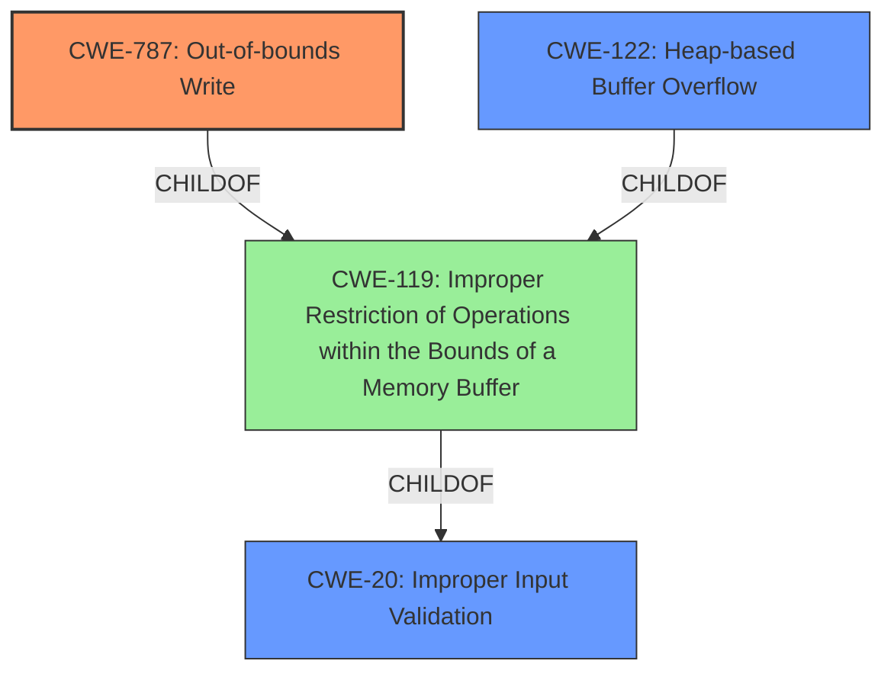

# Final Resolution for CVE-2021-40738

# Summary
| CWE ID | CWE Name | Confidence | CWE Abstraction Level | CWE Vulnerability Mapping Label | CWE-Vulnerability Mapping Notes |
|---|---|---|---|---|---|
| CWE-787 | Out-of-bounds Write | 0.9 | Base | Primary | Allowed |
| CWE-122 | Heap-based Buffer Overflow | 0.7 | Variant | Secondary | Allowed |
| CWE-20 | Improper Input Validation | 0.5 | Class | Contributing Factor | Discouraged |

## Evidence and Confidence

*   **Confidence Score:** 0.8
*   **Evidence Strength:** MEDIUM

## Relationship Analysis
The primary relationship that impacted the decision was the parent-child relationship between CWE-787 (**Out-of-bounds Write**) and CWE-119 (**Improper Restriction of Operations within the Bounds of a Memory Buffer**). CWE-787 (**Out-of-bounds Write**) is a child of CWE-119 (**Improper Restriction of Operations within the Bounds of a Memory Buffer**), making it a more specific classification, which is preferred. CWE-20 (**Improper Input Validation**) is a parent of CWE-119 (**Improper Restriction of Operations within the Bounds of a Memory Buffer**), indicating a possible vulnerability chain where improper input validation leads to memory corruption. The abstraction levels influenced the decision by favoring the base-level CWE-787 (**Out-of-bounds Write**) over the class-level CWE-119 (**Improper Restriction of Operations within the Bounds of a Memory Buffer**).

## Vulnerability Chain
The vulnerability chain starts with CWE-20 (**Improper Input Validation**) where the WAV file's header or data fields are not properly validated. This leads to CWE-787 (**Out-of-bounds Write**) because the application attempts to write data to a buffer without properly checking the boundaries. If the buffer is allocated on the heap, this results in CWE-122 (**Heap-based Buffer Overflow**). The final impact is arbitrary code execution. A missing link in the provided information is confirmation of heap allocation, which is why CWE-122 (**Heap-based Buffer Overflow**) remains a secondary consideration with moderate confidence.

## Summary of Analysis
The analysis is based on the provided evidence, including the vulnerability description and the retriever results. The primary **weakness** is identified as CWE-787 (**Out-of-bounds Write**), supported by the statement "Access of Memory Location After End of Buffer" in the CVE reference. This indicates that the application is writing data past the end of the intended buffer. The inclusion of CWE-122 (**Heap-based Buffer Overflow**) is justified by the nature of WAV file processing, which often involves dynamic memory allocation on the heap, making it a plausible secondary **weakness**. However, without explicit confirmation of heap allocation, the confidence remains moderate. The addition of CWE-20 (**Improper Input Validation**) as a contributing factor acknowledges that the root cause is the lack of validation of the WAV file's header and data fields. The graph relationships influenced the final selection by highlighting the hierarchical relationship between CWE-787 (**Out-of-bounds Write**) and CWE-119 (**Improper Restriction of Operations within the Bounds of a Memory Buffer**), favoring the more specific CWE-787 (**Out-of-bounds Write**). The selected CWEs are at the optimal level of specificity, with CWE-787 (**Out-of-bounds Write**) being a base-level CWE and CWE-122 (**Heap-based Buffer Overflow**) being a variant-level CWE. While CWE-119 (**Improper Restriction of Operations within the Bounds of a Memory Buffer**) is a parent of both, it is a class-level CWE, and the mapping guidance discourages its use when more specific CWEs are available. The evidence for CWE-20 (**Improper Input Validation**) is implied but not explicitly stated in the description, reducing the confidence.

I am adding CWE-20 since the description states "...when parsing a WAV file..." suggests there is a parsing routine and that routines reads data, and if the data is not validated, then this is a likely contributing factor.

"Adobe Audition version 14.4 (and earlier) is affected by a **memory corruption** vulnerability **when parsing a WAV file**..."

My overall confidence is 0.8, and the evidence strength is MEDIUM because the information regarding heap allocation and lack of input validation is implied but not explicitly stated in the vulnerability description.