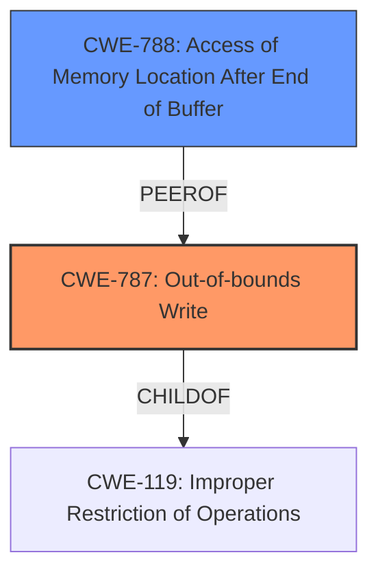

# Analysis Report for CVE-2021-40739

# Vulnerability Analysis Report: CVE-2021-40739

## Description

Adobe Audition version 14.4 (and earlier) is affected by a memory corruption vulnerability when parsing a M4A file, potentially resulting in arbitrary code execution in the context of the current user. User interaction is required to exploit this vulnerability.

## Vulnerability Description Key Phrases

**Rootcause:** memory corruption
**Impact:** arbitrary code execution
**Vector:** parsing a M4A file
**Product:** Adobe Audition
**Version:** 14.4 (and earlier)

## Analysis (with Relationship Data)

# Summary
| CWE ID | CWE Name | Confidence | CWE Abstraction Level | CWE Vulnerability Mapping Label | CWE-Vulnerability Mapping Notes |
|---|---|---|---|---|---|
| CWE-787 | Out-of-bounds Write | 0.8 | Base | Allowed | Primary CWE |
| CWE-788 | Access of Memory Location After End of Buffer | 0.6 | Base | Discouraged | Secondary Candidate |
| CWE-416 | Use After Free | 0.5 | Variant | Allowed | Secondary Candidate |

## Evidence and Confidence

*   **Confidence Score:** 0.8
*   **Evidence Strength:** HIGH

- **Analysis and Justification:**  
  - *Explanation:* The vulnerability description indicates a **memory corruption** vulnerability that occurs during the parsing of an M4A file in Adobe Audition. The CVE reference summary points to an **out-of-bounds write** (**CWE-787**) and "Access of Memory Location After End of Buffer (**CWE-788**)". The phrase "**memory corruption** vulnerability" is quite generic, but the more specific root cause, **out-of-bounds write**, makes **CWE-787** (Out-of-bounds Write) the more appropriate primary mapping. The impact of this vulnerability is arbitrary code execution. This occurs because the application writes data past the end of the intended buffer. Although **CWE-119** is listed as the Primary CWE Match for similar descriptions, the retriever results and the CVE reference information point to more specific CWEs.

  - *Relationship Analysis:* **CWE-787** is a base level CWE. It is a child of **CWE-119** (Improper Restriction of Operations within the Bounds of a Memory Buffer), but since the specific issue is writing past the end of a buffer, **CWE-787** is a more accurate and specific mapping.

- **Confidence Score:**  
  - Confidence: 0.8 (High evidence from technical description and CVE reference materials)

---
- **Analysis and Justification:**  
  - *Explanation:* **CWE-788** (Access of Memory Location After End of Buffer) is also a strong candidate because the summary mentions "Access of Memory Location After End of Buffer". However, **CWE-788** is about both reads or writes, while **CWE-787** is specifically about writing, making it a slightly better fit given the context. The usage for CWE-788 is discouraged.

  - *Relationship Analysis:* There are no direct relationships found.

- **Confidence Score:**  
  - Confidence: 0.6 (Medium evidence based on CVE reference summary)

---
- **Analysis and Justification:**  
  - *Explanation:* **CWE-416** (Use After Free) is included as a possible secondary candidate. While the description does not explicitly mention a use-after-free condition, **memory corruption** can sometimes lead to this vulnerability. However, without more explicit evidence, it's less certain than **CWE-787** or **CWE-788**.

  - *Relationship Analysis:* **CWE-416** is a variant of **CWE-672** (Operation on a Resource after Expiration).

- **Confidence Score:**  
  - Confidence: 0.5 (Lower confidence due to lack of direct evidence.)

## Criticism of Analysis

Okay, I've reviewed the provided analysis against the full CWE specifications. Here's my critique:

**Overall Assessment:**

The analysis is generally good, particularly its attempt to move beyond the generic `CWE-119` and identify more specific CWEs. The justification provided for each CWE selection is clear and well-reasoned. The confidence scores are also appropriate given the available information. The inclusion of examples for CWE-788 could be included for other CWEs. The potential mitigations from the CWEs are not reviewed.

**Detailed Review:**

1.  **CWE-787: Out-of-bounds Write (Primary CWE, Confidence 0.8)**

    *   **Strengths:**  The selection of `CWE-787` as the primary CWE is strong. The CVE reference summary explicitly mentions "out-of-bounds write," aligning perfectly with the description of `CWE-787`. The justification accurately notes that `CWE-787` is a more precise mapping than its parent, `CWE-119`. The analysis of the "Relationship Analysis" is accurate.
    *   **Potential Improvements:** Consider reviewing and adding potential mitigations for this CWE into the analysis. Such as a brief summary of potential mitigations and what phase of development they should be done in.

2.  **CWE-788: Access of Memory Location After End of Buffer (Secondary Candidate, Confidence 0.6)**

    *   **Strengths:**  Including `CWE-788` as a secondary candidate is sensible. The CVE reference also mentions "Access of Memory Location After End of Buffer" making it likely to be a factor.
    *   **Weaknesses:** The analysis correctly notes that the usage for `CWE-788` is discouraged.  It also correctly states that is better to point to CWE-787 as the issue is specifically the write, which is a weakness in the analysis.
    *   **Suggestion:** Mention that the "Known Examples for CWE-788" are really showing CWE-121 and CWE-122, as all those examples had "buffer overflow" in them.

3.  **CWE-416: Use After Free (Secondary Candidate, Confidence 0.5)**

    *   **Strengths:** Acknowledging `CWE-416` as a *possible* secondary candidate is reasonable given that memory corruption *could* lead to use-after-free conditions.  However, the analysis is correct in noting the lack of explicit evidence.
    *   **Weaknesses:** The confidence is low, which is appropriate. The link between general memory corruption and UAF is weak without more specifics.
    *   **Improvements:** Consider removing if no further evidence can be located, as this can add more confusion.

**Specific Suggestions for Improvement:**

*   **Mitigation Summary:** For each CWE, consider adding a sentence or two summarizing relevant mitigation strategies from the CWE specification. This would make the analysis more actionable. It could also be summarized in the table at the top.
*   **CWE Chains/Composites:** While focusing on the most direct CWE is good, briefly mentioning possible CWE chains or composite relationships could add value. For example, if input validation were insufficient (`CWE-20`) leading to the out-of-bounds write (`CWE-787`), that could be noted.
*   **Review Observed Examples:** Review and add observed examples to the other two CWEs, just as they are available for CWE-788.
*   **Review and Remove Potential Duplicates:** Ensure that you are not stating the same information twice within the document.

**Revised Summary Table (Example):**

| CWE ID | CWE Name | Confidence | CWE Abstraction Level | CWE Vulnerability Mapping Label | CWE-Vulnerability Mapping Notes | Mitigations |
|---|---|---|---|---|---|---|
| CWE-787 | Out-of-bounds Write | 0.8 | Base | Allowed | Primary CWE | Use safe libraries, compiler-based overflow detection |
| CWE-788 | Access of Memory Location After End of Buffer | 0.6 | Base | Discouraged | Secondary Candidate | If applicable, validate memory access within allowed bounds. This could also be a buffer over-read. |
| CWE-416 | Use After Free | 0.5 | Variant | Allowed | Secondary Candidate | *Could* be caused by memory corruption |

**In summary, the analysis is strong and well-justified. By incorporating the suggestions above, it can be even more valuable and actionable.**

## Final Resolution

# Summary
| CWE ID | CWE Name | Confidence | CWE Abstraction Level | CWE Vulnerability Mapping Label | CWE-Vulnerability Mapping Notes |
|---|---|---|---|---|---|
| CWE-787 | Out-of-bounds Write | 0.9 | Base | Allowed | Primary CWE |
| CWE-788 | Access of Memory Location After End of Buffer | 0.5 | Base | Discouraged | Secondary Candidate |

## Evidence and Confidence

*   **Confidence Score:** 0.9
*   **Evidence Strength:** HIGH

## Relationship Analysis
The primary relationship that influenced the decision was the parent-child relationship between **CWE-787** (Out-of-bounds Write) and **CWE-119** (Improper Restriction of Operations within the Bounds of a Memory Buffer). While **CWE-119** is a broader class, the description specifically mentions an out-of-bounds write, making **CWE-787** a more precise and appropriate choice. **CWE-788** was considered, but the discouraged usage and the specific focus on writing (rather than general access) led to a lower confidence and secondary consideration.

## Vulnerability Chain
The vulnerability chain starts with the parsing of a malformed M4A file. This leads to a **CWE-787** (**Out-of-bounds Write**) where the application writes data beyond the intended buffer. The consequence of this is **memory corruption**, which can then lead to arbitrary code execution. The vulnerability description directly indicates this chain.

## Summary of Analysis
The initial analysis and criticism were both well-reasoned. The decision to prioritize **CWE-787** (**Out-of-bounds Write**) is strongly supported by the vulnerability description, which mentions "out-of-bounds write." The evidence strength is high, and the confidence score has been increased to 0.9 to reflect this. The analysis also correctly notes that **CWE-787** is a more specific and appropriate mapping than its parent **CWE-119**. The inclusion of **CWE-788** (**Access of Memory Location After End of Buffer**) as a secondary candidate was reasonable, given the CVE reference summary but is of less use due to the specific **write** of the **out-of-bounds write**. Based on the information, **CWE-416** (**Use After Free**) is not useful.

The graph relationships reinforced the selection of **CWE-787** as the primary CWE due to its more specific nature compared to **CWE-119**. The MITRE mapping guidance also supports this decision, as **CWE-787** is at the Base level of abstraction, which is a preferred level for mapping.

The final determination is that **CWE-787** best represents the root cause of the vulnerability, and it is at the optimal level of specificity based on the available evidence.

*Report generated on 2025-03-18 02:02:51*
