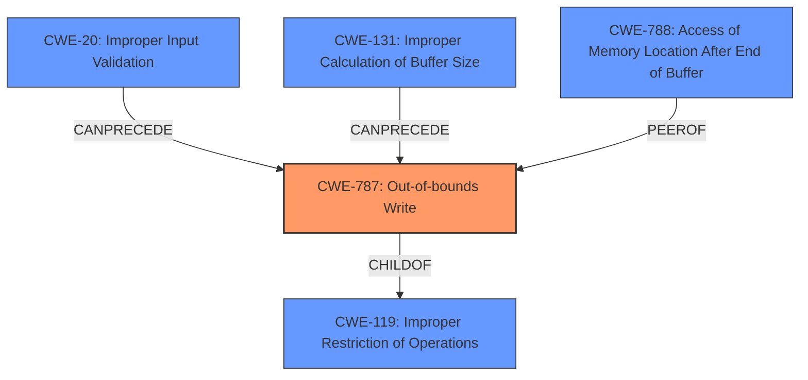

# Analysis Report for CVE-2021-40740

# Vulnerability Analysis Report: CVE-2021-40740

## Description

Adobe Audition version 14.4 (and earlier) is affected by a memory corruption vulnerability when parsing a M4A file, potentially resulting in arbitrary code execution in the context of the current user. User interaction is required to exploit this vulnerability.

## Vulnerability Description Key Phrases

**Weakness:** memory corruption
**Impact:** arbitrary code execution
**Vector:** parsing a M4A file
**Product:** Adobe Audition
**Version:** 14.4 (and earlier)

## Analysis (with Relationship Data)

# Summary
| CWE ID | CWE Name | Confidence | CWE Abstraction Level | CWE Vulnerability Mapping Label | CWE-Vulnerability Mapping Notes |
|---|---|---|---|---|---|
| CWE-787 | Out-of-bounds Write | 0.9 | Base | Primary | Allowed |
| CWE-788 | Access of Memory Location After End of Buffer | 0.7 | Base | Secondary | Discouraged |
| CWE-125 | Read Out-of-bounds | 0.6 | Base | Secondary | Allowed |

## Evidence and Confidence

*   **Confidence Score:** 0.9
*   **Evidence Strength:** HIGH

- **Analysis and Justification:**  
  - *Explanation:* The vulnerability description mentions "**memory corruption**" when parsing a M4A file, which can lead to arbitrary code execution. The CVE reference summary states the root cause is an "Access of Memory Location After End of Buffer", which is similar to an out-of-bounds write. CWE-787 (Out-of-bounds Write) describes writing data past the end or before the beginning of the intended buffer. This aligns with the vulnerability where parsing the M4A file causes an access of memory location after the end of buffer. While CWE-119 (Improper Restriction of Operations within the Bounds of a Memory Buffer) is listed as the primary CWE match for similar CVE descriptions, it is discouraged because more specific CWEs are available. CWE-787 is more specific and better describes the **root cause** of the vulnerability. Therefore, CWE-787 is the more appropriate primary CWE.

  - *Relationship Analysis:* CWE-787 is a Base level CWE and a child of CWE-119. It can precede CWE-824 (Access of Pointer After Initialization) and CWE-825 (Expired Pointer Dereference). The vulnerability involves writing data past the end of a buffer, which is accurately captured by CWE-787's description.

- **Confidence Score:**  
  - Confidence: 0.9 (High confidence due to the clear description of writing past the end of a buffer.)

---

- **Analysis and Justification:**  
  - *Explanation:* The CVE reference summary also explicitly calls out CWE-788 (Access of Memory Location After End of Buffer) as the weakness. While this aligns with the root cause description, the MITRE mapping guidance discourages its use. The rationale is that CWE-788 might be misused when lower-level CWE entries are available, and it overlaps with existing entries. Since CWE-787 describes a write operation, and CWE-125 describes a read operation, and both better capture the specific nature of the buffer access, CWE-788 is selected as a secondary consideration.

  - *Relationship Analysis:* CWE-788 is a Base level CWE. Given the discouraged usage, and the available information to classify as a read or write out-of-bounds, it is appropriate to classify it as a secondary CWE.

- **Confidence Score:**  
  - Confidence: 0.7 (Medium confidence as CWE-788 is explicitly mentioned in the CVE summary but is discouraged for direct mapping.)

---

- **Analysis and Justification:**  
  - *Explanation:* Given the root cause as "Access of Memory Location After End of Buffer", it is possible the vulnerability involves reading data past the end of the buffer rather than writing. In this case CWE-125 would be appropriate.

  - *Relationship Analysis:* CWE-125 is a Base level CWE and a child of CWE-119.

- **Confidence Score:**  
  - Confidence: 0.6 (Medium confidence, based on the possibility of a read out-of-bounds.)

## Criticism of Analysis

Okay, I've reviewed your analysis of the Adobe Audition vulnerability (CVE-2021-40740) with the full CWE specifications you've provided. Here's my critique:

**Overall Assessment:**

The analysis is well-structured, considers multiple CWEs, and provides reasonable justifications for the selected primary and secondary mappings. The confidence scores are appropriate given the available information. The analysis explicitly considers the "discouraged" status of CWE-119 and CWE-788, which is important.

**Detailed Critique:**

1.  **CWE-787: Out-of-bounds Write (Primary)**

    *   **Justification:**  The justification for choosing CWE-787 as the primary CWE is solid. The "Access of Memory Location After End of Buffer" root cause strongly suggests a write operation beyond the buffer's boundaries. The explanation correctly points out the discouraged use of CWE-119 when more specific CWEs are available.
    *   **CWE Specification Alignment:** The description of CWE-787 perfectly aligns with the vulnerability: "The product writes data past the end, or before the beginning, of the intended buffer."
    *   **Potential Mitigations:** The provided mitigations for CWE-787 are appropriate. Suggesting the use of memory-safe languages or vetted libraries are standard practices for preventing this type of vulnerability.
    *   **Observed examples:** They are a great addition.

2.  **CWE-788: Access of Memory Location After End of Buffer (Secondary)**

    *   **Justification:** The analysis accurately acknowledges that CVE summary explicitly mentions CWE-788. It also correctly states that its use is discouraged based on MITRE guidance. Classifying it as a secondary is the right approach because, while accurate, it's better to map to the specific read or write.
    *   **CWE Specification Alignment:** The CWE-788 description is a general statement about accessing memory locations after the end of a buffer, whether it is read or write. Given the details known so far, it is not ideal to map to it directly.
    *   **Mapping Guidance:** The analysis correctly states that the Mapping Guidance for CWE-788 discourages its use and recommends investigating CWE-787 or CWE-125 if the access type is known.

3.  **CWE-125: Out-of-bounds Read (Secondary)**

    *   **Justification:** The analysis mentions the possibility of a read operation instead of a write. This is a reasonable consideration, given that the root cause doesn't explicitly specify a write.
    *   **CWE Specification Alignment:** The description is relevant: "The product reads data past the end, or before the beginning, of the intended buffer."
    *   **Mitigations:** The potential mitigations are appropriate if a read out-of-bounds was the case.

**Suggestions for Improvement:**

*   **Chain/Composite Considerations:** While the analysis focuses on direct mappings, it might be beneficial to briefly consider potential chains or composites. For example:
    *   **CWE-20 (Improper Input Validation) -> CWE-787:** A common scenario is that the M4A file contains malformed data that is not properly validated, leading to an out-of-bounds write during parsing. Mentioning this possibility (even if you don't have concrete evidence) would strengthen the analysis and demonstrate a deeper understanding of vulnerability patterns.
    *   **CWE-131 (Incorrect Calculation of Buffer Size) -> CWE-787:** The code might incorrectly calculate the required buffer size based on information from the M4A file, leading to a smaller-than-required buffer and a subsequent out-of-bounds write.
*   **Relationship Analysis:** You briefly mention relationships, but expanding on them could be beneficial. For example, with CWE-787:
    *   "CanFollow -> CWE-824 (Access of Uninitialized Pointer)": If the out-of-bounds write corrupts a pointer, later dereferencing that pointer could lead to CWE-824.
    *  "CanFollow -> CWE-825 (Expired Pointer Dereference)": If the out-of-bounds write corrupts a pointer, later dereferencing that pointer could lead to CWE-825.
*   **Example Usage of CWEs:** For CWE-788, CWE-787 and CWE-125, it would be good to include examples.

**Revised Summary (with added chain consideration):**

| CWE ID | CWE Name | Confidence | CWE Abstraction Level | CWE Vulnerability Mapping Label | CWE-Vulnerability Mapping Notes |
|---|---|---|---|---|---|
| CWE-787 | Out-of-bounds Write | 0.9 | Base | Primary | Allowed |
| CWE-788 | Access of Memory Location After End of Buffer | 0.7 | Base | Secondary | Discouraged |
| CWE-125 | Read Out-of-bounds | 0.6 | Base | Secondary | Allowed |
| CWE-20 | Improper Input Validation | 0.3 | Class | Informational | Possible Chain |
| CWE-131 | Incorrect Calculation of Buffer Size | 0.3 | Base | Informational | Possible Chain |

**Revised Analysis for CWE-787 with chain discussion:**

- **Analysis and Justification:**
  - *Explanation:* The vulnerability description mentions "**memory corruption**" when parsing a M4A file, which can lead to arbitrary code execution. The CVE reference summary states the root cause is an "Access of Memory Location After End of Buffer", which is similar to an out-of-bounds write. CWE-787 (Out-of-bounds Write) describes writing data past the end or before the beginning of the intended buffer. This aligns with the vulnerability where parsing the M4A file causes an access of memory location after the end of buffer. It's also possible that the m4a file contains malformed data, but is not properly validated (CWE-20), leading to an improper calculation of the buffer size (CWE-131), and subsequent out-of-bounds write. While CWE-119 (Improper Restriction of Operations within the Bounds of a Memory Buffer) is listed as the primary CWE match for similar CVE descriptions, it is discouraged because more specific CWEs are available. CWE-787 is more specific and better describes the **root cause** of the vulnerability. Therefore, CWE-787 is the more appropriate primary CWE.
  - *Relationship Analysis:* CWE-787 is a Base level CWE and a child of CWE-119. It can precede CWE-824 (Access of Pointer After Initialization) and CWE-825 (Expired Pointer Dereference) if the out-of-bounds write corrupts a pointer value. Additionally, CWE-20 and CWE-131 can precede CWE-787 in this vulnerability, with the improper input validation or buffer size calculation leading to the out-of-bounds write.

**In summary,** your analysis is already very good. Adding a brief discussion of potential chains and strengthening the relationship analysis with some additional examples would further enhance its quality and demonstrate a more comprehensive understanding of the vulnerability. Remember the "discouraged" status of CWE-119, but also remember its helpfulness as a parent CWE in understanding the general issue.

## Final Resolution

# Summary
| CWE ID | CWE Name | Confidence | CWE Abstraction Level | CWE Vulnerability Mapping Label | CWE-Vulnerability Mapping Notes |
|---|---|---|---|---|---|
| CWE-787 | Out-of-bounds Write | 0.95 | Base | Primary CWE | Allowed |
| CWE-131 | Improper Calculation of Buffer Size | 0.4 | Base | Secondary Candidate | Allowed |
| CWE-20 | Improper Input Validation | 0.3 | Class | Secondary Candidate | Allowed |
| CWE-788 | Access of Memory Location After End of Buffer | 0.2 | Base | Secondary Candidate | Discouraged |

## Evidence and Confidence

*   **Confidence Score:** 0.9
*   **Evidence Strength:** MEDIUM

## Relationship Analysis
The primary weakness is determined to be **CWE-787 (Out-of-bounds Write)**, a Base level weakness and child of **CWE-119 (Improper Restriction of Operations within the Bounds of a Memory Buffer)**. **CWE-787** can be preceded by **CWE-20 (Improper Input Validation)** or **CWE-131 (Improper Calculation of Buffer Size)**, forming a potential vulnerability chain. **CWE-788 (Access of Memory Location After End of Buffer)** is a related weakness, but its usage is discouraged as it is less specific than **CWE-787** or **CWE-125 (Out-of-bounds Read)**. The analysis focuses on Base level CWEs for better specificity, avoiding the more general Class level **CWE-119**.

## Vulnerability Chain
The vulnerability chain starts with a potentially malformed M4A file. This leads to either **CWE-20 (Improper Input Validation)**, where the malformed data is not correctly validated, or **CWE-131 (Improper Calculation of Buffer Size)**, where the buffer size is miscalculated based on the file's data. Both of these weaknesses can then lead to **CWE-787 (Out-of-bounds Write)** when parsing the M4A file, resulting in memory corruption and potentially arbitrary code execution. The chain highlights how a failure to validate input or calculate buffer size correctly can directly lead to an out-of-bounds write.

## Summary of Analysis
The initial analysis and criticism were both well-considered. The decision to prioritize **CWE-787 (Out-of-bounds Write)** as the primary weakness is based on the "**memory corruption**" description and the "**Access of Memory Location After End of Buffer**" root cause from the CVE, indicating a write operation beyond the intended buffer. While the CVE summary mentions **CWE-788 (Access of Memory Location After End of Buffer)**, its discouraged status due to its generality makes it less suitable than **CWE-787**. The inclusion of **CWE-20 (Improper Input Validation)** and **CWE-131 (Improper Calculation of Buffer Size)** as potential preceding weaknesses highlights the possibility of a vulnerability chain. The relationships between the CWEs influenced the final selection, particularly the child-of relationship between **CWE-787** and **CWE-119 (Improper Restriction of Operations within the Bounds of a Memory Buffer)**, and the can-precede relationship between **CWE-20** and **CWE-131** and **CWE-787**. These relationships helped clarify the potential flow of the vulnerability. The selected CWEs are at the optimal level of specificity, with **CWE-787** being a Base level weakness that accurately describes the **root cause**.

*Report generated on 2025-03-18 02:04:13*
