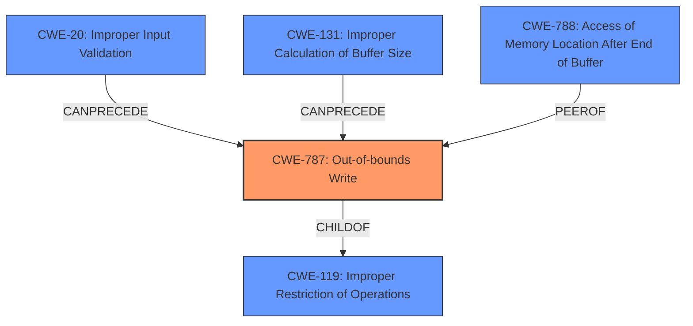

# Final Resolution for CVE-2021-40740

# Summary
| CWE ID | CWE Name | Confidence | CWE Abstraction Level | CWE Vulnerability Mapping Label | CWE-Vulnerability Mapping Notes |
|---|---|---|---|---|---|
| CWE-787 | Out-of-bounds Write | 0.95 | Base | Primary CWE | Allowed |
| CWE-131 | Improper Calculation of Buffer Size | 0.4 | Base | Secondary Candidate | Allowed |
| CWE-20 | Improper Input Validation | 0.3 | Class | Secondary Candidate | Allowed |
| CWE-788 | Access of Memory Location After End of Buffer | 0.2 | Base | Secondary Candidate | Discouraged |

## Evidence and Confidence

*   **Confidence Score:** 0.9
*   **Evidence Strength:** MEDIUM

## Relationship Analysis
The primary weakness is determined to be **CWE-787 (Out-of-bounds Write)**, a Base level weakness and child of **CWE-119 (Improper Restriction of Operations within the Bounds of a Memory Buffer)**. **CWE-787** can be preceded by **CWE-20 (Improper Input Validation)** or **CWE-131 (Improper Calculation of Buffer Size)**, forming a potential vulnerability chain. **CWE-788 (Access of Memory Location After End of Buffer)** is a related weakness, but its usage is discouraged as it is less specific than **CWE-787** or **CWE-125 (Out-of-bounds Read)**. The analysis focuses on Base level CWEs for better specificity, avoiding the more general Class level **CWE-119**.

## Vulnerability Chain
The vulnerability chain starts with a potentially malformed M4A file. This leads to either **CWE-20 (Improper Input Validation)**, where the malformed data is not correctly validated, or **CWE-131 (Improper Calculation of Buffer Size)**, where the buffer size is miscalculated based on the file's data. Both of these weaknesses can then lead to **CWE-787 (Out-of-bounds Write)** when parsing the M4A file, resulting in memory corruption and potentially arbitrary code execution. The chain highlights how a failure to validate input or calculate buffer size correctly can directly lead to an out-of-bounds write.

## Summary of Analysis
The initial analysis and criticism were both well-considered. The decision to prioritize **CWE-787 (Out-of-bounds Write)** as the primary weakness is based on the "**memory corruption**" description and the "**Access of Memory Location After End of Buffer**" root cause from the CVE, indicating a write operation beyond the intended buffer. While the CVE summary mentions **CWE-788 (Access of Memory Location After End of Buffer)**, its discouraged status due to its generality makes it less suitable than **CWE-787**. The inclusion of **CWE-20 (Improper Input Validation)** and **CWE-131 (Improper Calculation of Buffer Size)** as potential preceding weaknesses highlights the possibility of a vulnerability chain. The relationships between the CWEs influenced the final selection, particularly the child-of relationship between **CWE-787** and **CWE-119 (Improper Restriction of Operations within the Bounds of a Memory Buffer)**, and the can-precede relationship between **CWE-20** and **CWE-131** and **CWE-787**. These relationships helped clarify the potential flow of the vulnerability. The selected CWEs are at the optimal level of specificity, with **CWE-787** being a Base level weakness that accurately describes the **root cause**.