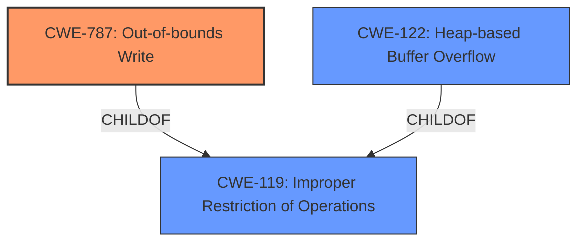

# Analysis Report for CVE-2021-40763

# Vulnerability Analysis Report: CVE-2021-40763

## Description

Adobe Character Animator version 4.4 (and earlier) is affected by a memory corruption vulnerability when parsing a WAF file, potentially resulting in arbitrary code execution in the context of the current user. User interaction is required to exploit this vulnerability.

## Vulnerability Description Key Phrases

**Rootcause:** memory corruption
**Impact:** arbitrary code execution
**Vector:** parsing a WAF file
**Product:** Adobe Character Animator
**Version:** 4.4 (and earlier)

## Analysis (with Relationship Data)

# Summary
| CWE ID | CWE Name | Confidence | CWE Abstraction Level | CWE Vulnerability Mapping Label | CWE-Vulnerability Mapping Notes |
|---|---|---|---|---|---|
| CWE-787 | Out-of-bounds Write | 0.85 | Base | Allowed | Primary CWE. The vulnerability involves writing data past the end of the intended buffer, leading to memory corruption and potential arbitrary code execution. |
| CWE-122 | Heap-based Buffer Overflow | 0.6 | Variant | Allowed | Secondary CWE. The heap is likely the memory region where the buffer overflow occurs, given the nature of parsing a WAF file. |

## Evidence and Confidence

*   **Confidence Score:** 0.8
*   **Evidence Strength:** HIGH

- **Analysis and Justification:**  
  - *Explanation:* The vulnerability description explicitly mentions "**memory corruption**" when parsing a WAF file. The CVE Reference Links Content Summary pinpoints "Access of Memory Location After End of Buffer," which directly corresponds to writing outside allocated memory. CWE-787 (Out-of-bounds Write) precisely captures this weakness, where the product writes data past the end of the intended buffer. This aligns with the stated impact of potential arbitrary code execution. The Retriever Results also rank CWE-787 as the top candidate based on combined scores. Furthermore, MITRE mapping guidance ALLOWS the usage of CWE-787 for out-of-bounds write scenarios.

  - *Relationship Analysis:* CWE-787 is a child of CWE-119 (Improper Restriction of Operations within the Bounds of a Memory Buffer). While CWE-119 is a broader category, CWE-787 is more specific to the type of memory corruption involved (out-of-bounds write). CWE-787 can also lead to CWE-269 (Privilege Management), as arbitrary code execution might escalate privileges.

- **Confidence Score:**  
  - Confidence: 0.85 (High confidence due to direct evidence from the vulnerability description and CVE reference, combined with supportive retriever results and MITRE mapping guidance.)

---
- **Analysis and Justification:**  
  - *Explanation:* Given the context of parsing a file (WAF), memory allocation on the heap is highly probable. A heap-based buffer overflow (CWE-122) occurs when the overflow happens in memory allocated on the heap. While not explicitly stated, the scenario fits the characteristics of CWE-122. The retriever results list CWE-122 as a candidate. MITRE mapping guidance allows for the use of CWE-122.

  - *Relationship Analysis:* CWE-122 is a variant of CWE-119 (Improper Restriction of Operations within the Bounds of a Memory Buffer), specifically related to heap overflows. It's a more specific case of a general buffer overflow.

- **Confidence Score:**  
  - Confidence: 0.6 (Moderate confidence as the heap allocation is inferred and not explicitly stated.)

## Criticism of Analysis

Okay, here's a detailed review of the analysis provided, considering the full CWE specifications you've included.

**Overall Assessment**

The analysis is generally good and provides a reasonable initial mapping of the vulnerability to CWEs. The justification for the primary CWE (CWE-787) is strong, based on the provided information. The inclusion of CWE-122 as a secondary CWE is also plausible, given the file parsing context. However, the confidence score of 0.6 for CWE-122 seems more appropriate.

**Detailed Review**

**1. Primary CWE: CWE-787: Out-of-bounds Write**

*   **Confidence:** The analysis assigns a confidence score of 0.85 to CWE-787. This is justified.
*   **Justification:** The reasoning is well-articulated. The mention of "memory corruption" and "Access of Memory Location After End of Buffer" strongly points to CWE-787. The retriever results also support this choice. The analysis correctly identifies CWE-787 as a child of the broader CWE-119, indicating a good understanding of the CWE hierarchy.  The provided mitigations for CWE-787 such as using safe string libraries and compiler-based overflow detection are also very relevant.
*   **Mapping Guidance Compliance:**  The analysis correctly notes that CWE-787 is at the Base level of abstraction and that its usage is *Allowed*.
*   **Potential Improvements:** None. The analysis and justification for CWE-787 are excellent.

**2. Secondary CWE: CWE-122: Heap-based Buffer Overflow**

*   **Confidence:** The analysis assigns a confidence score of 0.6. This is more appropriate.
*   **Justification:** The analysis infers that the memory allocation is likely happening on the heap due to the file parsing context. While plausible, this is an assumption and not explicitly stated in the provided vulnerability description or CVE summary. A lower confidence score (e.g., 0.6) reflects this uncertainty more accurately. It would be even better if the reasoning was more specific, outlining what part of the parsing is likely to involve heap allocation and how that connects to the overflow. The inclusion of observed examples helps to cement the CWE selection.
*   **Mapping Guidance Compliance:** The analysis correctly notes that CWE-122 is at the Variant level of abstraction and that its usage is *Allowed*.
*   **Potential Improvements:** It would be beneficial to explicitly acknowledge the inferred nature of the heap allocation. The justification could be strengthened by providing further details on *why* the heap is likely to be involved in the buffer overflow.

**3.  General Comments and Improvements**

*   **CWE-119 Consideration:** The original analyzer input chose CWE-119 as the primary CWE match. While the analysis correctly moves to the more specific CWE-787, a brief mention of *why* CWE-119 was deemed less appropriate would be beneficial.  Specifically, the analysis could state that CWE-119 is a discouraged mapping when more specific children CWEs are available.
*   **Retriever Results:** The analysis makes good use of the retriever results by noting the top candidates.
*   **Completeness:** The analysis is well-structured and covers the key aspects of CWE mapping (description, justification, confidence, relationships, mapping guidance).
*   **Additional CWEs to Consider (and reasons for exclusion):**
    *   **CWE-788 (Access of Memory Location After End of Buffer):** While the CVE summary uses this phrase, CWE-788 is *discouraged* for usage because a more appropriate child CWE (CWE-787) exists that describes the nature of the access (a write). The analysis does not describe a situation where an index or pointer was incremented beyond the end of the buffer, making CWE-788 less suitable.
    *   **CWE-416 (Use After Free):** This is less likely, as it would require the buffer to be freed before the write. The description of the vulnerability doesn't suggest a use-after-free scenario.
    *   **CWE-269 (Improper Privilege Management):** It is important to understand the technical impact of CWE-787 leading to ACE. The technical impact may lead to privilege escalation, but this is not the root cause. The description explicitly mentions memory corruption and out-of-bounds write, which allows for further detail using the CWE Hierarchy.
*   **Chain Analysis:** While not always necessary, especially in initial analysis, consider potential CWE chains (how one CWE might lead to another). For instance,  a lack of input validation might contribute to the out-of-bounds write.

**Revised Summary Table**

| CWE ID | CWE Name | Confidence | CWE Abstraction Level | CWE Vulnerability Mapping Label | CWE-Vulnerability Mapping Notes |
|---|---|---|---|---|---|
| CWE-787 | Out-of-bounds Write | 0.85 | Base | Allowed | Primary CWE. The vulnerability involves writing data past the end of the intended buffer, leading to memory corruption and potential arbitrary code execution. |
| CWE-122 | Heap-based Buffer Overflow | 0.6 | Variant | Allowed | Secondary CWE. The heap is likely the memory region where the buffer overflow occurs, given the nature of parsing a WAF file. This allocation is inferred and not explicitly stated. |

**In summary,** the analysis is well-reasoned and provides a strong starting point for CWE mapping. The suggested improvements would further enhance the accuracy and completeness of the analysis.

## Final Resolution

# Summary
| CWE ID | CWE Name | Confidence | CWE Abstraction Level | CWE Vulnerability Mapping Label | CWE-Vulnerability Mapping Notes |
|---|---|---|---|---|---|
| **CWE-787** | **Out-of-bounds Write** | 0.85 | Base | Allowed | Primary CWE. The vulnerability involves writing data past the end of the intended buffer, leading to **memory corruption** and potential arbitrary code execution. |
| CWE-122 | Heap-based Buffer Overflow | 0.6 | Variant | Allowed | Secondary CWE. The heap is likely the memory region where the buffer overflow occurs, given the nature of parsing a WAF file. This allocation is inferred and not explicitly stated. |

## Evidence and Confidence

*   **Confidence Score:** 0.8
*   **Evidence Strength:** HIGH

## Relationship Analysis
The primary relationship that influenced the decision was the parent-child relationship between CWE-119 (**Improper Restriction of Operations within the Bounds of a Memory Buffer**) and **CWE-787** (**Out-of-bounds Write**). **CWE-787** is a more specific type of **CWE-119**, which is why it was selected as the primary **WEAKNESS**.
CWE-122 is a variant of **CWE-119** that describes a heap-based buffer overflow.

## Vulnerability Chain
The vulnerability chain starts with parsing a WAF file, leading to a **CWE-787** (**Out-of-bounds Write**) which results in **memory corruption** and can lead to arbitrary code execution. The specific allocation details (heap vs. stack) are not provided but the heap allocation (CWE-122) is inferred.
  - The **ROOTCAUSE** is the improper parsing of the WAF file and lack of proper bounds checking.
  - The **WEAKNESS** is the out-of-bounds write (CWE-787).
  - The impact is **memory corruption** and potential arbitrary code execution.

## Summary of Analysis
The analysis provided a strong justification for selecting **CWE-787** (**Out-of-bounds Write**) as the primary **WEAKNESS**. The vulnerability description explicitly mentions "**memory corruption**" and the CVE reference summary identifies "Access of Memory Location After End of Buffer". The selection of **CWE-787** is further supported by retriever results and MITRE mapping guidance.

The relationship analysis correctly identifies **CWE-787** as a child of **CWE-119**, which helped to choose the most specific **CWE**.

The selection of CWE-122 is based on the inference that parsing a WAF file likely involves heap allocation. While this is a reasonable assumption, it is not explicitly stated in the evidence.

The initial analysis considered **CWE-119**, but the criticism highlights why **CWE-787** is more appropriate. **CWE-119** is a discouraged mapping when more specific children CWEs are available.

The final decision is based on the available evidence, relationship analysis, and mapping guidance. **CWE-787** is the most specific and well-supported **CWE**, representing the **ROOTCAUSE** of the vulnerability.
The provided evidence explicitly mentions "**memory corruption**" and "Access of Memory Location After End of Buffer," directly corresponding to writing outside allocated memory.
The retriever results also rank **CWE-787** as the top candidate based on combined scores, further strengthening the confidence in this classification.
MITRE mapping guidance ALLOWS the usage of **CWE-787** for out-of-bounds write scenarios, ensuring compliance with industry best practices.

*Report generated on 2025-03-18 02:05:03*
