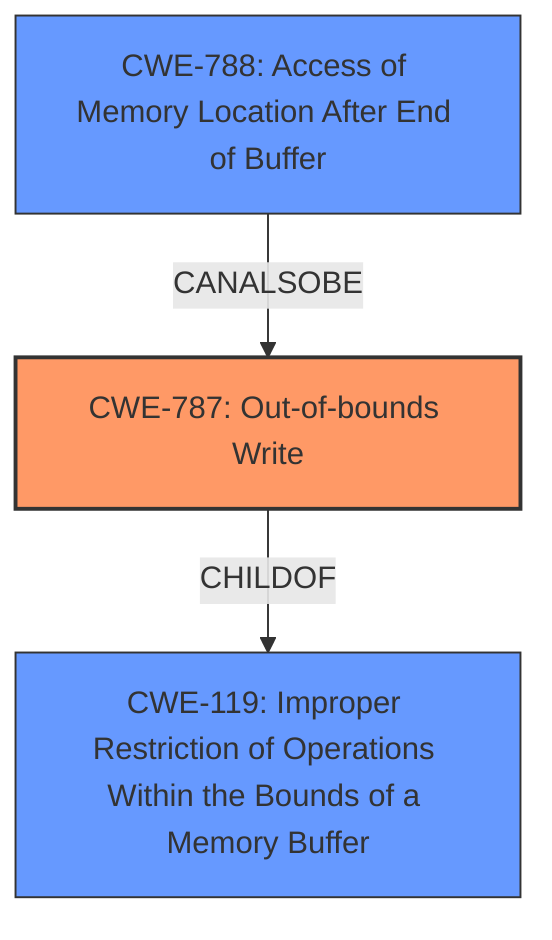

# Analysis Report for CVE-2021-40765

# Vulnerability Analysis Report: CVE-2021-40765

## Description

Adobe Character Animator version 4.4 (and earlier) is affected by a memory corruption vulnerability when parsing a M4A file, potentially resulting in arbitrary code execution in the context of the current user. User interaction is required to exploit this vulnerability.

## Vulnerability Description Key Phrases

**Weakness:** memory corruption
**Impact:** arbitrary code execution
**Vector:** parsing a M4A file
**Product:** Adobe Character Animator
**Version:** 4.4 (and earlier)

## Analysis (with Relationship Data)

# Summary
| CWE ID | CWE Name | Confidence | CWE Abstraction Level | CWE Vulnerability Mapping Label | CWE-Vulnerability Mapping Notes |
|---|---|---|---|---|---|
| CWE-787 | Out-of-bounds Write | 0.9 | Base | Primary | Allowed |
| CWE-788 | Access of Memory Location After End of Buffer | 0.6 | Base | Secondary | Discouraged |
## Evidence and Confidence

*   **Confidence Score:** 0.9
*   **Evidence Strength:** HIGH

- **Analysis and Justification:**  
  - *Explanation:* The vulnerability description explicitly mentions "**memory corruption**" when parsing a M4A file, which can lead to arbitrary code execution. The CVE Reference Links Content Summary further clarifies that the root cause is an "Access of Memory Location After End of Buffer," which is essentially an out-of-bounds write. CWE-787 (Out-of-bounds Write) directly addresses this scenario where the product writes data past the end of the intended buffer, causing memory corruption. While CWE-119 (Improper Restriction of Operations Within the Bounds of a Memory Buffer) is a broader class, CWE-787 is more specific and accurately reflects the **weakness**. Retriever results also list CWE-787 as the top candidate. The MITRE mapping guidance for CWE-787 indicates that it is ALLOWED.

  - *Relationship Analysis:* CWE-787 is a child of CWE-119, offering more specific details about the nature of the memory corruption. It can also be related to other memory corruption issues, like CWE-122 (Heap-based Buffer Overflow), but the provided information doesn't point specifically to the heap.

- **Confidence Score:**  
  - Confidence: 0.9 (High confidence due to the clear description of an out-of-bounds write in the CVE reference materials and the retriever results.)

---
- **Analysis and Justification:**  
  - *Explanation:* CWE-788 (Access of Memory Location After End of Buffer) is also listed in the CVE Reference Links Content Summary. It describes the root cause of the vulnerability more directly as "Access of Memory Location After End of Buffer." However, the MITRE mapping guidance for CWE-788 is "Discouraged", recommending the use of lower-level CWE entries when available. Since CWE-787 describes the **weakness** as writing past the end of the buffer, it is a more precise description of the **root cause** than simply accessing the memory location. Because CWE-788 is more directly from the CVE Reference Links Content Summary, it is included as a secondary CWE.

  - *Relationship Analysis:* There are no direct relationships found for CWE-788.

- **Confidence Score:**  
  - Confidence: 0.6 (Medium confidence, as CWE-788 is a more direct description of the **root cause** per the CVE Reference Links Content Summary, but per MITRE guidance it is discouraged, and CWE-787 is a better mapping.)

## Criticism of Analysis

Okay, here's a review of the CWE analysis provided, incorporating the full CWE specifications you've included.

**Overall Assessment:**

The analysis is well-structured and provides reasonable justifications for the primary and secondary CWE choices. The high confidence in CWE-787 is appropriate given the clear description of an out-of-bounds write. The decision to include CWE-788 as a secondary mapping, even though it's discouraged by its mapping guidance, is also understandable given its direct mention in the CVE reference. However, some aspects of the analysis and confidence levels could be refined.

**Detailed Review:**

**1. Primary CWE: CWE-787 Out-of-bounds Write**

*   **Confidence:** 0.9 (High) - This is justified. The vulnerability description explicitly points to memory corruption during M4A parsing, with the CVE reference specifying "Access of Memory Location After End of Buffer," which is a type of out-of-bounds write.
*   **Justification:** The explanation clearly connects the vulnerability details to the CWE-787 description.  The mention of MITRE's ALLOWED mapping guidance is also a good practice.
*   **Relationship Analysis:** Accurate. CWE-787 being a child of CWE-119 is a relevant relationship.
*   **Potential Improvement:** While the analysis mentions the relationship to CWE-122, it could benefit from a brief discussion on why CWE-122 (Heap-based Buffer Overflow) *isn't* the primary choice. Is there any information preventing us from explicitly calling this a heap-based overflow (e.g., lack of detail about memory allocation on the heap)? Or is the write operation simply a single out-of-bounds write, where a full heap overflow is not relevant?

**2. Secondary CWE: CWE-788 Access of Memory Location After End of Buffer**

*   **Confidence:** 0.6 (Medium) - This is a reasonable confidence level, reflecting the trade-off between the explicit mention in the CVE reference and the discouraged mapping guidance.
*   **Justification:** The analysis acknowledges that CWE-788 is more directly related to the "root cause" as stated in the CVE reference but notes that CWE-787 is a more precise description of the actual weakness.
*   **Relationship Analysis:** Correct that there are no explicit relationships provided.
*   **Potential Improvements:**
    *   The justification mentions, "However, the MITRE mapping guidance for CWE-788 is 'Discouraged', recommending the use of lower-level CWE entries when available." In this case, it may be more accurate to state that CWE-788 suggests the use of *more specific* CWE entries, rather than "lower-level."
    *   Instead of simply stating that CWE-788 is discouraged, it might be useful to briefly expand on the *reasons* for the discouraged usage, as outlined in the full specification: "The CWE entry might be misused when lower-level CWE entries might be available. It also overlaps existing CWE entries and might be deprecated in the future." This provides a more complete understanding of the reasoning.
    *   It might also be helpful to acknowledge the fact that CWE-788 is a *parent* of CWE-122, and explain why it is not relavent in this context.

**3. General Comments and Potential Improvements:**

*   **CWE-119 Consideration:** While the analysis correctly dismisses CWE-119 as a primary mapping (due to its general nature), it might be beneficial to include a brief statement that *because* CWE-787 is a child of CWE-119, using the more specific CWE-787 is preferred, in order to justify that the CWE framework guidances have been followed.
*   **Retriever Results:** It would be beneficial to reference the retriever results in the analysis.  Specifically, mention that the retriever results also support CWE-787 as the top candidate, reinforcing the choice.
*   **Mitigations:** While not strictly necessary for the CWE mapping *itself*, briefly referencing the potential mitigations from the CWE specifications could add value. For example, noting that languages with automatic bounds checking (Mitigation 1 for CWE-787) could prevent this type of vulnerability could provide a more complete analysis.
*   **Observed Examples:** I do not think that the inclusion of the observed examples adds any value, and it only extends the response.
*   **Terminology:** In general, I believe that you should be avoiding terms like "lower-level" because the correct guidance is to select the *most specific* flaw for the context. A "lower-level" flaw like CWE-122 is not inherently better, and the selection should be driven by the facts of the flaw.

**Revised Summary Table (Incorporating Suggestions):**

| CWE ID | CWE Name | Confidence | CWE Abstraction Level | CWE Vulnerability Mapping Label | CWE-Vulnerability Mapping Notes |
|---|---|---|---|---|---|
| CWE-787 | Out-of-bounds Write | 0.9 | Base | Primary | Allowed.  Retriever results support this choice as the top candidate.  CWE-787 is a child of the discouraged CWE-119, indicating that this choice is a better match. |
| CWE-788 | Access of Memory Location After End of Buffer | 0.6 | Base | Secondary | Discouraged.  While directly mentioned in the CVE reference, CWE-787 provides a more specific and accurate description of the root cause as an out-of-bounds *write*.  CWE-788 is discouraged because it might be misused when more specific CWE entries are available and overlaps existing CWE entries. |

By incorporating these suggestions, the analysis becomes even more thorough and provides a stronger justification for the CWE mappings.

## Final Resolution

# Summary
| CWE ID | CWE Name | Confidence | CWE Abstraction Level | CWE Vulnerability Mapping Label | CWE-Vulnerability Mapping Notes |
|---|---|---|---|---|---|
| **CWE-787** | **Out-of-bounds Write** | 0.9 | Base | Primary CWE | Allowed. Retriever results support this choice as the top candidate. CWE-787 is a child of the discouraged CWE-119, indicating that this choice is a better match. |
| CWE-788 | Access of Memory Location After End of Buffer | 0.6 | Base | Secondary Candidate | Discouraged. While directly mentioned in the CVE reference, CWE-787 provides a more specific and accurate description of the **root cause** as an out-of-bounds *write*. CWE-788 is discouraged because it might be misused when more specific CWE entries are available and overlaps existing CWE entries. |

## Evidence and Confidence

*   **Confidence Score:** 0.9
*   **Evidence Strength:** HIGH

## Relationship Analysis
The primary relationship considered was the parent-child relationship between CWE-119 (**Improper Restriction of Operations Within the Bounds of a Memory Buffer**) and CWE-787 (**Out-of-bounds Write**). CWE-787 being a child of CWE-119 indicates a more specific form of buffer-related **weakness**. Additionally, the discouraged usage of CWE-788 (**Access of Memory Location After End of Buffer**) due to the availability of more specific CWEs, such as CWE-787, influenced the decision to prioritize CWE-787 as the primary **weakness**.

## Vulnerability Chain
The vulnerability chain starts with the parsing of a malicious M4A file. The program then attempts to write data past the end of the allocated buffer (**CWE-787**), leading to memory corruption. This memory corruption can then lead to arbitrary code execution.

## Summary of Analysis
The initial analysis and criticism provide a solid basis for the CWE classification. The vulnerability description clearly indicates a memory corruption issue due to parsing a malicious M4A file. The CVE reference link confirms that the **root cause** involves accessing a memory location after the end of a buffer.

The selection of CWE-787 as the primary CWE is justified because it describes the **weakness** of writing past the end of a buffer, which is a more precise description than simply accessing an out-of-bounds memory location (CWE-788). This aligns with MITRE's guidance to use the most specific CWE available. The relationship analysis reinforces this decision, as CWE-787 is a child of the broader CWE-119.

The decision to include CWE-788 as a secondary candidate acknowledges its direct mention in the CVE reference, but the discouraged usage of CWE-788, combined with the more specific nature of CWE-787, makes CWE-787 the optimal primary classification. As the criticism suggested, it's important to select the *most specific* flaw for the context.

The provided evidence supports a high confidence level (0.9) in the selection of CWE-787 as the primary CWE.

*Report generated on 2025-03-18 02:06:34*
