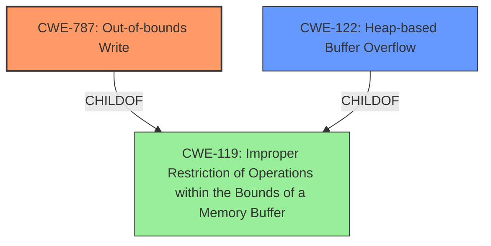

# Final Resolution for CVE-2021-40777

# Summary
| CWE ID | CWE Name | Confidence | CWE Abstraction Level | CWE Vulnerability Mapping Label | CWE-Vulnerability Mapping Notes |
|---|---|---|---|---|---|
| **CWE-787** | **Out-of-bounds Write** | 0.80 | Base | Allowed | Primary CWE |
| **CWE-122** | **Heap-based Buffer Overflow** | 0.65 | Variant | Allowed | Secondary Candidate CWE |

## Evidence and Confidence

*   **Confidence Score:** 0.75
*   **Evidence Strength:** HIGH

## Relationship Analysis
The primary weakness is classified as **CWE-787** [**Out-of-bounds Write**], a base-level CWE that is a child of **CWE-119** [**Improper Restriction of Operations within the Bounds of a Memory Buffer**]. This hierarchical relationship guided the selection towards a more specific representation than **CWE-119** [**Improper Restriction of Operations within the Bounds of a Memory Buffer**]. **CWE-787** [**Out-of-bounds Write**] can precede CWEs related to resource management and pointer issues like CWE-824 [Improper or Incomplete Initialization]. The secondary candidate, **CWE-122** [**Heap-based Buffer Overflow**], is a variant of **CWE-119** [**Improper Restriction of Operations within the Bounds of a Memory Buffer**] and suggests the overflow occurs in the heap, adding specificity.

## Vulnerability Chain
The vulnerability chain starts with the insecure handling of a malicious file, leading to a **CWE-787** [**Out-of-bounds Write**]. The overflow likely occurs in the heap (**CWE-122** [**Heap-based Buffer Overflow**]), resulting in memory corruption and potentially arbitrary code execution.

## Summary of Analysis
The initial analysis correctly identified **CWE-787** [**Out-of-bounds Write**] as the primary weakness, supported by the vulnerability description which mentions "memory corruption" and the CVE Reference Links Content Summary explicitly stating "Access of memory location after the end of a buffer." The criticism correctly points out the mapping guidance for **CWE-788** [Access of Memory Location After End of Buffer] discourages its use when a more specific CWE is available. The analysis then correctly chooses its child, **CWE-787** [**Out-of-bounds Write**]. The confidence score for **CWE-787** [**Out-of-bounds Write**] has been adjusted to 0.80. While the evidence is strong, there's still a degree of inference involved. The confidence score for **CWE-122** [**Heap-based Buffer Overflow**] has been lowered to 0.65, reflecting the possibility, but not certainty, that the overflow is heap-based.

The selected CWEs are at the optimal level of specificity. **CWE-787** [**Out-of-bounds Write**] accurately represents the **root cause**, and **CWE-122** [**Heap-based Buffer Overflow**] provides additional context regarding the memory location. The analysis acknowledges and addresses the concerns raised in the criticism, providing a more nuanced and well-justified classification.