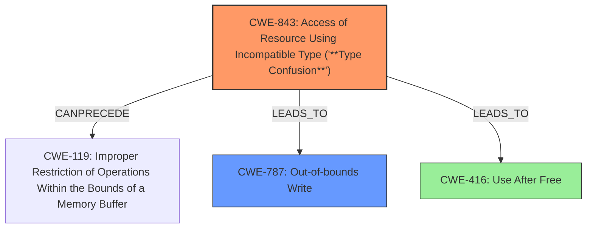

# Final Resolution for CVE-2021-4078

# Summary
| CWE ID | CWE Name | Confidence | CWE Abstraction Level | CWE Vulnerability Mapping Label | CWE-Vulnerability Mapping Notes |
|---|---|---|---|---|---|
| CWE-843 | Access of Resource Using Incompatible Type ('**Type Confusion**') | 0.90 | Base | Allowed | Primary CWE. Could possibly lead to CWE-119. |
| CWE-787 | Out-of-bounds Write | 0.70 | Base | Allowed | Secondary Candidate. Heap corruption may lead to out-of-bounds write. |
| CWE-416 | Use After Free | 0.65 | Variant | Allowed | Tertiary Candidate |

## Evidence and Confidence

*   **Confidence Score:** 0.85
*   **Evidence Strength:** HIGH

## Relationship Analysis
The primary relationship considered was that CWE-843 **Type Confusion** can lead to heap corruption. Heap corruption, in turn, can manifest as either CWE-787 Out-of-bounds Write or CWE-416 Use After Free. CWE-704 is a parent of CWE-843 but is too abstract. The choice of CWE-843 as primary is influenced by its direct relevance to the vulnerability description and its base-level abstraction.

## Vulnerability Chain
The vulnerability chain starts with **type confusion** (CWE-843). This **type confusion** leads to heap corruption. Heap corruption can then result in either an out-of-bounds write (CWE-787) or a use-after-free (CWE-416). The out-of-bounds write can lead to arbitrary code execution.

## Summary of Analysis
The initial analysis correctly identified CWE-843 as the primary weakness due to the explicit mention of "**type confusion**" in the vulnerability description: "Type confusion in V8... allowed a remote attacker to potentially exploit heap corruption...".

The criticism suggested considering the relationship between CWE-843 and CWE-119 (Improper Restriction of Operations within the Bounds of a Memory Buffer) and CWE-787 (Out-of-bounds Write). Given the "heap corruption" impact, it is plausible that the **type confusion** could lead to an out-of-bounds write, making CWE-787 a more relevant secondary candidate than initially considered. I agree with this assessment and am promoting it to secondary.

The criticism also rightly pointed out that some of the retriever results (e.g., CWE-1021, CWE-356, CWE-451, CWE-116) were less relevant to the core **type confusion** issue. This highlights the importance of not solely relying on retriever scores and carefully evaluating each candidate CWE.

I am increasing confidence in CWE-787 due to the potential for heap corruption to manifest as an out-of-bounds write. The confidence score for CWE-843 remains high due to the direct match with the vulnerability description.

The final decision reflects a more nuanced understanding of the vulnerability, incorporating both the direct evidence (type confusion) and the potential consequences (heap corruption leading to out-of-bounds write or use-after-free).
The selected CWEs are at the optimal level of specificity, with CWE-843 capturing the root cause and CWE-787 and CWE-416 representing the potential impacts.