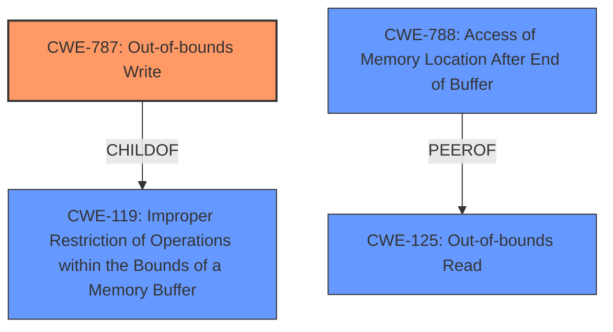

# Final Resolution for CVE-2021-40780

# Summary
| CWE ID  | CWE Name                            | Confidence | CWE Abstraction Level | CWE Vulnerability Mapping Label | CWE-Vulnerability Mapping Notes                                                                                                                                                                                                                   |
| ------- | ----------------------------------- | ---------- | --------------------- | ------------------------------- | ----------------------------------------------------------------------------------------------------------------------------------------------------------------------------------------------------------------------------------------------- |
| CWE-787 | Out-of-bounds Write                 | 0.85       | Base                  | Allowed                       | Primary CWE due to **memory corruption** and arbitrary code execution.                                                                                                                                                                                             |
| CWE-788 | Access of Memory Location After End of Buffer | 0.6       | Base                  | Discouraged                       | Secondary Candidate. Included because of mention in CVE content summary but discouraged as a direct mapping. More specific CWEs (787, 125) should be preferred.                                                                                      |
| CWE-125 | Out-of-bounds Read                  | 0.5       | Base                  | Allowed                       | Secondary Candidate. Included because of mention in CVE content summary.                                                                                                                                                                            |

## Evidence and Confidence

*   **Confidence Score:** 0.85
*   **Evidence Strength:** HIGH

## Relationship Analysis
The primary CWE is CWE-787 (**Out-of-bounds Write**), which is a base-level CWE. It's a child of CWE-119 (**Improper Restriction of Operations within the Bounds of a Memory Buffer**), indicating a broader class of buffer-related vulnerabilities. CWE-125 (**Out-of-bounds Read**) is a peer, representing a related but distinct weakness. CWE-788 (**Access of Memory Location After End of Buffer**) is included because the CVE summary mentions it, but the analysis recognizes that it is a discouraged mapping and less specific than CWE-787.

## Vulnerability Chain
The vulnerability chain starts with the **insecure handling** of a malicious file. This leads to a **memory corruption** (**CWE-787**) due to an **out-of-bounds write**. The consequence of this is arbitrary code execution. CWE-125 (**Out-of-bounds Read**) and CWE-788 (**Access of Memory Location After End of Buffer**) might be present, but the primary driver of the impact is the out-of-bounds write. There is a missing link related to how the malicious file is handled, specifically, the lack of input validation that allows the out-of-bounds write to occur. This could be represented with a CWE such as CWE-1284 (**Improper Validation of Specified Quantity in Input**).

## Summary of Analysis
The initial analysis correctly identified CWE-787 as the primary weakness, supported by the vulnerability description mentioning "**memory corruption**" and the potential for "arbitrary code execution". The criticism suggested considering more specific buffer overflow types (heap-based or stack-based) and the lack of input validation.

The final decision remains CWE-787 as the primary weakness because the arbitrary code execution indicates a **write** condition, making it more likely than a read. CWE-788 is included as a secondary candidate only because it's explicitly mentioned in the CVE summary, but it is noted as discouraged per CWE mapping guidance. CWE-125 is also included as a secondary candidate due to the CVE summary.

The graph relationships helped clarify the connection between CWE-787 and its parent CWE-119, emphasizing that the vulnerability is a specific instance of a broader class of buffer handling issues.

The selected CWEs are at the optimal level of specificity because CWE-787 is a base-level CWE directly related to the observed impact. While heap-based or stack-based overflows (CWE-122, CWE-121) could be considered, there isn't enough information to determine the specific type of buffer, so the base-level CWE is more appropriate. While the lack of input validation may have led to this, the details of the input are not described, so that is also not selected.

The decision is primarily based on the evidence provided in the vulnerability description ("**memory corruption**", "arbitrary code execution") and the CVE reference summary. The confidence is high (0.85) due to the strong alignment between the observed impact and the characteristics of CWE-787.