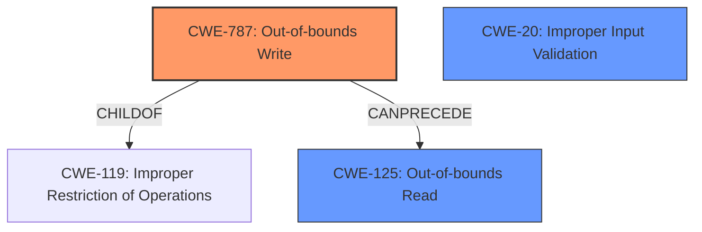

# Analysis Report for CVE-2021-40784

# Vulnerability Analysis Report: CVE-2021-40784

## Description

Adobe Premiere Rush version 1.5.16 (and earlier) is affected by a memory corruption vulnerability due to insecure handling of a malicious WAV file, potentially resulting in arbitrary code execution in the context of the current user. User interaction is required to exploit this vulnerability.

## Vulnerability Description Key Phrases

**Rootcause:** insecure handling
**Weakness:** memory corruption
**Impact:** arbitrary code execution
**Vector:** malicious WAV file
**Product:** Adobe Premiere Rush
**Version:** 1.5.16 (and earlier)

## Analysis (with Relationship Data)

# Summary
| CWE ID | CWE Name | Confidence | CWE Abstraction Level | CWE Vulnerability Mapping Label | CWE-Vulnerability Mapping Notes |
|---|---|---|---|---|---|
| CWE-787 | Out-of-bounds Write | 0.85 | Base | Allowed | Primary CWE |
| CWE-788 | Access of Memory Location After End of Buffer | 0.75 | Base | Discouraged | Secondary Candidate |
| CWE-125 | Out-of-bounds Read | 0.6 | Base | Allowed | Secondary Candidate |

## Evidence and Confidence

*   **Confidence Score:** 0.8
*   **Evidence Strength:** HIGH

- **Analysis and Justification:**
  - *Explanation:* The vulnerability description states a "**memory corruption**" due to "**insecure handling**" of a malicious WAV file, leading to arbitrary code execution. The CVE Reference Links Content Summary confirms "**Access of Memory Location After End of Buffer**", corresponding to CWE-788. However, the primary issue is writing beyond buffer boundaries to cause memory corruption, which makes CWE-787 (Out-of-bounds Write) a more precise classification. While CWE-119 is suggested as the primary CWE match for similar CVE Descriptions, CWE-787 is a more specific child of CWE-119, aligning better with the root cause. CWE-125 (Out-of-bounds Read) could also be involved, but the primary issue is writing past the buffer. The MITRE mapping guidance for CWE-787 states that it is ALLOWED.
  
  - *Relationship Analysis:* CWE-787 is a base-level CWE and a child of CWE-119 (Improper Restriction of Operations within the Bounds of a Memory Buffer). It is related to CWE-125 (Out-of-bounds Read) as writing out of bounds often involves reading as well.

- **Confidence Score:**
  - Confidence: 0.85 (High evidence from technical description, CVE reference materials, and retriever results)

---

## Criticism of Analysis

Okay, here's a review of the analysis, considering the full CWE specifications provided:

**Overall Assessment:**

The analysis is generally good and well-reasoned. It correctly identifies CWE-787 as the primary weakness. The justification is sound, especially regarding the distinction between CWE-787 and CWE-788. The confidence level of 0.85 is appropriate.  The inclusion of secondary candidates is also helpful.

**Detailed Review:**

*   **CWE-787 (Out-of-bounds Write) - Primary CWE:**
    *   **Abstraction Level:** Base - This is accurate.
    *   **CWE Vulnerability Mapping Label:** Allowed - Correct according to the specification.
    *   **Confidence Score:** 0.85 - Justified by the evidence.
    *   **Analysis and Justification:** The reasoning is excellent. It clearly explains why CWE-787 is a better fit than the more general CWE-119, highlighting the *write* aspect of the overflow. The relationship to CWE-125 (Out-of-bounds Read) is also mentioned, which is important context. The analysis takes into account that CWE-787 is `Allowed` for vulnerability mapping.
    *   **Mitigation Relevance:** The potential mitigations for CWE-787 (Language selection, Libraries/Frameworks, Environment Hardening) are all relevant and should be considered in addressing this vulnerability. Using safer string handling functions is a specific example.

*   **CWE-788 (Access of Memory Location After End of Buffer) - Secondary Candidate:**
    *   **Abstraction Level:** Base - Accurate.
    *   **CWE Vulnerability Mapping Label:** Discouraged - Correct.
    *   **Confidence Score:** 0.75 - Reasonable, given the nuance.
    *   **Analysis and Justification:** The analysis correctly acknowledges the CVE Reference Links Content Summary that mentions "Access of Memory Location After End of Buffer". However, the analysis continues to justify why CWE-787 is a better fit given more information.
    *   **Mitigation Relevance:** Since CWE-788 is flagged as `Discouraged`, it's good that the analysis focused on the *write* aspect which leads to more specific weaknesses.

*   **CWE-125 (Out-of-bounds Read) - Secondary Candidate:**
    *   **Abstraction Level:** Base - Accurate.
    *   **CWE Vulnerability Mapping Label:** Allowed - Correct.
    *   **Confidence Score:** 0.6 - Reasonable, it is possible this is also happening, but the primary issue is a write, according to the initial analysis text and CVE details.
    *   **Analysis and Justification:** The reasoning acknowledges a read *could* be involved but downplays it since the primary issue is the write.
    *   **Mitigation Relevance:** The provided mitigations for CWE-125, especially Input Validation, are relevant and important. Strict input validation is a key defense against memory corruption vulnerabilities.

**Suggestions for Improvement:**

*   **Heap vs. Stack:** While the analysis correctly identifies the out-of-bounds write, it might be useful to *attempt* to determine if the buffer is heap-based or stack-based (CWE-122 or CWE-121 respectively). However, without further information it would be speculation. If one could be determined, then a variant CWE would be preferable.
*   **Input Validation:** Given the description of "insecure handling" of the WAV file, explicitly mentioning the lack of or insufficient input validation (CWE-20) could strengthen the analysis, though that would be very general. The analysis does not mention any specific validation bypass. Mentioning that the program should check lengths and other properties is appropriate. The specifications for CWE-20 discourages its use unless you cannot get more specific.
*   **Chains:** Briefly exploring potential chains would make the analysis more robust. For example, could an integer overflow (CWE-190) contribute to the incorrect buffer size? Or is there perhaps a signed/unsigned conversion error (CWE-195) at play? It is important to remember that these are only possible depending on the level of information one can gather.

**Revised Summary Table (including optional suggestion above):**

| CWE ID  | CWE Name                                   | Confidence | CWE Abstraction Level | CWE Vulnerability Mapping Label | CWE-Vulnerability Mapping Notes                                                                                                                                                                                                                                                  |
| ------- | ------------------------------------------ | ---------- | --------------------- | ----------------------------- | -------------------------------------------------------------------------------------------------------------------------------------------------------------------------------------------------------------------------------------------------------------------------------- |
| CWE-787 | Out-of-bounds Write                        | 0.85       | Base                  | Allowed                       | Primary CWE                                                                                                                                                                                                                                                                      |
| CWE-788 | Access of Memory Location After End of Buffer | 0.75       | Base                  | Discouraged                   | Secondary Candidate                                                                                                                                                                                                                                                              |
| CWE-125 | Out-of-bounds Read                         | 0.6       | Base                   | Allowed                      | Secondary Candidate                                                                                                                                                                                                                                                                |

**Conclusion:**

The analysis is well-done, especially in its choice of CWE-787 and justification for why it is more specific than the suggested CWE-119. Incorporating the (optional) suggestions above could slightly improve the analysis, but the current state is already strong. The confidence levels are all justifiable.

## Final Resolution

# Summary
| CWE ID | CWE Name | Confidence | CWE Abstraction Level | CWE Vulnerability Mapping Label | CWE-Vulnerability Mapping Notes |
|---|---|---|---|---|---|
| CWE-787 | Out-of-bounds Write | 0.9 | Base | Allowed | Primary CWE |
| CWE-125 | Out-of-bounds Read | 0.7 | Base | Allowed | Secondary Candidate |
| CWE-20 | Improper Input Validation | 0.5 | Class | Discouraged | Secondary Candidate |

## Evidence and Confidence

*   **Confidence Score:** 0.85
*   **Evidence Strength:** MEDIUM

## Relationship Analysis
The primary relationship that impacted the decision was the hierarchical relationship between CWE-787 **Out-of-bounds Write** and CWE-119 **Improper Restriction of Operations within the Bounds of a Memory Buffer**, where CWE-787 is a child of CWE-119. This helped refine the classification to a more specific **weakness**. Additionally, the potential for CWE-125 **Out-of-bounds Read** to occur in conjunction with CWE-787 was considered. Finally, CWE-20 was considered due to the phrase "insecure handling" implying lack of input validation, but it was kept as a low confidence secondary candidate due to its generality.

## Vulnerability Chain
The vulnerability chain starts with the **insecure handling** of a malicious WAV file. This leads to a **CWE-787 Out-of-bounds Write**, which corrupts memory. The corrupted memory can then potentially be read via **CWE-125 Out-of-bounds Read**. The ultimate impact is arbitrary code execution. The lack of input validation **CWE-20** is a potential contributing factor.

## Summary of Analysis
The initial analysis correctly identified CWE-787 **Out-of-bounds Write** as the primary **weakness**. The criticism suggested considering whether the overflow occurred on the heap or stack and also suggested considering CWE-20 **Improper Input Validation**. Given the description, "insecure handling of a malicious WAV file," it is reasonable to assume that there is some form of **improper input validation**, which is why I added **CWE-20** as a secondary candidate. While not explicitly stated, the **insecure handling** implies a lack of proper validation of the WAV file's structure and data, which allows the out-of-bounds write to occur.

The graph relationships helped to confirm that **CWE-787** is the most specific and appropriate classification, being a child of the more general **CWE-119**.

The selected CWEs are at the optimal level of specificity. **CWE-787** is a base-level CWE and directly reflects the root cause of the memory corruption. **CWE-125** is also a base-level CWE and represents a potential consequence of the memory corruption. **CWE-20** is a class-level CWE and represents the general lack of input validation.

*Report generated on 2025-03-18 02:11:33*
