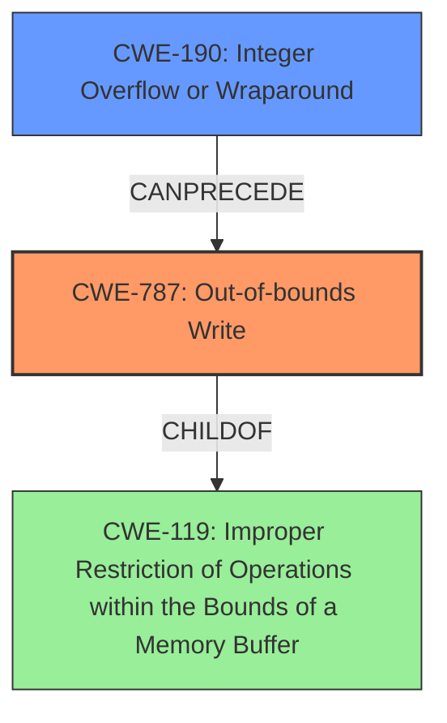

# Final Resolution for CVE-2021-40786

# Summary
| CWE ID | CWE Name | Confidence | CWE Abstraction Level | CWE Vulnerability Mapping Label | CWE-Vulnerability Mapping Notes |
|---|---|---|---|---|---|
| CWE-787 | Out-of-bounds Write | 0.90 | Base | Allowed | Primary CWE |
| CWE-190 | Integer Overflow or Wraparound | 0.70 | Base | Allowed | Secondary Candidate |

## Evidence and Confidence

*   **Confidence Score:** 0.90
*   **Evidence Strength:** HIGH

## Relationship Analysis
The primary relationship that impacted the decision was the parent-child relationship between CWE-787 (**Out-of-bounds Write**) and CWE-119 (**Improper Restriction of Operations within the Bounds of a Memory Buffer**). While CWE-119 is a parent of CWE-787, it is too general. CWE-787 is more specific and therefore more appropriate. The potential for CWE-190 (**Integer Overflow or Wraparound**) to precede CWE-787 in a vulnerability chain was also considered.

## Vulnerability Chain
The vulnerability chain starts with the **insecure handling** of a malicious file, potentially involving an integer overflow (**CWE-190**) during the calculation of a buffer size. This leads to an **incorrect buffer size calculation** and ultimately results in an **out-of-bounds write** (**CWE-787**), leading to arbitrary code execution.

## Summary of Analysis
The initial analysis correctly identified CWE-787 (**Out-of-bounds Write**) as the primary weakness, and the criticism provided valuable suggestions for improvement. Based on the vulnerability description ("memory corruption vulnerability due to insecure handling of a malicious file, potentially resulting in arbitrary code execution"), and the CVE summary indicating an "out-of-bounds write", CWE-787 is the most appropriate primary CWE.

The analysis was strengthened by considering the potential for an integer overflow (**CWE-190**) during buffer size calculation, making it a relevant secondary CWE. The graph relationships, particularly the CANPRECEDE relationship between CWE-190 and CWE-787, influenced the decision to include CWE-190 as a secondary candidate.

The selected CWEs are at the optimal level of specificity, with CWE-787 being a base-level weakness directly describing the out-of-bounds write and CWE-190 representing a potential root cause related to buffer size calculation. CWE-119 was considered but deemed too general.

The final confidence score is 0.90, reflecting the high confidence in the classification based on the available evidence and relationship analysis.