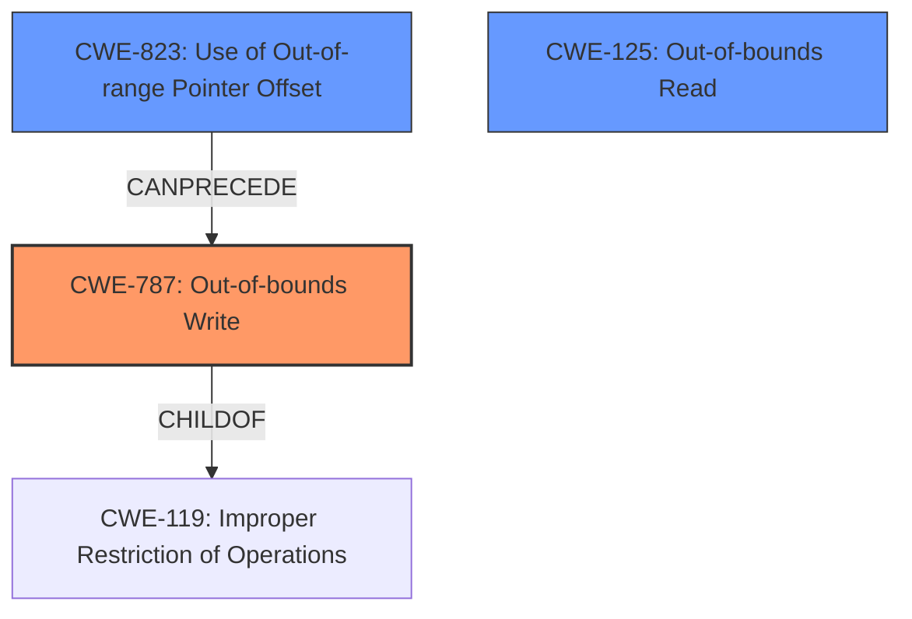

# Analysis Report for CVE-2021-40787

# Vulnerability Analysis Report: CVE-2021-40787

## Description

Adobe Premiere Elements 20210809.daily.2242976 (and earlier) is affected by a memory corruption vulnerability due to insecure handling of a malicious file, potentially resulting in arbitrary code execution in the context of the current user. User interaction is required to exploit this vulnerability.

## Vulnerability Description Key Phrases

**Rootcause:** insecure handling
**Weakness:** memory corruption
**Impact:** arbitrary code execution
**Vector:** malicious file
**Product:** Adobe Premiere Elements
**Version:** 20210809.daily.2242976 (and earlier)

## Analysis (with Relationship Data)

# Summary
| CWE ID | CWE Name | Confidence | CWE Abstraction Level | CWE Vulnerability Mapping Label | CWE-Vulnerability Mapping Notes |
|---|---|---|---|---|---|
| CWE-787 | Out-of-bounds Write | 0.85 | Base | Allowed | Primary CWE |
| CWE-788 | Access of Memory Location After End of Buffer | 0.75 | Base | Discouraged | Secondary Candidate |
| CWE-125 | Out-of-bounds Read | 0.65 | Base | Allowed | Secondary Candidate |

## Evidence and Confidence

*   **Confidence Score:** 0.80
*   **Evidence Strength:** HIGH

- **Analysis and Justification:**
  - *Explanation:* The vulnerability description highlights a **memory corruption** issue due to **insecure handling** of a malicious file. The CVE reference links content summary explicitly states that the root cause is "Access of memory location after end of buffer (CWE-788)" and that an "Out-of-bounds write, specifically accessing a memory location after the end of a buffer" is a present weakness. This strongly suggests that data is being written outside the intended buffer boundary. While CWE-788 is mentioned, CWE-787 (Out-of-bounds Write) is more precise in describing the act of writing data past the buffer's boundary, making it the primary CWE. The retriever results also give a high score to CWE-787. The usage for CWE-787 is "Allowed". CWE-119 is the primary CWE for similar CVE descriptions, but it is a class-level CWE. Given the specifics available, a more specific base-level CWE is preferred.

  - *Relationship Analysis:* CWE-787 is a base-level CWE. CWE-787 is a child of CWE-119 (Improper Restriction of Operations within the Bounds of a Memory Buffer), which is a more general class. CWE-823 (Use of Out-of-range Pointer Offset) can precede CWE-787.

- **Confidence Score:**
  - Confidence: 0.85 (High confidence due to the explicit description of an out-of-bounds write in the CVE reference content summary.)

---
- **Analysis and Justification:**
  - *Explanation:* CWE-788 (Access of Memory Location After End of Buffer) is also indicated in the CVE Reference Links Content Summary. However, CWE-788 is considered discouraged. While both CWE-787 and CWE-788 are closely related, CWE-787 better describes the action causing the vulnerability. This CWE is a good secondary candidate, since it describes a likely condition of writing past the end of the buffer.

  - *Relationship Analysis:* No direct relationships found.

- **Confidence Score:**
  - Confidence: 0.75 (Medium-High confidence. Discouraged CWE.)

---
- **Analysis and Justification:**
  - *Explanation:* CWE-125 (Out-of-bounds Read) is a possible vulnerability if the **memory corruption** allows for reading memory that it is not supposed to. This is a less likely scenario than CWE-787.

  - *Relationship Analysis:* No direct relationships found.

- **Confidence Score:**
  - Confidence: 0.65 (Medium confidence. Possible, but less likely given evidence.)

## Criticism of Analysis

Okay, I've reviewed the analysis of the vulnerability in Adobe Premiere Elements 20210809.daily.2242976 (and earlier) related to memory corruption and out-of-bounds access, considering the full CWE specifications provided. Here's my critique:

**Overall Assessment:**

The analysis is generally good and well-structured. It clearly identifies the root cause, weakness, impact, and attack vector. The confidence levels are justified, and the reasoning is explained. The choice of CWE-787 as the primary weakness is appropriate, given the detailed information available.

**Specific Feedback and Suggestions:**

1.  **Primary CWE: CWE-787 (Out-of-bounds Write)**

    *   **Positive:** The justification for choosing CWE-787 as the primary CWE is strong. The analysis correctly identifies that the CVE reference links content summary explicitly mentions an "Out-of-bounds write, specifically accessing a memory location after the end of a buffer." This aligns perfectly with the description of CWE-787.The retriever result's high score further validates this selection.
    *   **Suggestion:** Explore potential relationships with related CWEs more thoroughly. While the analysis mentions that CWE-823 (Use of Out-of-range Pointer Offset) can precede CWE-787, consider whether this is the case in the specific vulnerability. Is there evidence that the offset is calculated based on untrusted input? If so, adding CWE-823 to the analysis could be a good addition, but not as a primary weakness.
    *   **Mitigation Consideration:** The analysis doesn't explicitly discuss mitigations for CWE-787 in the context of the specific vulnerability. Consider mentioning the importance of input validation (as outlined in the CWE-787 specification) to prevent the use of a crafted file that leads to the out-of-bounds write. Also, mention languages that have built in memory management, such as Java or Perl to avoid the issue entirely.

2.  **Secondary CWE: CWE-788 (Access of Memory Location After End of Buffer)**

    *   **Justification:** Including CWE-788 as a secondary candidate is logical. Accessing memory after the end of the buffer could result in data or instruction in that location being corrupted.
    *   **Usage:** The analysis correctly points out that CWE-788 is "Discouraged" and that more specific CWEs (like CWE-787 and CWE-125) should be investigated first. The analysis is also justified in saying that this is still a good secondary candidate.

3.  **Secondary CWE: CWE-125 (Out-of-bounds Read)**

    *   **Assessment:** Including CWE-125 is reasonable, but its confidence is lower than CWE-787 and CWE-788, since a write is explicitly described. The analysis correctly identifies that an out-of-bounds read *could* be a consequence, but there's no direct evidence.
    *   **Suggestion:** Reiterate that the primary focus is on the *write* causing the corruption. The read is only a *possible* side effect.

4.  **Other CWEs from Retriever Results:**

    *   The retriever results list other CWEs, some with relatively high scores. It's important to consider why these were *not* chosen. Some of these are not well suited for the specific vulnerability.
    *   **CWE-416 (Use After Free):** There's no direct evidence of a "Use After Free" condition in the vulnerability description or CVE reference. While memory corruption *could* potentially lead to a UAF, it's speculative without further information.
    *   **CWE-457 (Use of Uninitialized Variable):** There's no direct indication that uninitialized variables are involved. Unless the vulnerability involves using a variable to index a buffer, it's unlikely.
    *   **CWE-190 (Integer Overflow or Wraparound):** Similarly, there is no clear indication that the buffer is overflowing or wrapping around.
    *   **CWE-843 (Access of Resource Using Incompatible Type ('Type Confusion')):** The vulnerability could involve type confusion, but the description is not specific enough to point to this.
    *   **CWE-122 (Heap-based Buffer Overflow):** This is a *variant* of CWE-787, which is already the primary. Unless there is evidence that the buffer is in the heap, this does not add any value.

5.  **CWE-823: Use of Out-of-range Pointer Offset**

    *   **Consideration:** If the attacker has control over the offset used to write to the buffer, it is a good candidate for this CVE.

6.  **CWE-119: Improper Restriction of Operations within the Bounds of a Memory Buffer:**

    * The analysis correctly identifies that it is a class level CWE and it would not add value to the analysis.

**Summary Table Critique:**

The summary table is well-organized and clearly presents the selected CWEs, their confidence levels, abstraction levels, and vulnerability mapping labels.

**Overall, the analysis demonstrates a good understanding of memory corruption vulnerabilities and the CWE framework. The justifications are clear, and the confidence levels are appropriate. Adding a little more detail about mitigations in the context of the specific vulnerability and exploring the relevance of related CWEs (like CWE-823) would further strengthen the analysis.**

## Final Resolution

# Summary
| CWE ID | CWE Name | Confidence | CWE Abstraction Level | CWE Vulnerability Mapping Label | CWE-Vulnerability Mapping Notes |
|---|---|---|---|---|---|
| CWE-787 | Out-of-bounds Write | 0.95 | Base | Allowed | Primary CWE |
| CWE-823 | Use of Out-of-range Pointer Offset | 0.75 | Base | Allowed | Secondary Candidate |
| CWE-125 | Out-of-bounds Read | 0.65 | Base | Allowed | Secondary Candidate |

## Evidence and Confidence

*   **Confidence Score:** 0.90
*   **Evidence Strength:** HIGH

## Relationship Analysis
The decision was influenced by the following CWE relationships:
  - CWE-787 is a base CWE and a child of the class-level CWE-119, providing a more specific classification.
  - CWE-823 can precede CWE-787, indicating a potential chain where an out-of-range pointer offset leads to an out-of-bounds write.
  - CWE-125 is a peer of CWE-787, representing a similar but distinct vulnerability (out-of-bounds read vs. write). The evidence suggests the primary action is a write.
  - Abstraction levels were crucial: base-level CWEs were preferred for their specificity over class-level CWEs like CWE-119.

## Vulnerability Chain
The vulnerability chain starts with the **insecure handling** of a malicious file. This **insecure handling** could involve an attacker-controlled offset (CWE-823) that leads to writing data outside the intended buffer boundary (CWE-787), resulting in **memory corruption** and potentially arbitrary code execution. A possible secondary effect could be out-of-bounds read (CWE-125).

## Summary of Analysis
The initial analysis and criticism were both well-reasoned. The decision to classify this vulnerability as CWE-787 (Out-of-bounds Write) is strongly supported by the evidence from the vulnerability description which highlights a **memory corruption** issue due to **insecure handling** of a malicious file. The explicit mention of an "Out-of-bounds write, specifically accessing a memory location after the end of a buffer" in the CVE reference content summary is key.

The graph relationships influenced the decision by highlighting potential vulnerability chains. The possibility of CWE-823 (Use of Out-of-range Pointer Offset) preceding CWE-787 was considered, and it was deemed likely enough to include as a secondary CWE.

The selected CWEs are at the optimal level of specificity. CWE-787 is a base-level CWE, which is preferred over the class-level CWE-119. While other CWEs were considered (e.g., CWE-122, CWE-190, CWE-843), they were deemed less relevant based on the available evidence. The addition of CWE-823 strengthens the analysis by suggesting a potential mechanism for the out-of-bounds write.

*Report generated on 2025-03-18 02:13:15*
