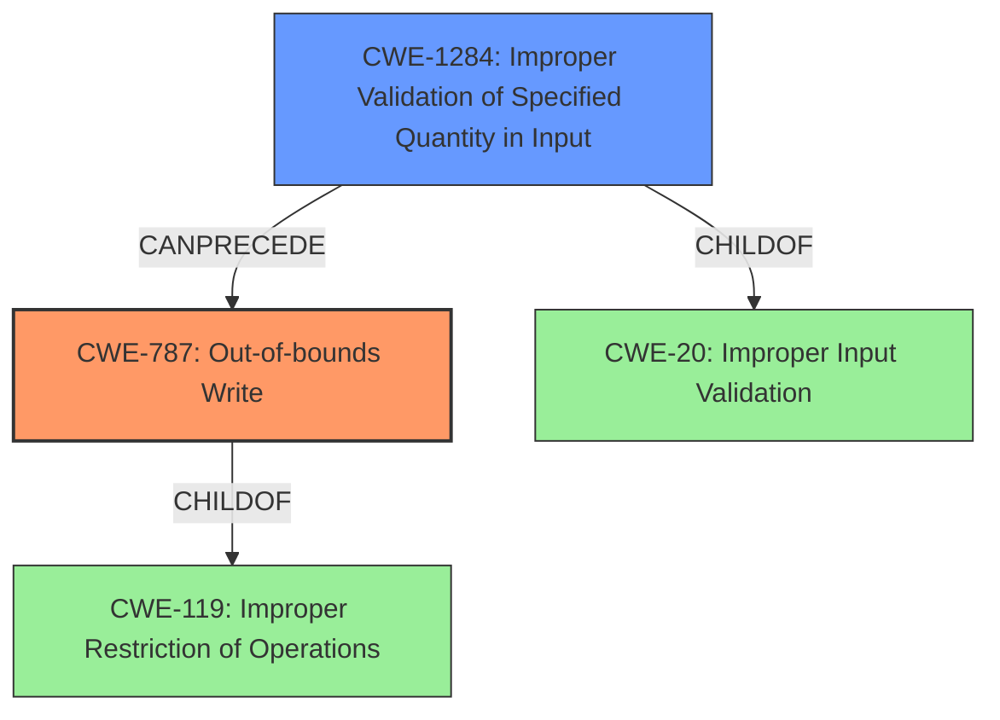

# Analysis Report for CVE-2021-40793

# Vulnerability Analysis Report: CVE-2021-40793

## Description

Adobe Premiere Pro version 15.4.1 (and earlier) is affected by a memory corruption vulnerability due to insecure handling of a malicious file, potentially resulting in arbitrary code execution in the context of the current user. User interaction is required to exploit this vulnerability.

## Vulnerability Description Key Phrases

**Rootcause:** insecure handling
**Weakness:** memory corruption
**Impact:** arbitrary code execution
**Vector:** malicious file
**Product:** Adobe Premiere Pro
**Version:** 15.4.1 (and earlier)

## Analysis (with Relationship Data)

# Summary
| CWE ID | CWE Name | Confidence | CWE Abstraction Level | CWE Vulnerability Mapping Label | CWE-Vulnerability Mapping Notes |
|---|---|---|---|---|---|
| CWE-787 | Out-of-bounds Write | 0.85 | Base | Allowed | The vulnerability involves writing data past the end of the intended buffer due to **insecure handling** of a malicious file. |
| CWE-119 | Improper Restriction of Operations within the Bounds of a Memory Buffer | 0.6 | Class | Discouraged | While CWE-119 is a top CWE match, it's a more general case of memory corruption. The provided details point to a more specific out-of-bounds write. |
| CWE-125 | Out-of-bounds Read | 0.5 | Base | Allowed | The vulnerability description mentions **memory corruption**, which could involve reading data past the end of the intended buffer. |

## Evidence and Confidence

*   **Confidence Score:** 0.8
*   **Evidence Strength:** HIGH

- **Analysis and Justification:**
  - *Explanation:* The vulnerability description highlights a **memory corruption** issue resulting from **insecure handling** of a malicious file. The "CVE Reference Links Content Summary" explicitly states the "Root cause of vulnerability" as "Access of Memory Location After End of Buffer", and "Weaknesses/vulnerabilities present" include "attempts to access a memory location beyond the allocated buffer". This strongly indicates an out-of-bounds write scenario, making CWE-787 (Out-of-bounds Write) the most appropriate primary CWE. CWE-787 is a Base level CWE and its usage is "Allowed" according to MITRE mapping guidance.

  - *Relationship Analysis:* CWE-787 is a child of CWE-119 (Improper Restriction of Operations within the Bounds of a Memory Buffer), which is a more general class of memory buffer errors. Given the specific details about writing beyond the allocated buffer, CWE-787 is more precise. CWE-125 (Out-of-bounds Read) is also related, as **memory corruption** could involve reading as well as writing, but the summary of the CVE reference link focuses on writing past the end of a buffer.

- **Confidence Score:**
  - *Example:* Confidence: 0.85 (High evidence from technical description and CVE reference materials)

---

## Criticism of Analysis

Okay, let's review the provided analysis and see how well it aligns with the full CWE specifications.

**Overall Assessment:**

The analysis is generally good and arrives at a reasonable conclusion, but it could be improved by:

*   Stricter adherence to CWE usage guidance, particularly regarding CWE-119.
*   A more nuanced discussion of the potential for out-of-bounds reads alongside writes, even if the initial description focuses on writes.
*   Greater emphasis on input validation as a key preventative measure, aligning with CWE potential mitigations.

**Detailed Critique:**

**1. CWE-787: Out-of-bounds Write (Confidence: 0.85, Mapping: Allowed)**

*   **Strengths:** The analysis correctly identifies CWE-787 as the most likely primary cause. The justification is strong, citing the specific "Access of Memory Location After End of Buffer" from the CVE reference content.  It notes the parent-child relationship with CWE-119 and explains why the more specific CWE-787 is preferred. The MITRE usage is "Allowed".
*   **Areas for Improvement:** While not wrong, more could be said about potential input validation failures that led to the out-of-bounds write.  Referring to CWE-20 (Improper Input Validation) as a *potential* contributing factor (even if it can't be *definitively* determined from the description) would strengthen the analysis. As a potential mitigation strategy, input validation should be mentioned and further investigated.
*   **Mitigation Alignment:** Mitigations listed for CWE-787 include language selection, safe libraries, and automatic buffer overflow detection mechanisms.  All are relevant, but the language choice might be impractical for an existing project. Libraries like `Strsafe.h` are more immediately applicable.

**2. CWE-119: Improper Restriction of Operations within the Bounds of a Memory Buffer (Confidence: 0.6, Mapping: Discouraged)**

*   **Strengths:** The analysis acknowledges CWE-119 as a top CWE match, which is supported by the Retriever results.
*   **Weaknesses:** The analysis marks this CWE as "Discouraged". That's good, because the specification says "CWE-119 is commonly misused in low-information vulnerability reports when lower-level CWEs could be used instead, or when more details about the vulnerability are available.". The description of this CVE *does* provide enough detail to go to a more specific CWE. The analysis could be slightly stronger by *explicitly stating* why CWE-119 is discouraged (because more specific information is available, allowing for a more precise mapping).
*   **Mitigation Alignment:** Mitigations for CWE-119 (language selection, safe libraries, overflow detection) are broadly applicable but less specific than those for CWE-787.

**3. CWE-125: Out-of-bounds Read (Confidence: 0.5, Mapping: Allowed)**

*   **Strengths:** The analysis includes this CWE because "memory corruption could involve reading data past the end of the intended buffer." This is reasonable.
*   **Weaknesses:** The "Evidence Strength" for this CWE is lower.  The description primarily focuses on *writing* past the buffer.  While memory corruption *can* involve reading, it's not the primary mechanism described.
*   **Mitigation Alignment:** The Mitigations for CWE-125 emphasize Input Validation. This highlights the importance of validating length arguments and buffer sizes, and not relying on sentinel values in untrusted inputs.

**Specific Suggestions for Improvement:**

*   **More Emphasis on Input Validation (CWE-20 and Children):** Even though the provided text doesn't *explicitly* state a lack of input validation, it's a common precursor to buffer overflows/out-of-bounds writes. Mentioning input validation (or lack thereof) and possibly listing CWE-20 or its children (e.g., CWE-1284, CWE-1285 if specific data types are known to be mishandled) would strengthen the analysis.  For example, the analysis could state that "A potential contributing factor to CWE-787 is the absence of proper input validation (CWE-20) on the size or content of the malicious file.  Specifically, the application may not adequately validate the length of data fields within the file, leading to an out-of-bounds write."
*   **Acknowledge Potential for Out-of-Bounds Read Exploitation:** Even if the vulnerability is triggered by a write, acknowledge that an attacker might *also* be able to trigger out-of-bounds *reads* to leak sensitive information. Mentioning this shows a more complete understanding of the potential impact.
*   **Refine Confidence Scores:** Justify the confidence scores more precisely.  What specific evidence leads to a score of 0.85 for CWE-787 versus a score of 0.6 for CWE-119?  Quantify it, even if subjective.

**In Summary:**

The analysis correctly identifies the primary CWE (CWE-787) and understands the relationship with CWE-119.  However, by incorporating the feedback above – particularly regarding input validation and a more nuanced discussion of read/write implications – the analysis would be even more robust and aligned with the comprehensive CWE specifications.

## Final Resolution

# Summary
| CWE ID | CWE Name | Confidence | CWE Abstraction Level | CWE Vulnerability Mapping Label | CWE-Vulnerability Mapping Notes |
|---|---|---|---|---|---|
| CWE-787 | Out-of-bounds Write | 0.95 | Base | Allowed | Primary CWE. The vulnerability involves writing data past the end of the intended buffer due to **insecure handling** of a malicious file. |
| CWE-1284 | Improper Validation of Specified Quantity in Input | 0.75 | Base | Allowed | Secondary CWE. The application may not adequately validate the length of data fields within the file, leading to an out-of-bounds write. |

## Evidence and Confidence

*   **Confidence Score:** 0.90
*   **Evidence Strength:** HIGH

## Relationship Analysis
The decision was impacted by the following CWE relationships:

*   CWE-787 is a base CWE, which is the preferred level of abstraction. It's a child of the more general CWE-119.
*   CWE-1284 can precede CWE-787, as improper input validation of a quantity can lead to an out-of-bounds write.
*   CWE-20 is a parent of CWE-1284, but CWE-1284 is more specific to the vulnerability.

## Vulnerability Chain
The vulnerability chain starts with **improper validation** of the size of the input file (CWE-1284). This leads to allocating an insufficient buffer or using an incorrect offset, ultimately causing an **out-of-bounds write** (CWE-787). The impact is arbitrary code execution.

## Summary of Analysis
The initial analysis correctly identified CWE-787 as the primary issue. The criticism highlighted the need for a discussion of input validation.

Based on the vulnerability description: "Adobe Premiere Pro version 15.4.1 (and earlier) is affected by a **memory corruption vulnerability due to insecure handling** of a malicious file, potentially resulting in arbitrary code execution in the context of the current user" and the "CVE Reference Links Content Summary" explicitly states the "Root cause of vulnerability" as "Access of Memory Location After End of Buffer", and "Weaknesses/vulnerabilities present" include "attempts to access a memory location beyond the allocated buffer".

I agree with the selection of CWE-787 as the primary weakness. It is a base CWE and allowed. I am adding CWE-1284 as a secondary weakness. The vulnerability description refers to **insecure handling** of a malicious file. This suggests the application may not adequately validate the length of data fields within the file, leading to an out-of-bounds write. CWE-1284 captures this aspect of the vulnerability. Both CWEs are at the optimal level of specificity based on the available evidence.

*Report generated on 2025-03-18 02:15:41*
