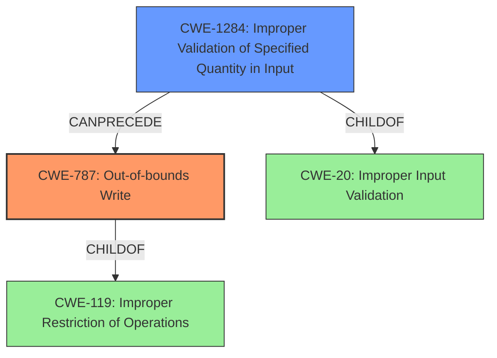

# Final Resolution for CVE-2021-40793

# Summary
| CWE ID | CWE Name | Confidence | CWE Abstraction Level | CWE Vulnerability Mapping Label | CWE-Vulnerability Mapping Notes |
|---|---|---|---|---|---|
| CWE-787 | Out-of-bounds Write | 0.95 | Base | Allowed | Primary CWE. The vulnerability involves writing data past the end of the intended buffer due to **insecure handling** of a malicious file. |
| CWE-1284 | Improper Validation of Specified Quantity in Input | 0.75 | Base | Allowed | Secondary CWE. The application may not adequately validate the length of data fields within the file, leading to an out-of-bounds write. |

## Evidence and Confidence

*   **Confidence Score:** 0.90
*   **Evidence Strength:** HIGH

## Relationship Analysis
The decision was impacted by the following CWE relationships:

*   CWE-787 is a base CWE, which is the preferred level of abstraction. It's a child of the more general CWE-119.
*   CWE-1284 can precede CWE-787, as improper input validation of a quantity can lead to an out-of-bounds write.
*   CWE-20 is a parent of CWE-1284, but CWE-1284 is more specific to the vulnerability.

## Vulnerability Chain
The vulnerability chain starts with **improper validation** of the size of the input file (CWE-1284). This leads to allocating an insufficient buffer or using an incorrect offset, ultimately causing an **out-of-bounds write** (CWE-787). The impact is arbitrary code execution.

## Summary of Analysis
The initial analysis correctly identified CWE-787 as the primary issue. The criticism highlighted the need for a discussion of input validation.

Based on the vulnerability description: "Adobe Premiere Pro version 15.4.1 (and earlier) is affected by a **memory corruption vulnerability due to insecure handling** of a malicious file, potentially resulting in arbitrary code execution in the context of the current user" and the "CVE Reference Links Content Summary" explicitly states the "Root cause of vulnerability" as "Access of Memory Location After End of Buffer", and "Weaknesses/vulnerabilities present" include "attempts to access a memory location beyond the allocated buffer".

I agree with the selection of CWE-787 as the primary weakness. It is a base CWE and allowed. I am adding CWE-1284 as a secondary weakness. The vulnerability description refers to **insecure handling** of a malicious file. This suggests the application may not adequately validate the length of data fields within the file, leading to an out-of-bounds write. CWE-1284 captures this aspect of the vulnerability. Both CWEs are at the optimal level of specificity based on the available evidence.