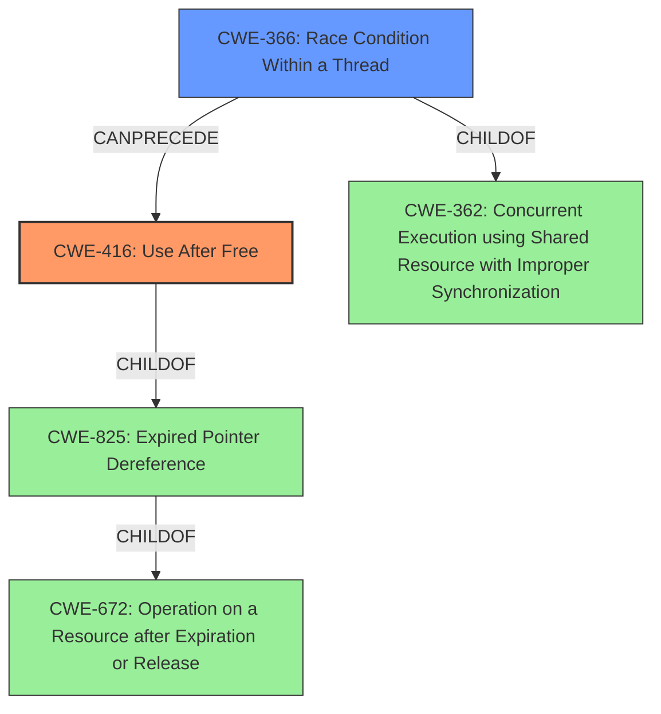

# Final Resolution for CVE-2021-4083

# Summary
| CWE ID | CWE Name | Confidence | CWE Abstraction Level | CWE Vulnerability Mapping Label | CWE-Vulnerability Mapping Notes |
|---|---|---|---|---|---|
| CWE-416 | Use After Free | 0.9 | Variant | Allowed | Primary CWE |
| CWE-366 | Race Condition Within a Thread | 0.8 | Base | Allowed | Supporting CWE: Enables CWE-416 |

## Evidence and Confidence

*   **Confidence Score:** 0.85
*   **Evidence Strength:** HIGH

## Relationship Analysis
The primary relationship is that **CWE-366** enables **CWE-416**. **CWE-416** is a variant of **CWE-825 (Expired Pointer Dereference)**, which in turn is a specific case of **CWE-672 (Operation on Resource After Expiry)**. **CWE-366** is a child of **CWE-362 (Concurrent Execution using Shared Resource with Improper Synchronization)**, but is more specific and thus preferred. The abstraction levels influenced the selection by prioritizing the most specific classifications possible.

## Vulnerability Chain
The vulnerability chain starts with the **ROOTCAUSE**, **CWE-366 (Race Condition Within a Thread)**, which allows two threads to simultaneously access a shared resource in the kernel's garbage collection for Unix domain socket file handlers. This race condition enables the **WEAKNESS**, **CWE-416 (Use After Free)**, where memory is accessed after it has been freed. The consequence is a system crash or potential privilege escalation.

## Summary of Analysis
I agree with the initial analysis that **CWE-416 (Use After Free)** is the primary **WEAKNESS**. The vulnerability description explicitly states that it is a "read-after-free" flaw. The analysis correctly points out the alignment with the CVE details and the allowed usage of this Variant-level CWE.

I agree with the criticism that **CWE-362 (Concurrent Execution using Shared Resource with Improper Synchronization)** is not the optimal choice. The more specific **CWE-366 (Race Condition Within a Thread)** is a better fit because it directly addresses the race condition occurring between threads within the kernel. The vulnerability description mentions simultaneous calls to `close()` and `fget()`, which directly relates to the definition of **CWE-366**: "If two threads of execution use a resource simultaneously, there exists the possibility that resources may be used while invalid, in turn making the state of execution undefined." This **ROOTCAUSE** enables the **CWE-416 (Use After Free)**. Therefore, I am changing the secondary CWE to **CWE-366**.

My assessment is strongly based on the provided evidence, specifically the vulnerability description which states "A read-after-free memory flaw was found...and can potentially trigger a race condition." This highlights both the **use-after-free** and the **race condition**.
The graph relationships influenced my selection by emphasizing the importance of choosing the most specific CWE. While **CWE-362** is related, **CWE-366** provides a more accurate representation of the vulnerability's root cause. The chosen CWEs are at the optimal level of specificity because **CWE-416** is a Variant and **CWE-366** is a Base level CWE, both preferred levels of abstraction.