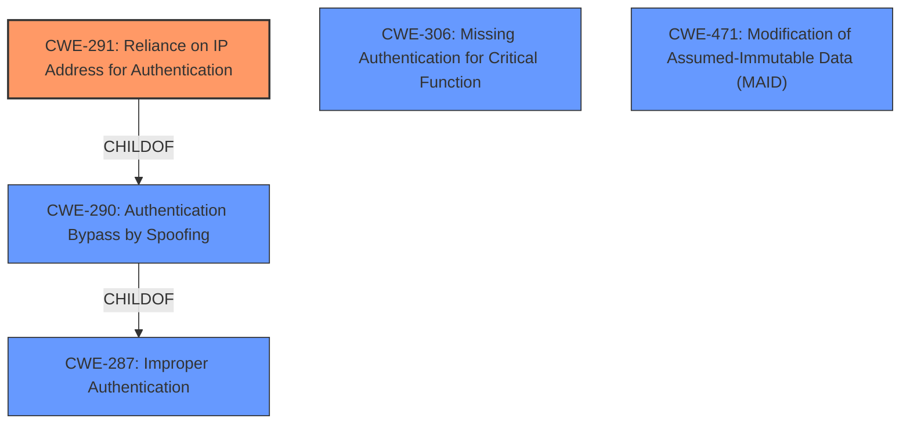

# Analysis Report for CVE-2021-40867

# Vulnerability Analysis Report: CVE-2021-40867

## Description

Certain NETGEAR smart switches are affected by an authentication hijacking race-condition vulnerability by an unauthenticated attacker who uses the same source IP address as an admin in the process of logging in (e.g., behind the same NAT device, or already in possession of a foothold on an admins machine). This occurs because the multi-step HTTP authentication process is effectively tied only to the source IP address. This affects GC108P before 1.0.8.2, GC108PP before 1.0.8.2, GS108Tv3 before 7.0.7.2, GS110TPP before 7.0.7.2, GS110TPv3 before 7.0.7.2, GS110TUP before 1.0.5.3, GS308T before 1.0.3.2, GS310TP before 1.0.3.2, GS710TUP before 1.0.5.3, GS716TP before 1.0.4.2, GS716TPP before 1.0.4.2, GS724TPP before 2.0.6.3, GS724TPv2 before 2.0.6.3, GS728TPPv2 before 6.0.8.2, GS728TPv2 before 6.0.8.2, GS750E before 1.0.1.10, GS752TPP before 6.0.8.2, GS752TPv2 before 6.0.8.2, MS510TXM before 1.0.4.2, and MS510TXUP before 1.0.4.2.

## Vulnerability Description Key Phrases

**Rootcause:** authentication hijacking race-condition
**Impact:** unauthenticated admin login
**Vector:** same source IP address
**Attacker:** unauthenticated attacker
**Product:** NETGEAR smart switches
**Version:** multiple versions

## Analysis (with Relationship Data)

# Summary
| CWE ID | CWE Name | Confidence | CWE Abstraction Level | CWE Vulnerability Mapping Label | CWE-Vulnerability Mapping Notes |
|---|---|---|---|---|---|
| CWE-291 | Reliance on IP Address for Authentication | 0.95 | Variant | Allowed | Primary CWE |
| CWE-306 | Missing Authentication for Critical Function | 0.75 | Base | Allowed | Secondary Candidate |
| CWE-290 | Authentication Bypass by Spoofing | 0.70 | Base | Allowed | Secondary Candidate |

## Evidence and Confidence

*   **Confidence Score:** 0.90
*   **Evidence Strength:** HIGH

- **Analysis and Justification:**  
  - *Explanation:* "The vulnerability is an **authentication hijacking race-condition** because the HTTP authentication process is effectively tied only to the source IP address. This aligns well with CWE-291, Reliance on IP Address for Authentication, which is a Variant level CWE and ALLOWED. The CVE description mentions that the `get.cgi` handler relies solely on the client IP and a guessable browser type number for verification, confirming the use of IP address for authentication. CWE-306 (Missing Authentication for Critical Function) is also relevant because the system doesn't properly authenticate users, allowing unauthenticated access. CWE-290 (Authentication Bypass by Spoofing) is also relevant because an attacker can spoof the IP address to bypass authentication. However, CWE-291 is the most specific and appropriate because it directly addresses the **reliance on IP address** which is the root cause. The suggested fix is to use a cryptographically secure random value for the result file name, which should then be passed as a token and used for subsequent get.cgi requests, this indicates the need for proper authentication mechanisms."
  
  - *Relationship Analysis:* "CWE-291 is a variant of CWE-290 (Authentication Bypass by Spoofing), and CWE-290 is a child of CWE-287 (Improper Authentication). The relationships suggest a hierarchy of authentication weaknesses, but CWE-291 is chosen for its specificity to the reliance on IP addresses. CWE-306 (Missing Authentication for Critical Function) can be related as it describes the absence of proper authentication."

- **Confidence Score:**  
  - *Example:* Confidence: 0.95 (High evidence from technical description and CVE reference materials)

---

## Criticism of Analysis

Okay, here's a review of the provided vulnerability analysis, considering the full CWE specifications:

**Overall Assessment:**

The analysis is generally good and identifies the primary CWE effectively. The justification is well-reasoned, and the relationships between the CWEs are explored. The high confidence level is justified based on the available evidence. However, there's room for improvement in discussing secondary CWEs and considering all aspects of the vulnerability based on the CWE specifications.

**Detailed Review:**

*   **CWE-291: Reliance on IP Address for Authentication (Primary CWE):**
    *   **Score:** 0.95 (Excellent Choice)
    *   **Justification:** This is the *most* specific and accurate CWE. The vulnerability hinges on the flawed assumption that the IP address is a reliable indicator of user identity.  The description of CWE-291 directly matches the core issue.
    *   **CWE Specification Alignment:** The analysis aligns perfectly with the description and extended description of CWE-291.  The discussion of IP address spoofing and the reliance on IP as the *sole* factor confirms this.
    *   **Mapping Guidance:** The analysis correctly notes that CWE-291 is at the Variant level and ALLOWED, which is preferable.
    *   **Potential Mitigations:** The analysis is missing discussion of potential mitigations. The spec for CWE-291 has the following mitigation:
        *   "Use other means of identity verification that cannot be simply spoofed. Possibilities include a username/password or certificate."
        This should be included in the analysis.

*   **CWE-306: Missing Authentication for Critical Function (Secondary Candidate):**
    *   **Score:** 0.75 (Good Candidate, but secondary to CWE-291)
    *   **Justification:** The analysis correctly identifies that the system lacks proper authentication, allowing unauthenticated access to critical functions (admin control). This is true because the IP check fails to prove identity.
    *   **CWE Specification Alignment:**  The description fits - "The product does not perform any authentication for functionality that requires a provable user identity." However, the issue isn't *completely* missing authentication, but *insufficient* authentication. This is why CWE-291 is superior.
    *   **Mapping Guidance:** Correctly identifies CWE-306 as Base level and allowed.
    *  **Potential Mitigations:** The spec for CWE-306 has a lot of good suggestions that aren't in the analysis, such as:
        *   Divide the software into anonymous, normal, privileged, and administrative areas
        *   Use a centralized authentication capability.
        *   Identify all potential communication channels, or other means of interaction with the software
        *   Consider using authentication capabilities as provided by the surrounding framework, operating system, or environment.

*   **CWE-290: Authentication Bypass by Spoofing (Secondary Candidate):**
    *   **Score:** 0.70 (Relevant, but less specific)
    *   **Justification:** The analysis notes that an attacker can potentially spoof the IP address to bypass authentication. This is a correct observation, but it's more of a *potential* attack vector given the primary weakness.
    *   **CWE Specification Alignment:** The description of CWE-290 is relevant.
    *   **Mapping Guidance:** Correctly identifies CWE-290 as Base level and allowed.
        *   **Potential Mitigations:** Not discussed in the analysis. The spec for CWE-290 has the following mitigation:
        *   "This can be resultant from insufficient verification." which is true of the root cause of the weakness
    *   **Improvement:** While valid, it's crucial to emphasize that IP address spoofing isn't strictly *required* for exploitation if the attacker is already on the same network or behind the same NAT. The same IP is enough to hijack the authentication.

**Additional Considerations and Potential Improvements:**

1.  **Race Condition Specificity:** The vulnerability is described as an "authentication hijacking race-condition." While the analysis acknowledges the race condition, it doesn't map it to a specific CWE. There isn't a perfect CWE for "race condition in authentication hijacking," so focusing on the primary weakness (IP address reliance) is correct. However, you could mention the race condition aspect briefly when discussing the attack vector.

2.  **Attack Vectors:** The analysis could expand on the attack vectors. For example:
    *   **Same IP Address:** Discuss how an attacker might achieve the same IP (e.g., ARP spoofing, being behind the same NAT, compromising a machine on the network).
    *   **Browser Type Number:** Mention that the "guessable browser type number" makes the authentication even weaker.  Is this a constant, or easily brute-forced?

3.  **Consider CWE-923: Improper Restriction of Communication Channel to Intended Endpoints:** While not a primary CWE, this is a relevant consideration. The communication channel (HTTP) isn't properly restricted to the intended authenticated user due to the reliance on a spoofable identifier (IP).

4.  **CWE-471: Modification of Assumed-Immutable Data (MAID):** Because the IP address should be immutable once associated with a logged in session, and because that immutability is not enforced, this is a decent secondary CWE. MAID's description "The product does not properly protect an assumed-immutable element from being modified by an attacker." applies because an attacker can get an IP address that was already associated with an administrator login and then modify the admin session and gain control of the device.

**Revised Summary Table (with Potential Additions):**

| CWE ID | CWE Name | Confidence | CWE Abstraction Level | CWE Vulnerability Mapping Label | CWE-Vulnerability Mapping Notes |
|---|---|---|---|---|---|
| CWE-291 | Reliance on IP Address for Authentication | 0.95 | Variant | Allowed | Primary CWE |
| CWE-306 | Missing Authentication for Critical Function | 0.75 | Base | Allowed | Secondary Candidate |
| CWE-290 | Authentication Bypass by Spoofing | 0.70 | Base | Allowed | Secondary Candidate |
| CWE-923 | Improper Restriction of Communication Channel to Intended Endpoints | 0.50 | Class | Allowed-with-Review | Additional Consideration |
| CWE-471 | Modification of Assumed-Immutable Data (MAID) | 0.50 | Base | Allowed | Additional Consideration |

**Conclusion:**

The analysis is solid, with CWE-291 being the correct primary mapping.  Adding discussion of potential mitigations, exploring the attack vectors in more detail, and briefly considering other relevant CWEs (even if ultimately rejected) would improve the comprehensiveness of the analysis. Remember to look at the CWE specifications for potential mitigations that can be added.

## Final Resolution

# Summary
| CWE ID | CWE Name | Confidence | CWE Abstraction Level | CWE Vulnerability Mapping Label | CWE-Vulnerability Mapping Notes |
|---|---|---|---|---|---|
| CWE-291 | Reliance on IP Address for Authentication | 0.95 | Variant | Allowed | Primary CWE |
| CWE-306 | Missing Authentication for Critical Function | 0.75 | Base | Allowed | Secondary Candidate |
| CWE-471 | Modification of Assumed-Immutable Data (MAID) | 0.50 | Base | Allowed | Additional Consideration |

## Evidence and Confidence

*   **Confidence Score:** 0.92
*   **Evidence Strength:** HIGH

## Relationship Analysis
The primary weakness is **CWE-291 (Reliance on IP Address for Authentication)**. This is a variant of **CWE-290 (Authentication Bypass by Spoofing)**, which is a child of **CWE-287 (Improper Authentication)**. This hierarchy illustrates the increasingly general nature of authentication weaknesses. While **CWE-290** and **CWE-287** are related, **CWE-291** is chosen due to its specificity to the reliance on IP addresses for authentication. **CWE-306 (Missing Authentication for Critical Function)** is also related as it describes the lack of proper authentication, but it's secondary because the authentication exists, it's just flawed in its reliance on IP. **CWE-471** is considered because once an IP is associated with a logged in session, it should be immutable, and this immutability is not enforced.

## Vulnerability Chain
The vulnerability chain starts with the **ROOTCAUSE** which is the **reliance on IP address for authentication (CWE-291)**. This leads to a **weak authentication mechanism**, where an attacker with the same IP address as an admin can hijack the authentication process. The lack of proper authentication for critical functions (**CWE-306**) further exacerbates the issue. Because the IP address *should be* immutable once associated with a logged in session, the lack of immutability enforcement is **CWE-471**. The end result is an unauthenticated attacker gaining unauthorized access to the NETGEAR switch.

## Summary of Analysis
The initial analysis correctly identified **CWE-291** as the primary weakness, supported by the CVE description which states that the authentication process is effectively tied only to the source IP address. The fact that the `get.cgi` handler relies solely on the client IP and a guessable browser type number for verification confirms the use of IP address for authentication. While **CWE-306** and **CWE-290** are relevant, **CWE-291** is the most specific because it directly addresses the **reliance on IP address** as the **ROOTCAUSE**. The suggested fix, using a cryptographically secure random value as a token, further supports the need for proper authentication mechanisms.

The criticism provided valuable points, particularly regarding potential mitigations and additional CWE considerations. Specifically, the inclusion of **CWE-471** highlights that the IP address is an assumed immutable element.

The graph relationships influenced the decision by illustrating the hierarchical nature of authentication weaknesses, confirming that **CWE-291** is the most specific and appropriate choice.

The selected CWEs are at the optimal level of specificity because **CWE-291** directly reflects the vulnerability, while the secondary CWEs (**CWE-306**, **CWE-471**) provide additional context to the vulnerability chain.

*Report generated on 2025-03-17 04:43:32*
