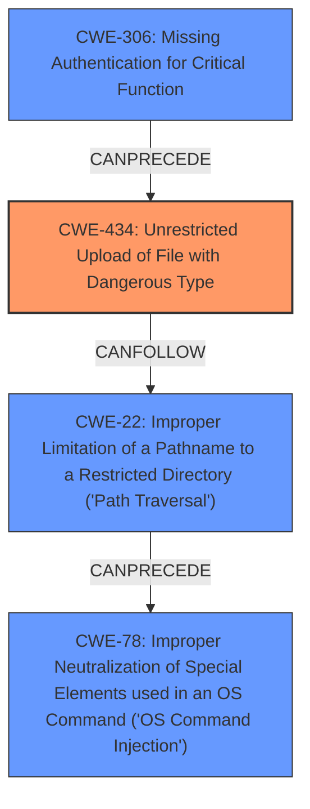

# Final Resolution for CVE-2021-40870

# Summary
| CWE ID | CWE Name | Confidence | CWE Abstraction Level | CWE Vulnerability Mapping Label | CWE-Vulnerability Mapping Notes |
|---|---|---|---|---|---|
| CWE-434 | Unrestricted Upload of File with Dangerous Type | 1.0 | Base | Allowed | Primary CWE. The product allows the upload or transfer of dangerous file types that are automatically processed within its environment. |
| CWE-306 | Missing Authentication for Critical Function | 0.9 | Base | Allowed | Secondary candidate. Unauthenticated access to an API endpoint allows file upload. |
| CWE-22 | Improper Limitation of a Pathname to a Restricted Directory ('Path Traversal') | 0.8 | Base | Allowed | Secondary candidate. Path traversal allows writing outside the intended directory. |
| CWE-78 | Improper Neutralization of Special Elements used in an OS Command ('OS Command Injection') | 0.6 | Base | Allowed | Secondary candidate. The system executes a command using code from the uploaded file. |

## Evidence and Confidence

*   **Confidence Score:** 0.95
*   **Evidence Strength:** HIGH

## Relationship Analysis
The decision was influenced by the following CWE relationships:
  - CWE-434 is the primary **ROOTCAUSE** due to the unrestricted file upload.
  - CWE-306 enables CWE-434 by allowing unauthenticated access to upload functionality.
  - CWE-22 allows writing outside the intended directory, exacerbating the impact.
  - CWE-78 occurs because the uploaded file is executed, leading to OS command injection.

## Vulnerability Chain
The vulnerability chain starts with **ROOTCAUSE** **CWE-306 (Missing Authentication for Critical Function)**, which allows an unauthenticated user to access the file upload functionality. This leads to **CWE-434 (Unrestricted Upload of File with Dangerous Type)**, enabling the upload of a malicious file. The attacker then uses **CWE-22 (Improper Limitation of a Pathname to a Restricted Directory ('Path Traversal'))** to write the file outside of the intended directory. Finally, when the uploaded file is accessed, it results in **CWE-78 (Improper Neutralization of Special Elements used in an OS Command ('OS Command Injection'))**, allowing the attacker to execute arbitrary commands on the system.

## Summary of Analysis
The initial analysis correctly identified CWE-434 as the primary weakness but needed further refinement. The criticism provided valuable insights, particularly regarding the addition of CWE-78 and a clearer explanation of the vulnerability chain.

The final determination is based on the following:

*   **CWE-434 (Unrestricted Upload of File with Dangerous Type):** This remains the primary **WEAKNESS** because the vulnerability description explicitly states that "Unrestricted upload of a file with a dangerous type is possible." This aligns directly with the description of CWE-434.
*   **CWE-306 (Missing Authentication for Critical Function):** This is a critical contributing factor, as the "unauthenticated user" aspect enables the exploitation of the other weaknesses. The `CVE Reference Links Content Summary` confirms the "unauthenticated API access."
*   **CWE-22 (Improper Limitation of a Pathname to a Restricted Directory ('Path Traversal')):** The vulnerability description mentions "directory traversal," and the `curl` example confirms the use of path traversal to write files outside the intended directory.
*   **CWE-78 (Improper Neutralization of Special Elements used in an OS Command ('OS Command Injection')):** The uploaded PHP file executes commands, so adding CWE-78 is valid as a consequence of the **WEAKNESS**. The `curl` command uploads a PHP file that, when accessed, executes a system command.

The graph relationships clearly illustrate how these CWEs are interconnected, with CWE-306 enabling CWE-434, which then leads to CWE-22 and ultimately CWE-78.

The selected CWEs are at the optimal level of specificity because they accurately reflect the root causes and contributing factors of the vulnerability, based on the provided evidence.