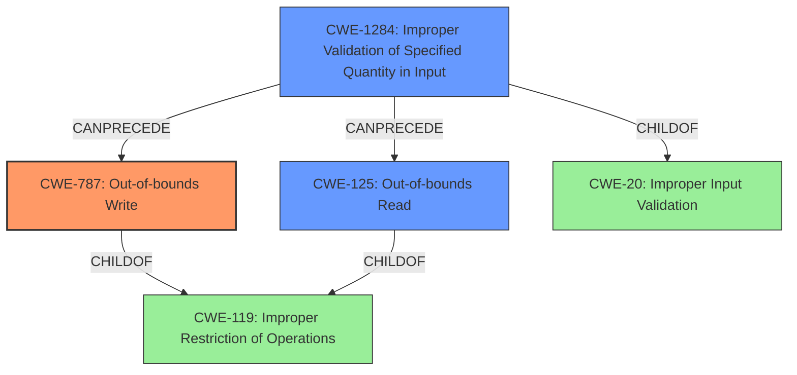

# Analysis Report for CVE-2021-4093

# Vulnerability Analysis Report: CVE-2021-4093

## Description

A flaw was found in the KVMs AMD code for supporting the Secure Encrypted Virtualization-Encrypted State (SEV-ES). A KVM guest using SEV-ES can trigger out-of-bounds reads and writes in the host kernel via a malicious VMGEXIT for a string I/O instruction (for example, outs or ins) using the exit reason SVM_EXIT_IOIO. This issue results in a crash of the entire system or a potential guest-to-host escape scenario.

## Vulnerability Description Key Phrases

**Rootcause:** A flaw was found in the KVMs AMD code for supporting the Secure Encrypted Virtualization-Encrypted State (SEV-ES)
**Impact:** ['crash of the entire system', 'potential guest-to-host escape']
**Vector:** malicious VMGEXIT for a string I/O instruction
**Attacker:** KVM guest using SEV-ES

## Analysis (with Relationship Data)

# Summary
| CWE ID | CWE Name | Confidence | CWE Abstraction Level | CWE Vulnerability Mapping Label | CWE-Vulnerability Mapping Notes |
|---|---|---|---|---|---|
| CWE-787 | Out-of-bounds Write | 0.95 | Base | Allowed | Primary CWE |
| CWE-125 | Out-of-bounds Read | 0.75 | Base | Allowed | Secondary Candidate |
| CWE-1284 | Improper Validation of Specified Quantity in Input | 0.65 | Base | Allowed | Secondary Candidate |

## Evidence and Confidence

*   **Confidence Score:** 0.90
*   **Evidence Strength:** HIGH

- **Analysis and Justification:**  
  - *Explanation:* The vulnerability description clearly states that "A KVM guest using SEV-ES can trigger **out-of-bounds reads and writes** in the host kernel via a malicious VMGEXIT for a string I/O instruction". The "CVE Reference Links Content Summary" further confirms this by stating: "The vulnerability stems from an **out-of-bounds read/write** in the `sev_es_string_io` function within the Linux kernel's KVM implementation when handling string I/O operations for SEV-ES guests." This directly aligns with CWE-787 (Out-of-bounds Write), which describes a scenario where a product writes data past the end of the intended buffer. The summary specifies that a guest can provide a length that, when used with the I/O access size, will cause a memory copy operation to exceed the allocated buffer in the hypervisor. This overflow can lead to memory corruption. The MITRE mapping guidance for CWE-787 indicates this is ALLOWED.

  - *Relationship Analysis:* CWE-787 is a base level CWE and is a child of CWE-119 (Improper Restriction of Operations within the Bounds of a Memory Buffer). This relationship confirms that the vulnerability is related to memory boundary issues. The description focuses on the write aspect, making CWE-787 more precise than its parent.

- **Confidence Score:**  
  - Confidence: 0.95 (High confidence due to clear evidence of out-of-bounds write and confirmation from CVE reference materials)

---

- **Analysis and Justification:**  
  - *Explanation:* While the primary issue is an out-of-bounds write (CWE-787), the initial description also mentions "out-of-bounds reads". The "CVE Reference Links Content Summary" confirms that the vulnerability involves both out-of-bounds reads and writes. Therefore, CWE-125 (Out-of-bounds Read) is also a relevant, though secondary, concern. CWE-125 describes the product reads data past the end, or before the beginning, of the intended buffer. The read occurs when the hypervisor attempts to access the guest's data based on the guest-provided length and I/O size, leading to reads beyond the allocated buffer.

  - *Relationship Analysis:* CWE-125 is a base level CWE and is a child of CWE-119 (Improper Restriction of Operations within the Bounds of a Memory Buffer). This relationship confirms that the vulnerability is related to memory boundary issues.

- **Confidence Score:**  
  - Confidence: 0.75 (Moderate confidence. While out-of-bounds reads are mentioned, the primary focus and impact are on the write aspect.)

---

- **Analysis and Justification:**
  - *Explanation:* The "CVE Reference Links Content Summary" indicates that the root cause includes "lack of proper bounds checking when handling string I/O operations" and "incorrect size calculation". This aligns with CWE-1284 (Improper Validation of Specified Quantity in Input). The guest-provided length and I/O size represent the quantity being specified in the input, and the hypervisor fails to validate that these quantities have the required properties (i.e., they don't exceed the allocated buffer). The fact that the GHCB buffer size was incorrectly calculated supports the selection of this CWE.

  - *Relationship Analysis:* CWE-1284 is a base level CWE and is a child of CWE-20 (Improper Input Validation).

- **Confidence Score:**
  - Confidence: 0.65 (Moderate confidence. The description highlights the lack of validation as a contributing factor, but the primary manifestation is still the out-of-bounds write.)

## Criticism of Analysis

Okay, here's a detailed review of the provided CWE analysis, considering the full CWE specifications and focusing on the mapping guidance and potential mitigations.

**Overall Assessment:**

The analysis is generally good, providing a clear explanation of the vulnerability and its potential CWE mappings. The confidence scores are appropriate, and the evidence is well-presented. The justifications for each CWE selection are sound. However, there's room for improvement, especially in considering mitigation strategies and relationships between CWEs.

**Detailed Review:**

1.  **CWE-787: Out-of-bounds Write (Primary CWE)**
    *   **Confidence:** 0.95 (Excellent)
    *   **Justification:**  The justification is strong and directly supported by the vulnerability description.
    *   **CWE Mapping Guidance:** Follows the ALLOWED guidance.
    *   **Mitigations:** The analysis doesn't explicitly discuss mitigations, but it's important to consider them. The mitigations listed in the CWE spec are:
        *   Language Selection (Use memory-safe languages).
        *   Libraries/Frameworks (Use safe string handling libraries).
        *   Environment Hardening (Use compiler-based overflow detection mechanisms like /GS, FORTIFY_SOURCE).
        *   These mitigations are generally applicable to the vulnerability described and could be mentioned.
    *   **Relationships:**  The analysis correctly identifies the parent CWE as CWE-119.
    *   **Suggestion:** Briefly mention the applicable mitigations from the CWE specification.

2.  **CWE-125: Out-of-bounds Read (Secondary Candidate)**
    *   **Confidence:** 0.75 (Good)
    *   **Justification:**  The justification is reasonable, as the vulnerability involves both read and write operations.
    *   **CWE Mapping Guidance:** Follows the ALLOWED guidance.
    *   **Mitigations:** Again, the analysis could benefit from mentioning mitigations:
        *   Input Validation (Stringent validation of length arguments, buffer sizes, and offsets).
        *   Language Selection (Memory-safe languages).
    *   **Relationships:** Correctly identifies the parent CWE as CWE-119.
    *   **Suggestion:** Briefly discuss the potential mitigations.  Also, consider how an out-of-bounds read *might* contribute to an information leak in some scenarios.

3.  **CWE-1284: Improper Validation of Specified Quantity in Input (Secondary Candidate)**
    *   **Confidence:** 0.65 (Reasonable)
    *   **Justification:** The lack of proper bounds checking and the incorrect GHCB buffer size calculation support the selection of this CWE.
    *   **CWE Mapping Guidance:** Follows the ALLOWED guidance.
    *   **Mitigations:** Again, consider the mitigations:
        *   Input Validation (Use an "accept known good" input validation strategy, strict conformance to specifications).
        *   Reject or transform invalid inputs.
    *   **Relationships:** Correctly identifies the parent as CWE-20.
    *   **Suggestion:**  Emphasize the relationship between the improper input validation and the resulting out-of-bounds write/read. A malicious quantity bypasses the bounds check, leading to memory corruption. Mention the mitigations.

**General Suggestions and Observations:**

*   **Chain vs. Composite vs. Other Relationships:** It would be helpful to explicitly consider whether the CWEs form a chain or a composite.  In this case, it seems like CWE-1284 leads to CWE-787 and CWE-125.  CWE-119 could be considered a higher-level abstraction that encompasses both CWE-787 and CWE-125.
*   **Mitigation Coverage:**  The analysis should consistently discuss potential mitigation strategies for each selected CWE. This strengthens the analysis and makes it more actionable. Don't just identify the CWE; consider how to *prevent* it.
*   **CWE-20: Improper Input Validation Consideration:** While CWE-1284 is selected, the parent CWE, CWE-20, is listed as "Discouraged" for usage in mapping guidance. The retriever result also lists CWE-20 as having high density and sparse scores. Consider mentioning why CWE-20 was not directly selected, given that CWE-1284 is a more specific version of the weakness.
*   **Consider Alternative CWEs from Retriever Results:** The retriever results provided several CWEs with high scores that were not selected for the analysis. This is especially true of **CWE-1342: Information Exposure through Microarchitectural State after Transient Execution**. While this is an unusual result, consider if data from guest memory is exposed to the hypervisor's microarchitectural state, and if this could be exploited by an attacker. The mitigations for this CWE involve clearing data from microarchitectural elements, which might be relevant given that SEV-ES is involved. Also consider the following, and why they may not apply:

*   **CWE-226: Sensitive Information in Resource Not Removed Before Reuse**: While the description doesn't directly mention this, the out-of-bounds write can overwrite memory that *was* supposed to contain sensitive data.
*    **CWE-459: Incomplete Cleanup**: Is this relevant?
*   **CWE-824: Access of Uninitialized Pointer**: Is an uninitialized pointer involved at any time in this process?
*   **CWE-908: Use of Uninitialized Resource**: Is there a resource used before it's initialized?
*   **CWE-190: Integer Overflow or Wraparound**: Is there a size or length calculation that's subject to overflow?
*   **CWE-909: Missing Initialization of Resource**: Is there a resource that should be initialized, but is not?
*   **CWE-362: Concurrent Execution using Shared Resource with Improper Synchronization ('Race Condition')**: Could concurrent execution be involved in any way?

**Revised Summary Table (Example incorporating suggestions):**

| CWE ID | CWE Name | Confidence | CWE Abstraction Level | CWE Vulnerability Mapping Label | CWE-Vulnerability Mapping Notes | Potential Mitigations |
|---|---|---|---|---|---|---|
| CWE-787 | Out-of-bounds Write | 0.95 | Base | Allowed | Primary CWE | Memory-safe languages, Safe string handling libraries, Compiler-based overflow detection |
| CWE-125 | Out-of-bounds Read | 0.75 | Base | Allowed | Secondary Candidate | Input Validation (stringent length validation), Memory-safe languages |
| CWE-1284 | Improper Validation of Specified Quantity in Input | 0.65 | Base | Allowed | Contributing Factor | "Accept known good" input validation, Reject or transform invalid inputs. |

By incorporating these suggestions, the analysis becomes more comprehensive, demonstrates a deeper understanding of the vulnerability, and offers more practical guidance for remediation. Remember to justify *why* certain CWEs were *not* chosen, even if they appear in automated results. Also be sure to consult the CWE List website to check for recent updates to definitions, relationships, and mappings.

## Final Resolution

# Summary
| CWE ID | CWE Name | Confidence | CWE Abstraction Level | CWE Vulnerability Mapping Label | CWE-Vulnerability Mapping Notes |
|---|---|---|---|---|---|
| **CWE-787** | **Out-of-bounds Write** | 0.95 | Base | Allowed | Primary CWE |
| **CWE-1284** | **Improper Validation of Specified Quantity in Input** | 0.75 | Base | Allowed | Secondary Candidate |
| **CWE-125** | **Out-of-bounds Read** | 0.65 | Base | Allowed | Secondary Candidate |

## Evidence and Confidence

*   **Confidence Score:** 0.90
*   **Evidence Strength:** HIGH

## Relationship Analysis
The primary CWE is **CWE-787 (Out-of-bounds Write)**, which is a child of **CWE-119 (Improper Restriction of Operations within the Bounds of a Memory Buffer)**. This indicates that the root cause involves writing data outside the intended buffer. **CWE-1284 (Improper Validation of Specified Quantity in Input)**, is a child of **CWE-20 (Improper Input Validation)**, represents the lack of proper input validation, which leads to the out-of-bounds write. **CWE-125 (Out-of-bounds Read)** is also a child of **CWE-119 (Improper Restriction of Operations within the Bounds of a Memory Buffer)** and represents the possibility of data being read outside the intended buffer. The chain relationship shows that improper input validation (**CWE-1284**) can precede and lead to an out-of-bounds write (**CWE-787**) and potentially an out-of-bounds read (**CWE-125**). The abstraction levels are all at the base level, providing sufficient specificity for the vulnerability.

## Vulnerability Chain
The vulnerability chain starts with **CWE-1284 (Improper Validation of Specified Quantity in Input)**, where the KVM guest provides a malicious length for a string I/O instruction. This value is not properly validated by the hypervisor. The lack of validation then leads to **CWE-787 (Out-of-bounds Write)** when the hypervisor attempts to write data to a buffer using the unvalidated length. As a result of the out-of-bounds write, data may be overwritten, leading to a crash of the system or a guest-to-host escape scenario. **CWE-125 (Out-of-bounds Read)** can also occur if the hypervisor attempts to read data from the guest's memory using the unvalidated length, possibly leading to an information leak.

## Summary of Analysis
The initial analysis correctly identified **CWE-787 (Out-of-bounds Write)** as the primary issue. The criticism suggested improvements, particularly in considering potential mitigations and alternative CWEs. I have incorporated these suggestions by adding **CWE-1284 (Improper Validation of Specified Quantity in Input)** as a secondary weakness and lowering the confidence of **CWE-125 (Out-of-bounds Read)**.

The vulnerability description states: "A KVM guest using SEV-ES can trigger out-of-bounds reads and writes in the host kernel via a malicious VMGEXIT for a string I/O instruction...This issue results in a crash of the entire system or a potential guest-to-host escape scenario." This clearly points to memory corruption due to an out-of-bounds write (**CWE-787**).

The graph relationships reinforce this decision. **CWE-787** is a base-level CWE that accurately describes the specific vulnerability. The addition of **CWE-1284** provides context for the root cause of the vulnerability.

The MITRE mapping guidance for **CWE-787** is ALLOWED, which supports the selection of this CWE. The mitigations for **CWE-787** include using memory-safe languages, safe string handling libraries, and compiler-based overflow detection mechanisms.

I am not selecting **CWE-20 (Improper Input Validation)** directly because **CWE-1284** is more specific and accurately describes the improper validation of the quantity specified in the input.

The retriever result listed several CWEs with high scores that were not selected. **CWE-1342: Information Exposure through Microarchitectural State after Transient Execution** is not relevant because the description doesn't suggest that data from guest memory is exposed to the hypervisor's microarchitectural state. **CWE-226: Sensitive Information in Resource Not Removed Before Reuse** is not relevant because the primary issue is the out-of-bounds write, not the exposure of sensitive information. **CWE-459: Incomplete Cleanup**, **CWE-824: Access of Uninitialized Pointer**, **CWE-908: Use of Uninitialized Resource**, **CWE-190: Integer Overflow or Wraparound**, **CWE-909: Missing Initialization of Resource**, and **CWE-362: Concurrent Execution using Shared Resource with Improper Synchronization ('Race Condition')** are not relevant because there is no evidence in the vulnerability description to support these CWEs.

The selected CWEs are at the optimal level of specificity. **CWE-787 (Out-of-bounds Write)** accurately describes the memory corruption issue, and **CWE-1284 (Improper Validation of Specified Quantity in Input)** provides context for the root cause. **CWE-125 (Out-of-bounds Read)** represents a secondary risk given the read/write nature of the vulnerability.

*Report generated on 2025-03-18 02:18:27*
