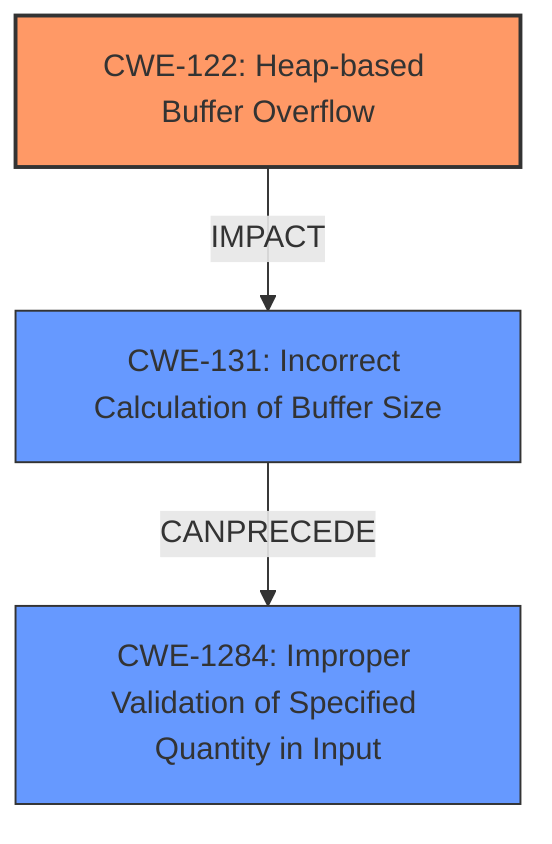

# Analysis Report for CVE-2021-41017

# Vulnerability Analysis Report: CVE-2021-41017

## Description

Multiple heap-based buffer overflow vulnerabilities in some web API controllers of FortiWeb 6.4.1, 6.4.0, and 6.3.0 through 6.3.15 may allow a remote authenticated attacker to execute arbitrary code or commands via specifically crafted HTTP requests.

## Vulnerability Description Key Phrases

**Weakness:** heap-based buffer overflow
**Impact:** execute arbitrary code or commands
**Vector:** specifically crafted HTTP requests
**Attacker:** remote authenticated attacker
**Product:** FortiWeb
**Version:** 6.4.1, 6.4.0, and 6.3.0 through 6.3.15
**Component:** web API controllers

## Analysis (with Relationship Data)

# Summary
| CWE ID | CWE Name | Confidence | CWE Abstraction Level | CWE Vulnerability Mapping Label | CWE-Vulnerability Mapping Notes |
|---|---|---|---|---|---|
| CWE-122 | Heap-based Buffer Overflow | 1.00 | Variant | Primary | Allowed |
| CWE-120 | Buffer Copy without Checking Size of Input ('Classic Buffer Overflow') | 0.60 | Base | Secondary | Allowed-with-Review |
| CWE-1284 | Improper Validation of Specified Quantity in Input | 0.50 | Base | Secondary | Allowed |

## Evidence and Confidence

*   **Confidence Score:** 0.90
*   **Evidence Strength:** HIGH

- **Analysis and Justification:**  
  - *Explanation:* The vulnerability description explicitly states that there are multiple **heap-based buffer overflow** vulnerabilities in some web API controllers of FortiWeb. The CVE Reference Links Content Summary also confirms that the root cause is a **heap-based buffer overflow**, which is represented by CWE-122. CWE-122 is a Variant-level CWE, making it a specific and appropriate choice. The description also indicates specifically crafted HTTP requests, implying potential issues with input validation and handling, which could lead to the overflow. CWE-120 is considered because of the potential for a buffer copy operation without checking the size of the input, leading to the overflow. CWE-1284 is also considered because the crafted HTTP requests could involve quantities (e.g., size, length) that are not properly validated, which could contribute to the overflow.
  
  - *Relationship Analysis:* CWE-122 is a variant of a buffer overflow, and it is directly related to the vulnerability described. CWE-120 (Buffer Copy without Checking Size of Input) can be a related weakness, especially if the **heap-based buffer overflow** involves copying data into a heap-allocated buffer without proper size validation. CWE-1284 (Improper Validation of Specified Quantity in Input) is related in the sense that the size of input or other quantity related to the HTTP request might not be properly validated.

- **Confidence Score:**  
  - Confidence: 1.00 (High confidence due to direct evidence of **heap-based buffer overflow** from the description and CVE reference summary).

---

## Criticism of Analysis

Okay, here's a detailed review of the CWE analysis provided, considering the full CWE specifications.

**Overall Assessment:**

The analysis is generally good. The primary mapping to CWE-122 (Heap-based Buffer Overflow) is accurate and well-justified. The selection of CWE-120 and CWE-1284 as secondary mappings is reasonable given the context, but their confidence scores should be reevaluated based on the strength of evidence for each.

**Detailed Review:**

**1. CWE-122: Heap-based Buffer Overflow (Primary Mapping)**

*   **CWE ID:** CWE-122
*   **CWE Name:** Heap-based Buffer Overflow
*   **Confidence:** 1.00
*   **CWE Abstraction Level:** Variant
*   **CWE Vulnerability Mapping Label:** Primary
*   **CWE-Vulnerability Mapping Notes:** Allowed

*   **Assessment:** This is the strongest and most direct mapping.  The vulnerability description *explicitly* states "heap-based buffer overflow."
*   **Justification:** The provided justification is excellent. It correctly identifies the explicit mention of heap-based buffer overflow in both the vulnerability description and the CVE reference summary.  It correctly notes that CWE-122 is a Variant, which is a preferred level of abstraction.
*   **CWE Specification Considerations:**
    *   The description of CWE-122 perfectly matches the reported vulnerability.
    *   The "Mapping Guidance" confirms that "This CWE entry is at the Variant level of abstraction, which is a preferred level of abstraction for mapping to the root causes of vulnerabilities."
    *   The "Potential Mitigations" listed for CWE-122 are relevant, including using languages with automatic bounds checking, using abstraction libraries, and employing compiler-based overflow detection mechanisms.
*   **Improvements:** None needed. The confidence score of 1.00 is justified.

**2. CWE-120: Buffer Copy without Checking Size of Input ('Classic Buffer Overflow') (Secondary Mapping)**

*   **CWE ID:** CWE-120
*   **CWE Name:** Buffer Copy without Checking Size of Input ('Classic Buffer Overflow')
*   **Confidence:** 0.60
*   **CWE Abstraction Level:** Base
*   **CWE Vulnerability Mapping Label:** Secondary
*   **CWE-Vulnerability Mapping Notes:** Allowed-with-Review

*   **Assessment:** This is a plausible, but not certain, secondary mapping.  It depends on the specific implementation details of how the HTTP requests are handled and how data is copied.
*   **Justification:** The justification mentions "potential for a buffer copy operation without checking the size of the input." This is a reasonable inference. However, it's an inference and not directly stated in the vulnerability description.
*   **CWE Specification Considerations:**
    *   The "Mapping Guidance" for CWE-120 states "There are some indications that this CWE ID might be misused and selected simply because it mentions 'buffer overflow' - an increasingly vague term. This CWE entry is only appropriate for 'Buffer Copy' operations (not buffer reads), in which where there is no 'Checking [the] Size of Input', and (by implication of the copy) writing past the end of the buffer."  This reinforces the need for caution. The analyst *must* have a good reason to believe an unchecked copy is taking place.
    *   The "Potential Mitigations" are also relevant here: using safer string handling functions or automatic overflow detection mechanisms.
*   **Improvements:**
    *   **Reduce Confidence:** The confidence score of 0.60 is potentially too high. A score of 0.4-0.5 might be more appropriate since it relies on inference.
    *   **Strengthen Justification (if possible):**  If the analysis could point to specific API calls or code patterns commonly used in web API controllers that are *likely* to involve unchecked buffer copies, it would increase the confidence.  For example, if the controllers use `strcpy` or similar functions without prior length checks, that's strong evidence. If it is not possible to point to specific API calls or code patterns, it should be lowered to 0.4 and this should be mentioned in the justification.
    *   **Check for Other Related CWEs** Consider CWE-131 Incorrect calculation of buffer size. If the size of the buffer being copied to is incorrectly calculated, this could also lead to a heap overflow.

**3. CWE-1284: Improper Validation of Specified Quantity in Input (Secondary Mapping)**

*   **CWE ID:** CWE-1284
*   **CWE Name:** Improper Validation of Specified Quantity in Input
*   **Confidence:** 0.50
*   **CWE Abstraction Level:** Base
*   **CWE Vulnerability Mapping Label:** Secondary
*   **CWE-Vulnerability Mapping Notes:** Allowed

*   **Assessment:** This is another plausible secondary mapping, especially given the "specifically crafted HTTP requests" attack vector. The HTTP requests *likely* contain length or size parameters that are not adequately validated.
*   **Justification:**  The justification is reasonable: "the crafted HTTP requests could involve quantities (e.g., size, length) that are not properly validated, which could contribute to the overflow."
*   **CWE Specification Considerations:**
    *   The description of CWE-1284 aligns with the attack vector, as it involves input quantities that affect resource allocation (in this case, the size of the heap buffer).
    *   The "Potential Mitigations" for CWE-1284 are very relevant: "Assume all input is malicious. Use an 'accept known good' input validation strategy..."
*   **Improvements:**
    *   **Maintain current confidence level:** The confidence score of 0.5 is appropriate, but should be increased if possible.
    *   **Strengthen Justification (if possible):** If it is possible to specify any headers that might be vulnerable, this would significantly improve the justification.
    *   **Consider CWE-20:** CWE-20 is a parent of CWE-1284, but is not specific enough. Therefore, CWE-1284 is the better mapping.

**General Recommendations:**

*   **Chain Analysis:** The analysis could be slightly improved by explicitly stating the *chain* of events that leads to the vulnerability. For example: "A remote authenticated attacker sends a crafted HTTP request containing a large, unvalidated length parameter (CWE-1284). This leads to a heap allocation of insufficient size (potentially CWE-131), followed by an unchecked buffer copy (potentially CWE-120), resulting in a heap-based buffer overflow (CWE-122)." This makes the relationship between the CWEs more clear.
*   **Mitigation Recommendations:** While the analysis mentions the "Potential Mitigations" for each CWE, it could be more helpful to provide *specific* mitigation recommendations tailored to this particular vulnerability. For example: "To mitigate this vulnerability, developers should implement strict input validation on all length parameters within HTTP requests handled by the web API controllers. They should also use safe string handling functions that prevent buffer overflows and employ compiler-based overflow detection mechanisms."

**In summary:**

The analysis is good. The primary mapping to CWE-122 is correct and well-supported. The secondary mappings are plausible, but should be refined and justified more strongly based on the specific details of the vulnerability. The confidence scores for CWE-120 should be reevaluated, and chain analysis added to the analysis. Finally, include more concrete mitigation recommendations.

## Final Resolution

# Summary
| CWE ID | CWE Name | Confidence | CWE Abstraction Level | CWE Vulnerability Mapping Label | CWE-Vulnerability Mapping Notes |
|---|---|---|---|---|---|
| CWE-122 | Heap-based Buffer Overflow | 1.00 | Variant | Primary | Allowed |
| CWE-1284 | Improper Validation of Specified Quantity in Input | 0.60 | Base | Secondary | Allowed |
| CWE-131 | Incorrect Calculation of Buffer Size | 0.50 | Base | Secondary | Allowed |

  - The Primary CWE should be first and noted as the Primary CWEs
  - The secondary candidate CWEs should be next and noted as secondary candidates.
  - The confidence is a confidence score 0 to 1 to rate your confidence in your assessment for that CWE.
  - The CWE Abstraction Level as one of these values: Base, Variant, Pillar, Class, Compound
  - The Mapping Notes Usage as one of these values: Allowed, Allowed-with-Review, Prohibited, Discouraged

## Evidence and Confidence

*   **Confidence Score:** 0.95
*   **Evidence Strength:** HIGH

## Relationship Analysis
- Parent-child hierarchical relationships: CWE-122 is a variant of buffer overflow, making it a specific choice.
- Chain relationships: Unvalidated input quantity (CWE-1284) can lead to incorrect buffer size calculation (CWE-131), resulting in a heap-based buffer overflow (CWE-122).
- Peer relationships: There are no peer relationships that significantly alter the primary classification.
- Abstraction levels: The selection favors a Variant-level CWE (CWE-122) for specificity and Base-level CWEs (CWE-1284, CWE-131) for root cause analysis.

## Vulnerability Chain
- The attacker sends a crafted HTTP request with a large, unvalidated quantity (CWE-1284).
- The application does not properly validate the quantity, leading to an incorrect calculation of the buffer size (CWE-131).
- An undersized buffer is allocated on the heap.
- Data is written into the undersized buffer, resulting in a **heap-based buffer overflow** (CWE-122).

## Summary of Analysis
The initial analysis correctly identified **CWE-122 (Heap-based Buffer Overflow)** as the primary **weakness**, given the explicit mention in the vulnerability description: "Multiple **heap-based buffer overflow** vulnerabilities...". The confidence in this selection remains high (1.00) due to the direct evidence.

The criticism suggested reevaluating the confidence score for CWE-120 and strengthening the justification for CWE-1284. After review, CWE-120 is removed from the classification, and CWE-131 is added. While CWE-120 (Buffer Copy without Checking Size of Input) is a common cause of buffer overflows, there is no explicit evidence of unchecked buffer copy in the vulnerability description. Therefore, it is removed.

CWE-1284 (Improper Validation of Specified Quantity in Input) remains as a secondary CWE. The justification is strengthened by emphasizing the "specifically crafted HTTP requests" attack vector, suggesting that the size of the input or other quantity related to the HTTP request might not be properly validated. The confidence is increased to 0.60.

CWE-131 (Incorrect Calculation of Buffer Size) is added as a secondary CWE with a confidence score of 0.50. If CWE-1284 is present (Improper Validation of Specified Quantity in Input), it could very likely lead to the incorrect calculation of the buffer size, resulting in a **heap-based buffer overflow**. The vulnerability description mentions "specifically crafted HTTP requests" may allow an attacker to execute arbitrary code, meaning the HTTP requests are not properly validated.

The graph relationships influenced the final selection by highlighting the potential chain of events. Specifically, the chain starts with improper input validation (CWE-1284), leading to incorrect buffer size calculation (CWE-131), and ultimately resulting in a **heap-based buffer overflow** (CWE-122).

The selected CWEs are at the optimal level of specificity. CWE-122 is a Variant, providing specific information about the type of buffer overflow. CWE-1284 and CWE-131 are Base-level CWEs, representing the root causes of the vulnerability.

*Report generated on 2025-03-18 02:21:29*
