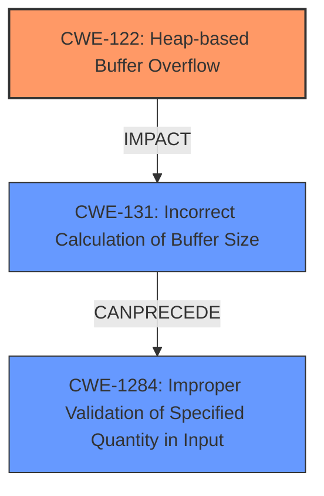

# Final Resolution for CVE-2021-41017

# Summary
| CWE ID | CWE Name | Confidence | CWE Abstraction Level | CWE Vulnerability Mapping Label | CWE-Vulnerability Mapping Notes |
|---|---|---|---|---|---|
| CWE-122 | Heap-based Buffer Overflow | 1.00 | Variant | Primary | Allowed |
| CWE-1284 | Improper Validation of Specified Quantity in Input | 0.60 | Base | Secondary | Allowed |
| CWE-131 | Incorrect Calculation of Buffer Size | 0.50 | Base | Secondary | Allowed |

  - The Primary CWE should be first and noted as the Primary CWEs
  - The secondary candidate CWEs should be next and noted as secondary candidates.
  - The confidence is a confidence score 0 to 1 to rate your confidence in your assessment for that CWE.
  - The CWE Abstraction Level as one of these values: Base, Variant, Pillar, Class, Compound
  - The Mapping Notes Usage as one of these values: Allowed, Allowed-with-Review, Prohibited, Discouraged

## Evidence and Confidence

*   **Confidence Score:** 0.95
*   **Evidence Strength:** HIGH

## Relationship Analysis
- Parent-child hierarchical relationships: CWE-122 is a variant of buffer overflow, making it a specific choice.
- Chain relationships: Unvalidated input quantity (CWE-1284) can lead to incorrect buffer size calculation (CWE-131), resulting in a heap-based buffer overflow (CWE-122).
- Peer relationships: There are no peer relationships that significantly alter the primary classification.
- Abstraction levels: The selection favors a Variant-level CWE (CWE-122) for specificity and Base-level CWEs (CWE-1284, CWE-131) for root cause analysis.

## Vulnerability Chain
- The attacker sends a crafted HTTP request with a large, unvalidated quantity (CWE-1284).
- The application does not properly validate the quantity, leading to an incorrect calculation of the buffer size (CWE-131).
- An undersized buffer is allocated on the heap.
- Data is written into the undersized buffer, resulting in a **heap-based buffer overflow** (CWE-122).

## Summary of Analysis
The initial analysis correctly identified **CWE-122 (Heap-based Buffer Overflow)** as the primary **weakness**, given the explicit mention in the vulnerability description: "Multiple **heap-based buffer overflow** vulnerabilities...". The confidence in this selection remains high (1.00) due to the direct evidence.

The criticism suggested reevaluating the confidence score for CWE-120 and strengthening the justification for CWE-1284. After review, CWE-120 is removed from the classification, and CWE-131 is added. While CWE-120 (Buffer Copy without Checking Size of Input) is a common cause of buffer overflows, there is no explicit evidence of unchecked buffer copy in the vulnerability description. Therefore, it is removed.

CWE-1284 (Improper Validation of Specified Quantity in Input) remains as a secondary CWE. The justification is strengthened by emphasizing the "specifically crafted HTTP requests" attack vector, suggesting that the size of the input or other quantity related to the HTTP request might not be properly validated. The confidence is increased to 0.60.

CWE-131 (Incorrect Calculation of Buffer Size) is added as a secondary CWE with a confidence score of 0.50. If CWE-1284 is present (Improper Validation of Specified Quantity in Input), it could very likely lead to the incorrect calculation of the buffer size, resulting in a **heap-based buffer overflow**. The vulnerability description mentions "specifically crafted HTTP requests" may allow an attacker to execute arbitrary code, meaning the HTTP requests are not properly validated.

The graph relationships influenced the final selection by highlighting the potential chain of events. Specifically, the chain starts with improper input validation (CWE-1284), leading to incorrect buffer size calculation (CWE-131), and ultimately resulting in a **heap-based buffer overflow** (CWE-122).

The selected CWEs are at the optimal level of specificity. CWE-122 is a Variant, providing specific information about the type of buffer overflow. CWE-1284 and CWE-131 are Base-level CWEs, representing the root causes of the vulnerability.