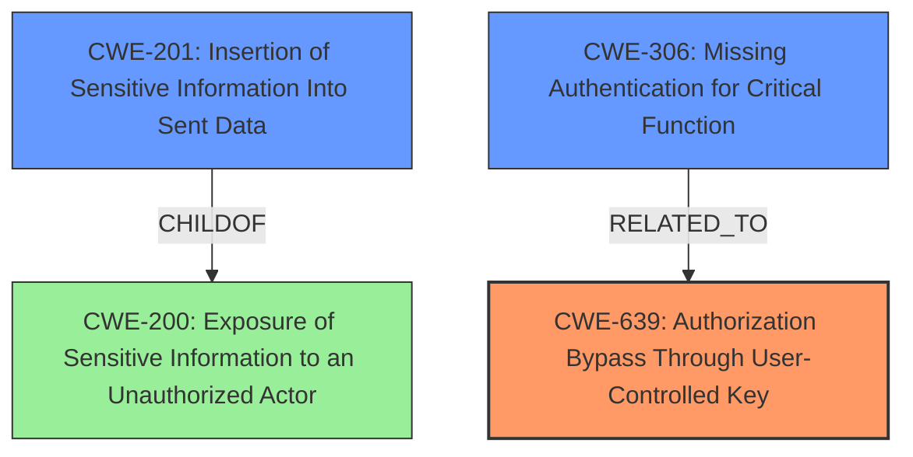

# Final Resolution for CVE-2021-41120

# Summary

| CWE ID | CWE Name | Confidence | CWE Abstraction Level | CWE Vulnerability Mapping Label | CWE-Vulnerability Mapping Notes |
|---|---|---|---|---|---|
| CWE-639 | Authorization Bypass Through User-Controlled Key | 0.95 | Base | Allowed | Primary CWE |
| CWE-201 | Insertion of Sensitive Information Into Sent Data | 0.75 | Base | Allowed | Secondary Candidate |
| CWE-306 | Missing Authentication for Critical Function | 0.65 | Base | Allowed | Secondary Candidate |

## Evidence and Confidence

*   **Confidence Score:** 0.9
*   **Evidence Strength:** HIGH

## Relationship Analysis
The primary relationship that influenced the selection was the parent-child relationship. Specifically, while CWE-200 [Exposure of Sensitive Information to an Unauthorized Actor] is a broader category, the selection of CWE-201 [Insertion of Sensitive Information Into Sent Data] as a child is more specific to the vulnerability description because it highlights the **insertion** of the customer's name into the data being sent. CWE-306 [Missing Authentication for Critical Function] is related to the authorization bypass in CWE-639 [Authorization Bypass Through User-Controlled Key] as the lack of authentication exacerbates the impact of the IDOR. There were no direct chain relationships identified. The abstraction levels were also considered. All selected CWEs are at the Base or Variant level, which is preferred for root cause analysis. The suggestion to consider mapping to a more specific Variant of CWE-639 such as CWE-566 [Authorization Bypass Through User-Controlled SQL Primary Key] was not appropriate as the provided information did not indicate that there was a SQL database used during checkout.

## Vulnerability Chain
The vulnerability chain starts with **CWE-639 [Authorization Bypass Through User-Controlled Key]** due to the predictable payment ID. This allows an attacker to access payment pages without proper authorization. Subsequently, **CWE-201 [Insertion of Sensitive Information Into Sent Data]** comes into play because the payment form is prefilled with the customer's sensitive data (first and last name). Finally, **CWE-306 [Missing Authentication for Critical Function]** exacerbates the issue, as the payment form lacks authentication, making it easier to access and exploit the exposed information. The chain represents the progression from the initial authorization flaw to the exposure of sensitive data due to the lack of proper security controls.

## Summary of Analysis
The initial analysis provided a solid foundation for CWE classification. The criticism offered valuable suggestions for improvement, particularly in considering relationships between CWEs and exploring potential mitigations. The final decision was influenced by both the initial analysis and the criticism, with a focus on selecting the most specific and relevant CWEs for each aspect of the vulnerability.

The primary CWE, **CWE-639 [Authorization Bypass Through User-Controlled Key]**, remains the most appropriate choice due to the direct link between the auto-incremented payment ID and the authorization bypass. The evidence is strong, as the vulnerability description explicitly states that the URL to the payment page was created with an autoincremented payment ID, making it easily predictable. The change of the route to `/pay-with-paypal/{orderToken}/{paymentId}` and using orderToken to verify the payment are ways of preventing the ID from being controlled, which aligns with Mitigation 2 mentioned in the criticism.

The secondary CWEs, **CWE-201 [Insertion of Sensitive Information Into Sent Data]** and **CWE-306 [Missing Authentication for Critical Function]**, were retained as they contribute to the overall vulnerability. CWE-201 highlights the exposure of sensitive information, while CWE-306 underscores the lack of authentication on the payment form.

The graph relationships influenced the final selection by emphasizing the importance of specificity and relevance. The selection of CWE-201 over CWE-200 demonstrates this principle, as CWE-201 is a more precise representation of the vulnerability. The selected CWEs are at the optimal level of specificity, as they accurately capture the root causes and contributing factors of the vulnerability.