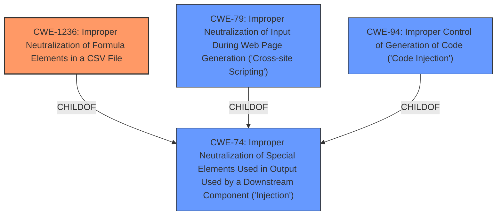

# Final Resolution for CVE-2021-41128

# Summary
| CWE ID    | CWE Name                                                                      | Confidence | CWE Abstraction Level | CWE Vulnerability Mapping Label | CWE-Vulnerability Mapping Notes |
| :--------- | :---------------------------------------------------------------------------- | :--------- | :-------------------- | :------------------------------ | :------------------------------ |
| CWE-1236  | Improper Neutralization of Formula Elements in a CSV File                   | 1.0        | Base                  | Primary CWE                     | Allowed                       |
| CWE-74    | Improper Neutralization of Special Elements Used in Output Used by a Downstream Component ('Injection')                                                                     | 0.4        | Class                  | Secondary Candidate             | Discouraged                      |
| CWE-79    | Improper Neutralization of Input During Web Page Generation ('Cross-site Scripting') | 0.2        | Base                  | Secondary Candidate             | Allowed                       |
| CWE-94    | Improper Control of Generation of Code ('Code Injection')                     | 0.1        | Base                  | Secondary Candidate             | Allowed-with-Review           |

## Evidence and Confidence

*   **Confidence Score:** 0.95
*   **Evidence Strength:** HIGH

## Relationship Analysis
The primary decision driver was the direct match of the vulnerability description to **CWE-1236 (Improper Neutralization of Formula Elements in a CSV File)**. While **CWE-74 (Improper Neutralization of Special Elements Used in Output Used by a Downstream Component ('Injection'))** is a parent, **CWE-1236** offers a more specific classification. **CWE-79 (Improper Neutralization of Input During Web Page Generation ('Cross-site Scripting'))** and **CWE-94 (Improper Control of Generation of Code ('Code Injection'))** were considered but deemed less relevant because the vulnerability's context is within a CSV file, not a web page or direct code injection within the application.

## Vulnerability Chain
The vulnerability chain starts with a user entering data into the Hygeia application. The application then exports this data into a CSV file without proper sanitization of formula elements. When the CSV file is opened in spreadsheet software, the injected formulas are executed, leading to potential code execution or data exfiltration.

**Root Cause:** **CWE-1236 (Improper Neutralization of Formula Elements in a CSV File)** - The application fails to neutralize or incorrectly neutralizes special elements (formulas) in the CSV file.
**Weakness:** Lack of input validation and output sanitization when exporting to CSV.
**Impact:** Code execution or data exfiltration when the CSV file is opened in spreadsheet software.

## Summary of Analysis
The initial analysis correctly identified **CWE-1236 (Improper Neutralization of Formula Elements in a CSV File)** as the primary **WEAKNESS**. The criticism was helpful in highlighting the importance of explicitly stating why **CWE-74 (Improper Neutralization of Special Elements Used in Output Used by a Downstream Component ('Injection'))** is not the primary choice, even though it's a parent weakness. The reason is that **CWE-1236** is a more specific and therefore more accurate representation of the vulnerability. The assessment is based on the provided evidence, including the vulnerability description: *"Users of the system are able to submit formula as exported fields which then get executed upon ingestion of the exported file. There is no validation or sanitization of these formula fields and so malicious may construct malicious code."* This directly aligns with the description of **CWE-1236**. The graph relationships influenced the final selection by emphasizing the importance of choosing the most specific applicable **CWE**. **CWE-1236** is at the optimal level of specificity because it directly addresses the improper neutralization of formula elements in a CSV file, which is the root cause of the vulnerability. The other **CWE** candidates are either too broad or not directly relevant to the vulnerability's context.