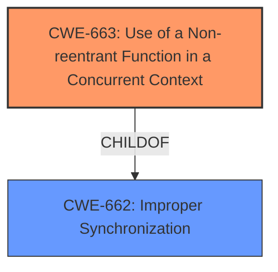

# Analysis Report for CVE-2021-41213

# Vulnerability Analysis Report: CVE-2021-41213

## Description

TensorFlow is an open source platform for machine learning. In affected versions the code behind `tf.function` API can be made to deadlock when two `tf.function` decorated Python functions are mutually recursive. This occurs due to using a non-reentrant `Lock` Python object. Loading any model which contains mutually recursive functions is vulnerable. An attacker can cause denial of service by causing users to load such models and calling a recursive `tf.function`, although this is not a frequent scenario. The fix will be included in TensorFlow 2.7.0. We will also cherrypick this commit on TensorFlow 2.6.1, TensorFlow 2.5.2, and TensorFlow 2.4.4, as these are also affected and still in supported range.

## Vulnerability Description Key Phrases

**Rootcause:** non-reentrant Lock Python object
**Impact:** deadlock
**Vector:** loading any model which contains mutually recursive functions
**Product:** TensorFlow
**Version:** affected versions
**Component:** tf.function API

## Analysis (with Relationship Data)

# Summary
| CWE ID | CWE Name | Confidence | CWE Abstraction Level | CWE Vulnerability Mapping Label | CWE-Vulnerability Mapping Notes |
|---|---|---|---|---|---|
| CWE-663 | Use of a Non-reentrant Function in a Concurrent Context | 0.95 | Base | Allowed | Primary CWE: The vulnerability involves a non-reentrant lock causing deadlocks in a concurrent context. |

## Evidence and Confidence

*   **Confidence Score:** 0.95
*   **Evidence Strength:** HIGH

- **Analysis and Justification:**  
  - *Explanation:* The vulnerability description explicitly states that the **rootcause** is the use of a **non-reentrant Lock Python object**. This directly leads to a deadlock when two `tf.function` decorated Python functions are mutually recursive. The `CVE Reference Links Content Summary` further reinforces this by explaining that the `threading.Lock` object, which is not re-entrant, prevents the same thread from acquiring the lock multiple times in recursive calls, causing a deadlock. This aligns precisely with CWE-663, which describes the "Use of a Non-reentrant Function in a Concurrent Context." The fix mentioned in the description, replacing `threading.Lock` with `threading.RLock`, further validates this mapping, as `RLock` is re-entrant and resolves the deadlock issue. The MITRE mapping guidance for CWE-663 indicates this is ALLOWED, reinforcing the appropriateness of this mapping.

  - *Relationship Analysis:* While there are no direct parent-child relationships, CWE-663 is related to concurrency issues and resource management. The deadlock can be considered a consequence of improper concurrency control.

- **Confidence Score:**  
  - *Example:* Confidence: 0.95 (Strong evidence from vulnerability description, CVE reference details, and proposed fix.)

## Criticism of Analysis

Okay, here's a review of the provided analysis, incorporating the full CWE specifications.

**Overall Assessment:**

The analysis is strong and accurately identifies the primary CWE.  The justification for selecting CWE-663 is well-supported by the vulnerability description, CVE details, and the nature of the fix (replacing a non-reentrant lock with a re-entrant one).  The confidence score of 0.95 is justified.

**Detailed Critique:**

*   **CWE-663 (Use of a Non-reentrant Function in a Concurrent Context):**
    *   **Correctness:** The mapping to CWE-663 is correct and well-justified. The root cause is explicitly stated as a non-reentrant lock, which directly aligns with the CWE description. The use case described (deadlock due to mutually recursive functions) clearly falls under the scope of this CWE.
    *   **Abstraction Level:** The analysis correctly identifies CWE-663 as a "Base" level CWE, which is the preferred level of abstraction for vulnerability mapping.
    *   **Mapping Guidance:** The analysis adheres to the CWE mapping guidance. It acknowledges the "Allowed" usage and explains why the CWE name and description are an appropriate fit.  It avoids forcing a lower-level mapping.
    *   **Mitigations:** The analysis doesn't explicitly mention mitigations, but the fix directly addresses the recommended mitigation: "Use reentrant functions if available." The analysis could be slightly improved by mentioning this mitigation explicitly.  It could also mention the other mitigations: "Add synchronization to your non-reentrant function" (though this is less applicable after-the-fact, it's worth mentioning) and "In Java, use the ReentrantLock Class" (though that's Java-specific and not relevant to the core problem).
    *   **Relationships:** The analysis mentions the relationship of CWE-663 to concurrency and resource management. A minor addition could be mentioning CWE-662 (Improper Synchronization) as a parent. While not a direct parent in the strict sense, CWE-662 provides a broader context for understanding synchronization issues.

*   **Retriever Results (CWEs suggested by retrievers):**

    *   **CWE-835 (Loop with Unreachable Exit Condition ('Infinite Loop')):** While deadlock can *resemble* an infinite loop, it's fundamentally different.  Deadlock is a concurrency issue, while an infinite loop is a control flow issue. This is a *weak* association at best and shouldn't be considered a valid mapping. The code sample provided doesn't have an obvious infinite loop, so this suggestion seems spurious.
    *   **CWE-824 (Access of Uninitialized Pointer):** This is not relevant at all and seems like a complete misfire by the retrievers. There's nothing in the vulnerability description to suggest uninitialized pointers.
    *   **CWE-1284 (Improper Validation of Specified Quantity in Input):** This is also likely incorrect. The vulnerability doesn't involve validating quantities.
    *   **CWE-1287 (Improper Validation of Specified Type of Input):** Similarly irrelevant. No input type validation issues are mentioned.
    *   **CWE-787 (Out-of-bounds Write):** Completely irrelevant to this vulnerability.
    *   **CWE-617 (Reachable Assertion):**  Unlikely to be relevant. The vulnerability doesn't mention assertions being triggered.
    *   **CWE-1286 (Improper Validation of Syntactic Correctness of Input):** Not relevant here.
    *   **CWE-125 (Out-of-bounds Read):** Completely irrelevant to this vulnerability.
    *   **CWE-415 (Double Free):** This is also highly unlikely and appears to be a misinterpretation.

**Recommendations:**

1.  **Keep CWE-663 as the primary mapping.**  The analysis is accurate and well-justified.
2.  **Explicitly mention the relevant mitigations for CWE-663** in the analysis (especially "Use reentrant functions if available").
3.  **Reject the other CWE suggestions from the retrievers.** They are not relevant to the vulnerability based on the provided information. The retriever results highlight the importance of manual review and validation of automated analysis.
4.  **Consider (optionally) mentioning CWE-662 (Improper Synchronization)** to provide broader context, even though it's a class-level CWE.

By incorporating these recommendations, the analysis can be further strengthened.

## Final Resolution

# Summary
| CWE ID | CWE Name | Confidence | CWE Abstraction Level | CWE Vulnerability Mapping Label | CWE-Vulnerability Mapping Notes |
|---|---|---|---|---|---|
| CWE-663 | Use of a Non-reentrant Function in a Concurrent Context | 0.95 | Base | Allowed | Primary CWE: The vulnerability involves a **non-reentrant lock** causing deadlocks in a concurrent context. |

## Evidence and Confidence

*   **Confidence Score:** 0.95
*   **Evidence Strength:** HIGH

## Relationship Analysis
The primary relationship considered was the direct match of the vulnerability description to the CWE-663 description. While CWE-662 (Improper Synchronization) is a parent, CWE-663 offers the specificity required. There are no significant chain relationships relevant in this case, as the **non-reentrant function** directly leads to the deadlock. The Base abstraction level of CWE-663 is optimal for mapping the **rootcause**.

## Vulnerability Chain
The vulnerability chain is straightforward:
1.  **Root Cause:** Use of a **non-reentrant Lock Python object** (CWE-663)
2.  **Weakness:** Two `tf.function` decorated Python functions are mutually recursive.
3.  **Impact:** Deadlock, leading to denial of service.

There are no missing links, as the description clearly outlines the steps leading to the vulnerability.

## Summary of Analysis
The initial analysis is accurate and well-justified. The **rootcause** is the usage of a **non-reentrant lock** which directly aligns with CWE-663. The criticality correctly points out that other CWE suggestions from the retriever are inaccurate and not relevant to the vulnerability description.

The vulnerability description states, "This occurs due to using a **non-reentrant Lock** Python object," which is the primary reason for selecting CWE-663. The fix also validated the selection by replacing the `threading.Lock` with `threading.RLock` which is re-entrant, therefore resolving the deadlock issue.

The graph relationships confirmed that CWE-663 is the most specific and appropriate classification. The other CWEs suggested by retrievers (CWE-835, CWE-824, CWE-1284, CWE-1287, CWE-787, CWE-617, CWE-1286, CWE-125, CWE-415) are not relevant based on the evidence provided.
CWE-663 is at the optimal level of specificity (Base).

*Report generated on 2025-03-16 22:59:40*
