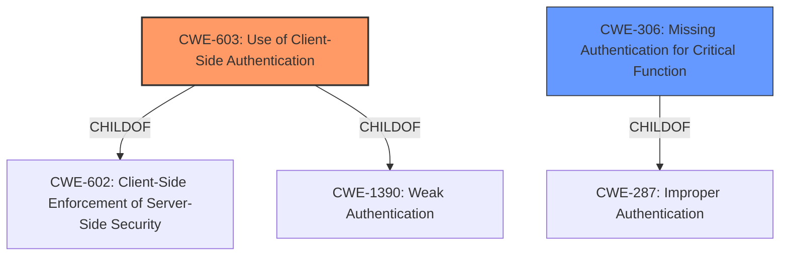

# Final Resolution for CVE-2021-41286

# Summary
| CWE ID | CWE Name | Confidence | CWE Abstraction Level | CWE Vulnerability Mapping Label | CWE-Vulnerability Mapping Notes |
|---|---|---|---|---|---|
| CWE-603 | Use of Client-Side Authentication | 1.0 | Base | Allowed | Primary CWE |
| CWE-306 | Missing Authentication for Critical Function | 0.7 | Base | Allowed | Secondary Candidate |

## Evidence and Confidence

*   **Confidence Score:** 0.95
*   **Evidence Strength:** HIGH

## Relationship Analysis
The primary CWE is CWE-603, which is a Base level CWE. It is a child of CWE-602 (Client-Side Enforcement of Server-Side Security) and CWE-1390 (Weak Authentication).
CWE-306 is a Base level CWE and a child of CWE-287 (Improper Authentication). It represents a consequence of the flawed client-side authentication rather than an independent root cause.

## Vulnerability Chain
The vulnerability chain starts with the **ROOTCAUSE** being the **CWE-603 (Use of Client-Side Authentication)**. This leads to a situation where the server does not properly authenticate the user, which can be seen as a **CWE-306 (Missing Authentication for Critical Function)**. The final impact is that an attacker can log in with any account, including the administrative account, gaining unauthorized access.

## Summary of Analysis
The initial analysis and criticism both converge on **CWE-603 (Use of Client-Side Authentication)** as the primary weakness.
The vulnerability description states that the application relies on a client-side authentication mechanism where password validity is checked locally. This allows an attacker to bypass authentication by manipulating the client-side login function.

The selection of **CWE-603 (Use of Client-Side Authentication)** is at the optimal level of specificity, as it directly addresses the **ROOTCAUSE** of the vulnerability. It is more specific than its parent CWEs, such as CWE-602 and CWE-1390, and provides a clear understanding of the flaw. The secondary weakness, **CWE-306 (Missing Authentication for Critical Function)**, is a consequence of the client-side authentication. The retriever results, while highlighting authentication-related CWEs, underscore the importance of manual analysis to identify the precise nature of the vulnerability.
I agree with the selection of CWE-603 as the primary weakness, and CWE-306 as a secondary weakness.
The confidence score is increased to 0.95 to reflect the high confidence in the assessment.