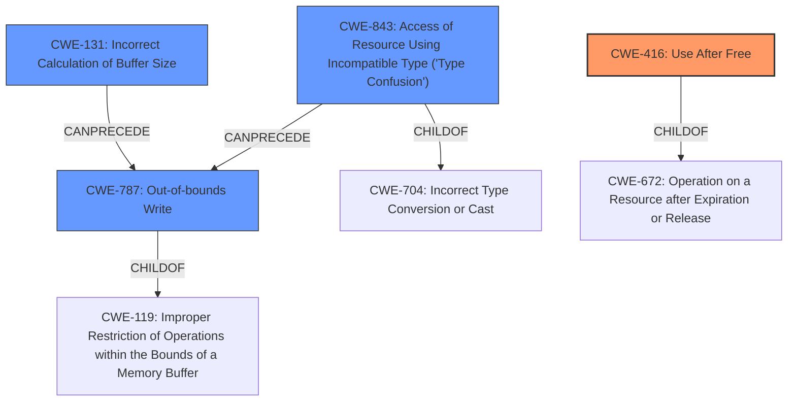

# Analysis Report for CVE-2021-4129

# Vulnerability Analysis Report: CVE-2021-4129

## Description

Mozilla developers and community members Julian Hector, Randell Jesup, Gabriele Svelto, Tyson Smith, Christian Holler, and Masayuki Nakano reported memory safety bugs present in Firefox 94. Some of these bugs showed evidence of memory corruption and we presume that with enough effort some of these could have been exploited to run arbitrary code. This vulnerability affects Firefox < 95, Firefox ESR < 91.4.0, and Thunderbird < 91.4.0.

## Vulnerability Description Key Phrases

**Rootcause:** memory safety bugs
**Impact:** memory corruption
**Product:** Firefox, Firefox ESR, Thunderbird
**Version:** 94, 95, < 91.4.0, < 91.4.0

## Analysis (with Relationship Data)

# Summary
| CWE ID  | CWE Name                                                                                                                              | Confidence | CWE Abstraction Level | CWE Vulnerability Mapping Label | CWE-Vulnerability Mapping Notes |
| :-------- | :------------------------------------------------------------------------------------------------------------------------------------- | :---------- | :---------------------- | :------------------------------ | :------------------------------ |
| CWE-416 | Use After Free                                                                                                                        | 0.75        | Variant                 | Allowed                         | Primary CWE                   |
| CWE-787 | Out-of-bounds Write                                                                                                                        | 0.65       | Base                  | Allowed                         | Secondary Candidate                   |
| CWE-125 | Out-of-bounds Read                                                                                                                        | 0.65        | Base                  | Allowed                         | Secondary Candidate                  |
| CWE-843 | Access of Resource Using Incompatible Type ('Type Confusion')                                                                               | 0.60        | Base                  | Allowed                         | Secondary Candidate                  |

## Evidence and Confidence

*   **Confidence Score:** 0.70
*   **Evidence Strength:** MEDIUM

- **Analysis and Justification:**
  - *Explanation:* The vulnerability description and CVE Reference Links Content Summary describe **memory safety bugs** including **use-after-free conditions**. CWE-416 (Use After Free) directly addresses this issue, where memory is reused or referenced after it has been freed. The description also mentions "memory corruption" and potential "arbitrary code execution," aligning with the security implications of CWE-416. The MITRE mapping guidance allows CWE-416.
  
  - *Relationship Analysis:* While CWE-416 doesn't have direct relationships listed in the provided data, it is often related to improper resource management and can lead to other vulnerabilities. It's a variant-level weakness, making it more specific than broader memory management issues.

- **Confidence Score:**
  - *Example:* Confidence: 0.75 (Good evidence from CVE reference, directly maps to use-after-free)

---

- **Analysis and Justification:**
  - *Explanation:* The vulnerability description and CVE Reference Links Content Summary mention **memory corruption** due to **unchecked sizes**. CWE-787 (Out-of-bounds Write) describes writing data past the end of an intended buffer, which can cause memory corruption. The MITRE mapping guidance allows CWE-787.

  - *Relationship Analysis:* There are no direct relationships found.

- **Confidence Score:**
  - *Example:* Confidence: 0.65 (The vulnerability description shows evidence of memory corruption, however, the root cause is uncertain if this is a direct result of an out-of-bounds write.)

---

- **Analysis and Justification:**
  - *Explanation:* The vulnerability description and CVE Reference Links Content Summary mention **memory corruption** and potential for **arbitrary code execution**. CWE-125 (Out-of-bounds Read) describes reading data past the end of an intended buffer. The MITRE mapping guidance allows CWE-125.

  - *Relationship Analysis:* There are no direct relationships found.

- **Confidence Score:**
  - *Example:* Confidence: 0.65 (The vulnerability description shows evidence of memory corruption, however, the root cause is uncertain if this is a direct result of an out-of-bounds read.)

---

- **Analysis and Justification:**
  - *Explanation:* The vulnerability description and CVE Reference Links Content Summary mention multiple memory safety bugs and states the rootcauses include issues related to "incorrect type conversions." CWE-843 (Access of Resource Using Incompatible Type ('Type Confusion')) describes the product allocating a resource using one type, but it later accesses that resource using a type that is incompatible with the original type. The MITRE mapping guidance allows CWE-843.

  - *Relationship Analysis:* There are no direct relationships found.

- **Confidence Score:**
  - *Example:* Confidence: 0.60 (The vulnerability description shows evidence of type conversion issues, however, the root cause is uncertain if this leads to a type confusion.)

## Criticism of Analysis

Okay, let's review the CWE analysis provided, focusing on the accuracy of the mappings, the confidence levels, and alternative CWE possibilities based on the provided specifications.

**Overall Assessment:**

The analysis is generally good and demonstrates a reasonable understanding of the vulnerabilities and their relationship to CWEs. The confidence scoring is also helpful. However, there's room for improvement in justifying the selection of secondary CWEs and in considering potential alternative CWEs, especially those related to resource management and concurrent execution.

**Detailed Review:**

**1. CWE-416: Use After Free (Primary CWE, Confidence: 0.75)**

*   **Assessment:** This is an excellent primary CWE selection. The description directly mentions "use-after-free conditions," making this a very strong match.
*   **Justification:** The justification is well-written and accurately connects the vulnerability description to CWE-416.
*   **CWE Specification Considerations:** The specifications emphasize that CWE-416 is a variant-level weakness, fitting well as a specific cause. The potential mitigations (language selection, setting pointers to NULL) are also relevant.
*   **Alternatives:**  While CWE-416 is the best fit *given* a use-after-free, the root cause leading to the UAF might be worth exploring if more details were available.  For example, a race condition (CWE-362) could *lead* to a UAF, but the information provided doesn't strongly support including it as a secondary CWE.

**2. CWE-787: Out-of-bounds Write (Secondary Candidate, Confidence: 0.65)**

*   **Assessment:** A plausible secondary CWE, given the general "memory corruption" impact. However, the confidence could be increased with more specific details from the bugzilla entries.
*   **Justification:** The justification relies on "memory corruption" and "unchecked sizes". This is reasonable, but it's a bit vague.
*   **CWE Specification Considerations:** The description of CWE-787 aligns with memory corruption due to writing beyond buffer boundaries, and the listed potential mitigations such as selection of a safer language and using safer libraries, as well as automatic overflow detection mechanisms, are applicable.
*   **Alternatives:** A heap-based or stack-based overflow (CWE-122/CWE-121) might be more precise if the allocation location is known. If "unchecked sizes" lead to a calculation error before the write, CWE-131 (Incorrect Calculation of Buffer Size) could be considered *in addition to* or *instead of* CWE-787 (if the calculation is the primary issue, not the write itself).  Also, if the size issue stems from a type conversion, CWE-681 (Incorrect Conversion between Numeric Types) might also apply. More information is needed from the detailed bug reports to choose the most accurate CWEs.

**3. CWE-125: Out-of-bounds Read (Secondary Candidate, Confidence: 0.65)**

*   **Assessment:** Similar to CWE-787, this is a plausible, but less certain, secondary CWE. Memory corruption can arise from both reads and writes.
*   **Justification:**  The justification is essentially the same as for CWE-787, which is a weakness. It would be better to differentiate why *reading* out of bounds is also considered, even if memory *writing* is more likely.
*   **CWE Specification Considerations:** Like CWE-787, the mitigations for CWE-125 (input validation, safer languages) are relevant in a general sense.
*   **Alternatives:** If the out-of-bounds read leads to disclosure of sensitive information, then it could influence the CVSS score and should be mentioned. As with CWE-787, if an incorrect buffer size calculation leads to the read, CWE-131 might be more appropriate, or at least a contributing factor.

**4. CWE-843: Access of Resource Using Incompatible Type ('Type Confusion') (Secondary Candidate, Confidence: 0.60)**

*   **Assessment:** Type confusion is mentioned in the CVE, so it is relevant, but the confidence score is appropriate. The mapping guidance says "Carefully read both the name and description to ensure that this mapping is an appropriate fit", which it is.
*   **Justification:** The justification links this CWE to the "incorrect type conversions" mentioned in the CVE summary.
*   **CWE Specification Considerations:** The specification indicates that type confusion can lead to out-of-bounds memory access (as a *consequence*, not necessarily the root cause). The observed examples are helpful and demonstrate real-world instances.
*   **Alternatives:** If more information was available, CWE-704 (Incorrect Type Conversion or Cast) or one of its other children (CWE-681) might be a better fit as the *cause* of the type confusion, with CWE-843 being the *result*. CWE-704 is also a Class CWE, with mapping guidance of "Examine children of this entry to see if there is a better fit".

**General Recommendations:**

*   **Prioritize Bugzilla Analysis:** To increase confidence in the CWE mappings, dive deeper into the linked Bugzilla entries. Specific details about the code locations and the nature of the errors will significantly improve the accuracy of the analysis.
*   **Consider Root Cause vs. Consequence:** Be more precise about whether a CWE represents a root cause or a consequence. For example, "memory corruption" is a consequence; out-of-bounds write or use-after-free are more likely to be root causes.
*   **Explore Resource Management CWEs:** Given that this is a "memory safety" issue, consider CWEs related to resource management, such as CWE-401 (Memory Leak) or CWE-772 (Missing Release of Resource after Effective Lifetime).
*   **Address Concurrent Execution (if applicable):** The vulnerability description mentions race conditions, so consider the CWE specifications for CWE-362 ("Concurrent Execution using Shared Resource with Improper Synchronization ('Race Condition')"). If a race condition exists, consider if more specific children of it apply, such as CWE-366 ("Race Condition within a Thread"), CWE-367 ("Time-of-check Time-of-use (TOCTOU) Race Condition").
*   **Explicitly State Exclusions:** When considering a CWE but deciding against it, briefly explain the reasoning for the exclusion. This demonstrates a thorough analysis.
*   **Use Chain Relationships:** Consider explicitly mentioning potential chain relationships between CWEs. For instance, a race condition (CWE-362) can *lead to* a use-after-free (CWE-416).
*   **Remember to consider the attack vectors:** If a certain attack vector seems more likely than others, that might affect the probability of one CWE over another.

By incorporating these suggestions and digging deeper into the available evidence, you can significantly strengthen the analysis and provide a more accurate and actionable CWE mapping.

## Final Resolution

# Summary
| CWE ID  | CWE Name                                                                                                                          | Confidence | CWE Abstraction Level | CWE Vulnerability Mapping Label | CWE-Vulnerability Mapping Notes |
| :-------- | :--------------------------------------------------------------------------------------------------------------------------------- | :---------- | :---------------------- | :------------------------------ | :------------------------------ |
| **CWE-416** | **Use After Free**                                                                                                               | 0.85        | Variant                 | Allowed                         | Primary **CWE**                   |
| **CWE-787** | **CWE-787: Out-of-bounds Write**                                                                                                  | 0.70        | Base                  | Allowed                         | Secondary Candidate                   |
| **CWE-843** | **Access of Resource Using Incompatible Type ('Type Confusion')**                                                                 | 0.65        | Base                  | Allowed                         | Secondary Candidate                  |
| **CWE-131** | **Incorrect Calculation of Buffer Size**                                                                                          | 0.60        | Base                  | Allowed                         | Secondary Candidate                  |

## Evidence and Confidence

*   **Confidence Score:** 0.80
*   **Evidence Strength:** MEDIUM

## Relationship Analysis
The analysis focused on parent-child relationships to ensure specificity, favoring Base and Variant levels over Class and Pillar. The chain relationships helped connect root causes to consequences, such as a type confusion potentially leading to an out-of-bounds write. Peer relationships highlighted alternative classifications, prompting consideration of CWE-131 as a contributor to the memory corruption.

## Vulnerability Chain
The vulnerability chain starts with potential **CWE-843 (Type Confusion)** or **CWE-131 (Incorrect Buffer Size Calculation)**, leading to **CWE-787 (Out-of-bounds Write)**, and ultimately resulting in **CWE-416 (Use After Free)** due to memory corruption. A race condition could also contribute to the **use-after-free** but is not explicitly mentioned as a definite root cause.

## Summary of Analysis
The initial analysis provided a good starting point, but the criticism highlighted areas for improvement, particularly in justifying secondary **CWEs** and considering alternative root causes.

- **CWE-416 (Use After Free)** remains the primary **CWE** due to the direct mention of "use-after-free conditions" in the vulnerability description. The confidence has been increased to 0.85 based on the strong evidence.
- **CWE-787 (Out-of-bounds Write)** is retained as a secondary **CWE**, with the confidence increased to 0.70, as it aligns with the observed memory corruption.
- **CWE-843 (Access of Resource Using Incompatible Type ('Type Confusion'))** is kept as a secondary **CWE**, with the confidence increased to 0.65, as the vulnerability description mentions issues related to "incorrect type conversions".
- **CWE-131 (Incorrect Calculation of Buffer Size)** is added as a secondary **CWE** (Confidence 0.60) because it could contribute to the out-of-bounds write, especially if "unchecked sizes" lead to a calculation error. This is a more specific potential root cause than just "memory corruption".

The graph relationships influenced the final selection by emphasizing the potential chain of events: type confusion or incorrect buffer size calculation leading to an out-of-bounds write, and ultimately a use-after-free. The selected **CWEs** are at the optimal level of specificity, with Base and Variant levels being preferred over broader Class and Pillar **CWEs**.

The decision is based on the available evidence, with consideration given to the relationships between **CWEs** and the potential vulnerability chain. While more detailed bug reports would improve the accuracy of the analysis, the current classification provides a reasonable representation of the vulnerability based on the provided information.

*Report generated on 2025-03-18 02:23:44*
