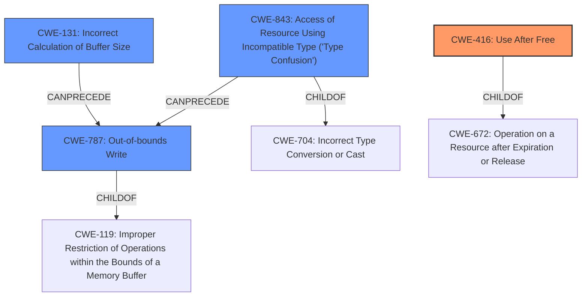

# Final Resolution for CVE-2021-4129

# Summary
| CWE ID  | CWE Name                                                                                                                          | Confidence | CWE Abstraction Level | CWE Vulnerability Mapping Label | CWE-Vulnerability Mapping Notes |
| :-------- | :--------------------------------------------------------------------------------------------------------------------------------- | :---------- | :---------------------- | :------------------------------ | :------------------------------ |
| **CWE-416** | **Use After Free**                                                                                                               | 0.85        | Variant                 | Allowed                         | Primary **CWE**                   |
| **CWE-787** | **CWE-787: Out-of-bounds Write**                                                                                                  | 0.70        | Base                  | Allowed                         | Secondary Candidate                   |
| **CWE-843** | **Access of Resource Using Incompatible Type ('Type Confusion')**                                                                 | 0.65        | Base                  | Allowed                         | Secondary Candidate                  |
| **CWE-131** | **Incorrect Calculation of Buffer Size**                                                                                          | 0.60        | Base                  | Allowed                         | Secondary Candidate                  |

## Evidence and Confidence

*   **Confidence Score:** 0.80
*   **Evidence Strength:** MEDIUM

## Relationship Analysis
The analysis focused on parent-child relationships to ensure specificity, favoring Base and Variant levels over Class and Pillar. The chain relationships helped connect root causes to consequences, such as a type confusion potentially leading to an out-of-bounds write. Peer relationships highlighted alternative classifications, prompting consideration of CWE-131 as a contributor to the memory corruption.

## Vulnerability Chain
The vulnerability chain starts with potential **CWE-843 (Type Confusion)** or **CWE-131 (Incorrect Buffer Size Calculation)**, leading to **CWE-787 (Out-of-bounds Write)**, and ultimately resulting in **CWE-416 (Use After Free)** due to memory corruption. A race condition could also contribute to the **use-after-free** but is not explicitly mentioned as a definite root cause.

## Summary of Analysis
The initial analysis provided a good starting point, but the criticism highlighted areas for improvement, particularly in justifying secondary **CWEs** and considering alternative root causes.

- **CWE-416 (Use After Free)** remains the primary **CWE** due to the direct mention of "use-after-free conditions" in the vulnerability description. The confidence has been increased to 0.85 based on the strong evidence.
- **CWE-787 (Out-of-bounds Write)** is retained as a secondary **CWE**, with the confidence increased to 0.70, as it aligns with the observed memory corruption.
- **CWE-843 (Access of Resource Using Incompatible Type ('Type Confusion'))** is kept as a secondary **CWE**, with the confidence increased to 0.65, as the vulnerability description mentions issues related to "incorrect type conversions".
- **CWE-131 (Incorrect Calculation of Buffer Size)** is added as a secondary **CWE** (Confidence 0.60) because it could contribute to the out-of-bounds write, especially if "unchecked sizes" lead to a calculation error. This is a more specific potential root cause than just "memory corruption".

The graph relationships influenced the final selection by emphasizing the potential chain of events: type confusion or incorrect buffer size calculation leading to an out-of-bounds write, and ultimately a use-after-free. The selected **CWEs** are at the optimal level of specificity, with Base and Variant levels being preferred over broader Class and Pillar **CWEs**.

The decision is based on the available evidence, with consideration given to the relationships between **CWEs** and the potential vulnerability chain. While more detailed bug reports would improve the accuracy of the analysis, the current classification provides a reasonable representation of the vulnerability based on the provided information.